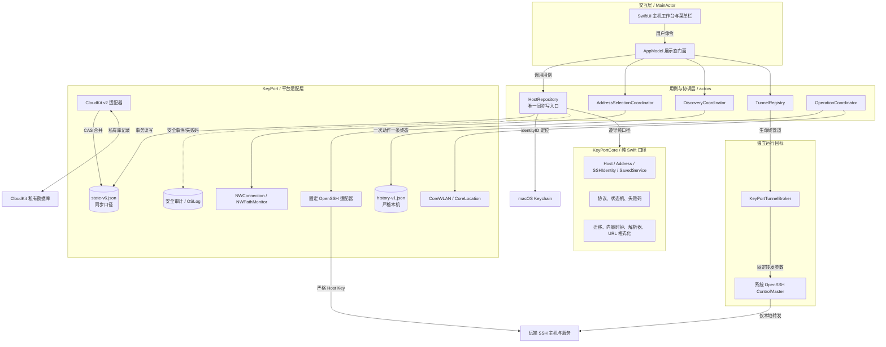
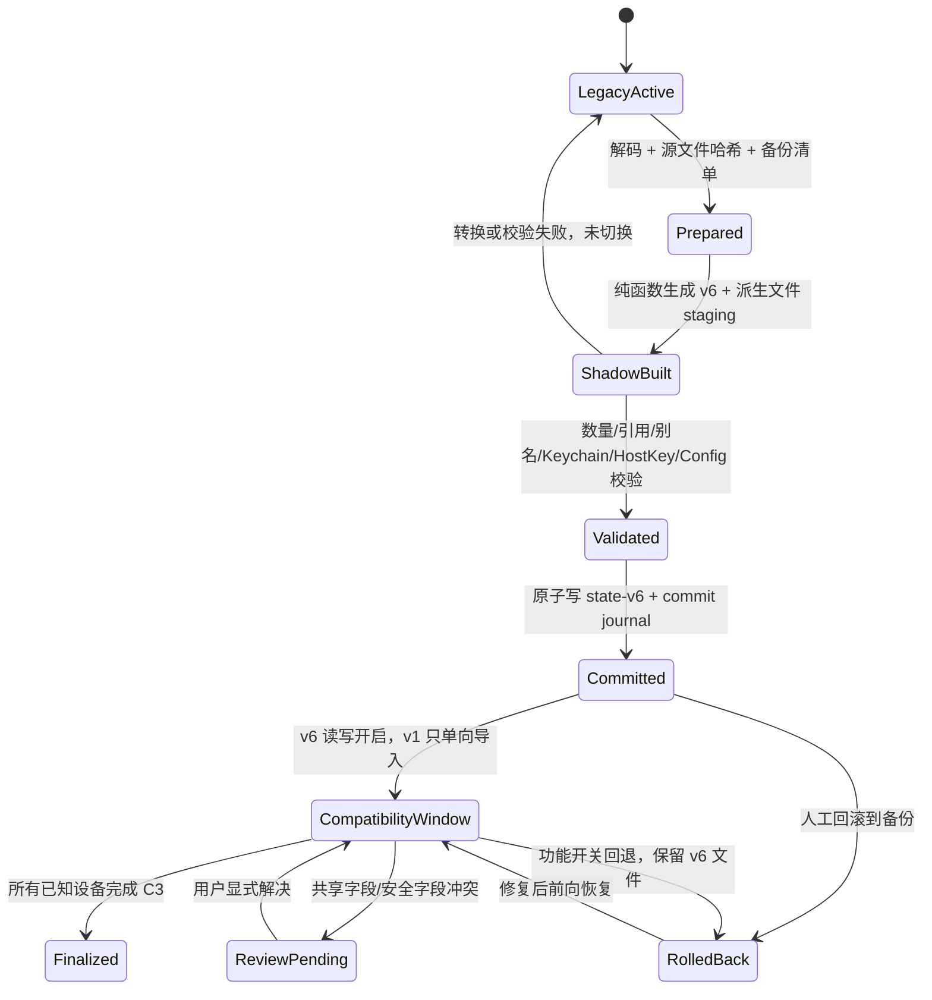
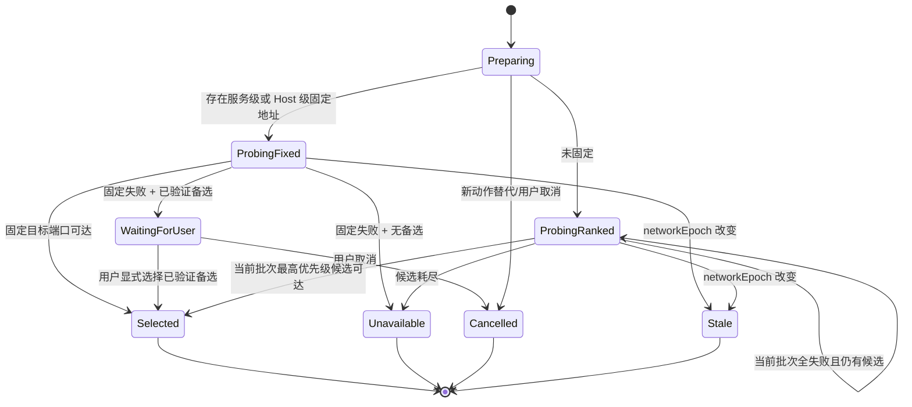
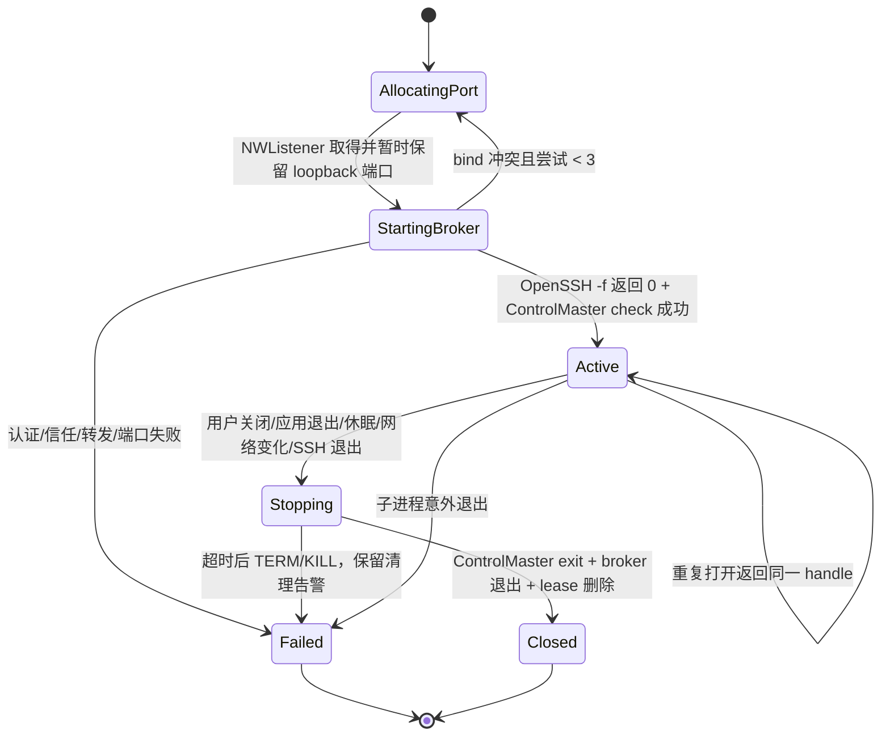

# KeyPort 主机工作台技术架构与迁移契约

- Issue: JODER-10
- 输入基线: JODER-8 已批准产品方案与 12 个验收场景
- 代码基线: `d25456d` (`origin/main`)
- 方案日期: 2026-08-25
- 结论: **go with conditions**

本文只定义首版承重技术口径，不改变 JODER-8 的产品范围、页面顺序或服务类型。文中的 `Host` 是稳定的物理机或虚拟机对象；“可达”“SSH 可信”“本次访问方式”始终是三个独立状态轴。

## 1. 结论与进入实施的条件

首版可以在现有 SwiftPM、SwiftUI、系统 OpenSSH、版本化 JSON 和 CloudKit 私有库之上实施，不需要引入 SwiftData、后台守护服务、局域网扫描、系统 hosts/DNS/代理修改或第三方 SSH 协议栈。选择在现有两层模块内增加纯领域契约和平台适配器，并新增一个职责单一的 `KeyPortTunnelBroker` 可执行目标，用父进程生命线托管 OpenSSH 转发。

以下条件必须在对应功能开关打开前完成；它们不是隐含扩容：

| 条件 | 负责人 | 可验证门禁 | 未满足时的结论 |
| --- | --- | --- | --- |
| C1 隧道来源语义 | 所有者 | 接受隧道 URL 为 `http(s)://127.0.0.1:<port>`；依赖原始 Host header、SNI 或证书主机名的 HTTP(S) 服务不承诺透明工作，KeyPort 不绕过 TLS，也不修改 hosts/DNS/代理 | 对“来源敏感的 HTTP(S) 隧道”是 `no-go`；直连 HTTPS、普通 HTTP 隧道和通用 TCP 不受影响 |
| C2 SSID 权限 | macOS 平台实现负责人 | 使用真实团队签名包，在 macOS 14 与当前发布目标上完成允许、拒绝、系统关闭、授权撤销四组实验；拒绝后 SSH/发现/访问验收 100% 通过 | 保持网络提示开关关闭，不阻断其他能力 |
| C3 跨版本 CloudKit | 数据/同步实现负责人 | 两台 Mac 以 v5/v6、v6/v6 组合验证一遍；身份数、Keychain 命中、别名、Host Key、授权和墓碑均与迁移清单一致 | 不切换 `hostModelV6ReadEnabled`，继续运行旧模型 |
| C4 发现与崩溃清理 | SSH/平台实现负责人 | Linux/macOS fixture 覆盖 IPv4/IPv6、权限不足、容器宿主可见端口和大输出；对活动隧道 `SIGKILL` 主应用后 2 秒内端口关闭 | 不开放发现/隧道功能开关 |

C1 是唯一需要所有者确认的产品表达边界。若期望任意 HTTPS/虚拟主机服务在隧道后仍保持原始来源语义，需要受管浏览器代理、本地 TLS 终止或 DNS/hosts 介入，均超出已批准首版且扩大安全边界，本方案明确拒绝。

## 2. 已验证事实、实验与假设

### 2.1 仓库事实

- `Package.swift:4-33` 只有 `KeyPortCore`、主应用、AskPass 与检查/测试目标，最低 macOS 14；主应用链接 AppKit、CloudKit、LocalAuthentication 和 Security。
- `Sources/KeyPortCore/Models/DomainModels.swift:127-185` 的 `ServerConnection` 同时拥有端点、账号、别名、Host Key、运行状态和机器配置；`325-355` 的当前快照版本为 5。
- `Sources/KeyPort/Stores/SnapshotStore.swift:17-27` 以单一 JSON 文件原子保存，并设置 `0600`；`Sources/KeyPort/Support/KeyPortPaths.swift:16-25` 的当前路径是 `state-v1.json`。
- `Sources/KeyPort/Stores/AppModel.swift:701-725` 在主 Actor 加载、迁移并持久化整个快照；`845-1011` 保存账号时同时写 Keychain、Host Key、授权、SSH Config 与快照，尚无可恢复事务日志。
- `Sources/KeyPort/Services/Keychain/KeychainService.swift:89-113,157-188` 以旧 `ServerConnection.id.uuidString.lowercased()` 作为 generic-password account；因此 ID 可原样继承，无需搬运秘密。
- `Sources/KeyPortCore/SSHConfig/SSHConfig.swift:92-121` 以账号 ID 聚合并输出稳定别名；`Sources/KeyPort/Services/SSHConfig/SSHConfigService.swift:41-61` 只写 KeyPort 管理文件与一条幂等 Include。
- `Sources/KeyPort/Services/HostKey/HostKeyService.swift:25-47` 保存 `ssh-keyscan` 返回的原始 known_hosts 行；`Sources/KeyPort/Services/SSH/SSHService.swift:147-158` 强制专用 known_hosts 与严格 Host Key 校验。
- `Sources/KeyPort/Services/CloudSync/CloudSyncService.swift:132-203,241-247` 以一个 `KPMetadata/keyport-metadata-v1` 记录保存脱敏快照，并用 `.ifServerRecordUnchanged` 做 CAS；`Sources/KeyPortCore/Support/CloudMetadataSnapshotPolicy.swift:16-36,137-155` 当前只按 ID、整数版本和时间合并。
- `Sources/KeyPortCore/Support/CloudMetadataSnapshotPolicy.swift:39-78` 已把认证检查、私钥路径和审计恢复为本机状态；连接记录、发现候选和隧道尚不存在。
- `Sources/KeyPort/Support/ProcessRunner.swift:19-55` 会同步等待子进程，未提供超时、Task 取消、输出上限或长期进程托管，不能直接复用为发现/隧道运行时。
- `Sources/KeyPort/App/ContentView.swift:13-27,203-249` 已有三栏结构；`Sources/KeyPort/App/KeyPortMenuBarView.swift:31-114` 目前只显示已授权 SSH 别名；`Sources/KeyPort/Features/Servers/ServerListView.swift:9-58` 仅在 UI 按端点聚合账号。
- `Resources/KeyPort.entitlements:5-20` 与 `script/build_and_run.sh:63-91` 尚无网络提示所需的平台声明和使用说明。

### 2.2 本轮验证证据

- `./script/test.sh` 通过：32 个 XCTest、`KeyPortCoreChecks` 和 AskPass 受保护 FIFO 集成检查全部成功。
- Xcode 当前 macOS 26.5 SDK 的 CoreWLAN 头文件明确说明：SSID 仅在 Location Services 开启且用户授权应用后可用；Apple 的 `CWInterface.ssid()` 与 Core Location 授权文档见文末。
- 当前 SDK 的 `NWPathMonitor` 是网络变化观察器，`NWConnection` 可取消；本地 `NWListener` 只有设置 `newConnectionHandler` 后才能以系统分配端口进入 `.ready`，实验取得动态端口 `54783`。
- Foundation 实验中，`URLComponents.host = "2001:db8::1"` 生成 `nil`，显式使用 `[2001:db8::1]` 后生成 `https://[2001:db8::1]:8443/status`；URL 构造器必须自行处理 IPv6 方括号。
- `/usr/bin/ssh -G -N -o ExitOnForwardFailure=yes -L '127.0.0.1:55000:[::1]:8080' example.invalid` 返回 0，确认当前 OpenSSH 接受带方括号的 IPv6 转发目标。
- 本机 `/usr/sbin/lsof -nP -a -iTCP -sTCP:LISTEN -F0pcnT` 字段模式返回可解析的 PID、命令、端点和 TCP 字段；实验只统计字段数，未保存或输出具体监听内容。

### 2.3 尚未被代码或本机证明的事实

- 真实 CloudKit 双设备冲突、iCloud Keychain 跨设备命中、真实 Linux `ss` 输出、远端权限不足、OpenSSH 崩溃清理和 SSID 授权必须由 C2-C4 的环境验收完成。
- JODER-8 没有承诺通过隧道保持 HTTP Host/TLS SNI；本方案把该事实作为 C1 明示条件，不自行扩展为本地代理或证书管理。

## 3. 方案比较与架构决定

| 方案 | 优点 | 代价/风险 | 决定 |
| --- | --- | --- | --- |
| A. 规范化 v6 快照 + 现有 CloudKit CAS + 平台适配器 | 保留当前 JSON/Actor/CloudKit 经验；实体可独立合并；Keychain/别名 ID 可原样继承；回滚路径短 | 仍是单 CloudKit payload，需要大小保护；需要一次显式迁移 | **采用** |
| B. 保留 `ServerConnection`，只增加 Host UI 聚合视图 | 改动最少，短期 UI 快 | 多地址、服务、Host Key 和删除没有唯一所有者；共享字段继续复制；迁移与 Cloud 冲突无法收口 | 拒绝，不能满足 JODER-8 的一等 Host 语义 |
| C. SwiftData + 每实体 CloudKit 记录 | 查询和大规模同步更自然 | 同时替换持久化、迁移和同步栈；当前 SwiftPM/JSON 测试接缝全部重做；首版回滚与签名风险显著上升 | 首版拒绝；单 payload 达到大小门禁后再立项 |

ADR-1：`Host` 是逻辑聚合根，实体在物理快照中规范化为独立数组，以便地址、身份和服务分别合并。所有跨实体写入必须经过 `HostRepository` 的单次事务；UI 不再直接修改 `AppSnapshot`。

ADR-2：不新增业务 library target。纯模型、迁移、合并、解析和格式化继续进入 `KeyPortCore`；Network/CoreWLAN/CloudKit/Process/AppKit 适配器留在 `KeyPort`。只新增 `KeyPortTunnelBroker` executable target，因为崩溃清理需要独立进程生命线，而不是代码分层需要新模块。

ADR-3：CloudKit 新旧代际使用不同记录名。v6 读取 `keyport-metadata-v2`，兼容期只把 v1 变更单向导入 v2，不把无法完整表达的 Host/Service 反写 v1，从结构上防止旧客户端删除新字段。

## 4. 技术架构与依赖方向

本图是详细设计的逻辑 + 运行时视图，回答稳定技术单元、状态所有权与外部边界；步骤和分支另见后续状态图。



图例：圆柱表示持久状态；实线表示同步命令/依赖；双向线表示同步；虚线表示旁路审计。CloudKit、Keychain、系统 OpenSSH 与远端主机均按不可靠外部依赖处理，失败不得破坏本地同步口径。

依赖方向固定为：`Views -> AppModel -> UseCases -> KeyPortCore protocols/domain`。平台实现依赖 `KeyPortCore`，`KeyPortCore` 不反向导入 SwiftUI、CloudKit、Network、CoreWLAN 或 AppKit。`KeyPortTunnelBroker` 不依赖主应用，也不暴露任意命令入口。

## 5. 数据所有权、稳定 ID 与不变量

### 5.1 同步实体

所有同步实体携带 `SyncStamp`：

```swift
public struct SyncStamp: Codable, Hashable, Sendable {
    public var vector: [String: UInt64]       // deviceID -> counter
    public var mutationID: UUID
    public var updatedAt: Date
}

public protocol SyncedEntity: Identifiable, Codable, Sendable {
    var stamp: SyncStamp { get }
    var deletedAt: Date? { get }
}
```

| 实体 | 稳定 ID | 所有者与主要字段 | 引用 |
| --- | --- | --- | --- |
| `Host` | 新建为随机 UUID；迁移时为固定 namespace + `legacyEndpointKey` 的 UUIDv5 | `HostRepository`；名称、分组、机器配置、Host 级固定地址、时间、墓碑 | `fixedAddressID?` |
| `AccessAddress` | 新建随机 UUID；迁移地址用 HostID + endpoint key 的 UUIDv5 | `HostRepository`；规范化 DNS/IP、SSH 端口、来源、用户排序、墓碑 | `hostID` |
| `SSHIdentity` | **直接继承旧 `ServerConnection.id`** | `HostRepository`；用户名、稳定别名、身份级首选地址、时间、墓碑 | `hostID`, `preferredAddressID?` |
| `HostKeyPin` | `addressID + algorithm + fingerprint` 的稳定字符串 | `HostRepository`；算法、指纹、原始 known_hosts 行、确认/替换时间、状态 | `hostID`, `addressID` |
| `SavedService` | 用户确认保存时生成随机 UUID | `HostRepository`；名称、协议、远端监听、路径、收藏、服务级固定地址、墓碑 | `hostID`, `fixedAddressID?` |
| `Authorization` | 保持 `identityID:fingerprint`；旧 `serverID` 解码键兼容 | `HostRepository`；设备密钥与远端授权元数据 | `sshIdentityID`, `keyID` |
| `NodeAssociation` | 保持现有逻辑节点 ID | `HostRepository`；原 `serverID` 语义改名为 `sshIdentityID`，解码兼容旧键 | `sshIdentityID` |
| `MergeReview` | 冲突双方 mutation ID 的确定性 ID | Cloud 合并器创建、用户显式解决；结构化保存两份非秘密候选和阻断等级 | `entityType`, `entityID` |

`Host.notes` 不进入同步实体。现有备注迁入 `LocalHostAnnotation(hostID, notes)`，继续只在本机快照和加密元数据归档中存在，保持当前 `CloudMetadataSnapshotPolicy` 不同步 notes 的隐私边界。

服务监听结构固定为：

```swift
public enum ServiceProtocol: String, Codable, Sendable { case http, https, tcp }
public enum ListenerBind: Codable, Hashable, Sendable {
    case loopbackV4, loopbackV6, wildcardV4, wildcardV6
    case specific(IPAddress)
}
public struct RemoteServiceEndpoint: Codable, Hashable, Sendable {
    public var bind: ListenerBind
    public var port: UInt16
    public var path: String?      // http(s) only, normalized to leading slash
}
```

### 5.2 本机与运行时实体

| 数据 | 存储与寿命 | CloudKit | 加密归档 |
| --- | --- | --- | --- |
| Host、Address、Identity、Pin、Service、Authorization、NodeAssociation、墓碑 | `state-v6.json`，同步口径 | 是，先脱敏 | 是 |
| Host 备注、认证检查、机器本地可用性、最近可达证据 | 本机快照 | 否 | 备注/检查可进入；网络证据不进入 |
| `ConnectionRecord`、SSID、进行中操作 journal | `history-v1.json`，`0600` | **否** | **否** |
| `DiscoverySession`、`DiscoveryCandidate`、原始命令输出 | 内存；页面关闭即丢弃 | 否 | 否 |
| `TunnelHandle` | `TunnelRegistry` 内存 | 否 | 否 |
| crash lease（仅 tunnelID/controlPath/brokerPID/时间） | runtime 目录；关闭/下次启动清理 | 否 | 否 |
| 密码 | Keychain，account = `SSHIdentity.id` | 否 | 否 |
| 私钥 | `~/.ssh/keyport/identities` | 否 | 否 |

### 5.3 强制不变量

1. 每个活动子实体必须引用一个活动 Host；墓碑可以保留历史引用。
2. 活动 `SSHIdentity.alias` 在 KeyPort 范围和用户已有字面 SSH Host 别名中唯一。
3. `Host.fixedAddressID`、`SSHIdentity.preferredAddressID` 和 `SavedService.fixedAddressID` 若存在，必须指向同一 Host 的活动地址；服务级固定优先于 Host 级固定。
4. 活动 SSH 身份至少存在一个带合法 SSH 端口的活动地址，否则身份进入不可用展示态，不得生成 SSH Config。
5. 同一地址 + 算法最多一个 `confirmed` Pin；旧指纹只能是 `replaced`，冲突只能是 `pendingReview`。任何 `pendingReview` 或当前扫描 mismatch 都阻止该 Host 的所有 SSH 动作。
6. 端口可达不能提升 SSH 信任；SSH 信任不能提升 HTTPS/TLS 信任；访问方式只描述本次 direct/tunnel/unavailable。
7. 发现候选没有仓储写权限；只有 `confirmService` 命令可以创建或显式更新服务。
8. 连接历史可引用已删除对象，但不得反向阻止墓碑；UI 以“已删除对象”显示。
9. 删除 Host/Identity 不自动删除远端公钥、不删除仍被其他身份引用的本机密钥，也不触碰 hosts、DNS、resolver、路由或防火墙。
10. 每个同步写命令携带 `expectedMutationID`；不匹配返回 `staleRevision`，不做隐式覆盖。

### 5.4 并发与 Cloud 冲突

整数版本 + 时间无法证明两个离线写入的因果关系。v6 对每个实体使用小型版本向量：一方向量支配另一方时取支配者；互不支配即为并发冲突。并发冲突不做 LWW：合并器选择 mutation ID 字典序较小者作为临时展示值，同时创建 `MergeReview` 保存两份结构化、已脱敏候选。

- 名称/分组冲突允许浏览，但标记待确认。
- 地址归属、固定地址、用户名/别名、Host Key、删除与更新并发冲突会阻止对应连接/发现/隧道动作。
- 用户解决冲突时，新写入先 join 两个版本向量，再递增当前设备计数，因此结果因果上支配两份候选。
- 墓碑因果上晚于更新时获胜；墓碑与更新并发时 UI 隐藏对象但保留更新候选，允许显式恢复。v1 不物理清除同步墓碑，避免离线设备复活数据。

### 5.5 删除 saga

模型事务与 Keychain/SSH Config 不是同一原子域。删除命令先在本机 journal 记录意图，再原子写墓碑，随后重建派生的 known_hosts/SSH Config 并清理 Keychain。派生步骤幂等：

- 配置失败：墓碑仍是权威状态，展示 `derivedConfigOutOfDate` 并在启动/手动修复时重试；保留配置备份。
- Keychain 删除失败：保留 `credentialCleanupPending(identityID)`，明确提示并重试；绝不静默报告完全清理。
- 远端授权不在此 saga 中；必须由独立“撤销授权”动作完成。
- 地址删除若仍被固定/首选/服务引用，命令必须在同一快照事务中先重新指派，或返回 `addressStillReferenced`。

## 6. v5 -> v6 迁移、CloudKit 兼容与回滚

### 6.1 迁移状态机

本图回答一次升级如何准备、验证、提交、失败恢复和回滚；待确认冲突由用户负责解决，迁移器不猜测。



### 6.2 文件与 Cloud 代际

- 保留原 `state-v1.json`，升级前复制到 `backups/<timestamp>/state-v1.json` 并记录 SHA-256、权限和代码版本。
- v6 权威本地文件为 `state-v6.json`；迁移 staging 和 `migration-journal.json` 也位于应用支持目录，均为 `0600`。
- 同一备份清单保存 `~/.ssh/keyport/config` 与 `known_hosts` 的副本和哈希；私钥不复制，Keychain 不导出。
- CloudKit 使用新 record type/name `KPMetadataV2/keyport-metadata-v2`。现有 `KPMetadata/keyport-metadata-v1` 不覆盖、不删除，旧客户端无法触碰 v2。
- v6 同步期间读取 v1 payload 的规范哈希。哈希变化时，以伪设备 `legacy-v1` 和旧 entity version 形成版本向量后导入；与 v2 并发修改冲突时创建 `MergeReview`。
- v6 **不反写 v1**。混合版本期是 v1 -> v2 单向兼容；旧设备看不到新服务/地址。因此 C3 要求全部已知设备升级后才宣布迁移完成。
- v2 Cloud payload 编码前硬限制 800 KiB；超过时本地继续工作、Cloud 返回 `payloadTooLarge`，不得截断。容量 fixture 至少覆盖 50 Host、每 Host 4 地址/4 身份/20 服务；若超过门禁，发布前改为每实体 CloudKit 记录，不能放宽限制硬推。

### 6.3 确定性转换

1. 解码 v1-v5 后先执行现有 v2-v5 纯迁移，再处理 Host 模型。
2. `legacyEndpointKey` 严格沿用当前 UI 聚合规则：host 去首尾空白、转小写、去末尾点，再拼 SSH port；不做 DNS、反向 DNS、相似名、共享出口或 Host Key 推断。
3. 同 endpoint key 的记录创建一个确定性 Host 和一个确定性 Address；不同 endpoint 永不自动合并。
4. 每个旧 `ServerConnection` 创建一个 `SSHIdentity`，ID 原样继承。旧 username、alias、createdAt、updatedAt 和墓碑原样进入对应字段。
5. 旧 `confirmedHostKeys` 原始行逐条保留。相同算法出现不同指纹时全部进入 `MergeReview`，没有任一候选被静默设为可信。
6. name/group/notes/machine configuration 等原本复制的共享字段若不一致，所有候选进入 `MergeReview`；临时展示只用确定性代表，不能覆盖来源记录。
7. `Authorization.serverID` 与 `NodeAssociation.serverID` 仅改字段语义/编码兼容，值不变，因此远端授权、设备密钥和逻辑节点仍指向同一 SSH 身份。
8. 转换是 `sourceHash -> outputHash` 的幂等纯函数；相同输入必须产生字节等价的排序后快照。

### 6.4 无损证明门禁

| 资产 | 证明方式 |
| --- | --- |
| Keychain 定位 | 对迁移前每个 ID 记录 local/synchronizable/missing 三态；迁移后以相同 ID 查询，矩阵必须完全相等。迁移器从不读出或重写密码值 |
| SSH 别名 | 活动别名 multiset 与 identityID -> alias 映射完全相等；用新模型渲染 managed config 后，对每个别名运行 `ssh -G` 比较 hostname/port/user/identityfile/knownhosts |
| Host Key | 原始 `knownHostsLine` multiset、算法和指纹完全相等；冲突只增加 review，不丢候选 |
| 设备密钥 | key ID、device ID、fingerprint、公钥和本机私钥路径映射完全相等；私钥文件哈希/权限不改 |
| 远端授权 | `identityID + fingerprint` 授权 ID 完全相等；迁移不连接远端、不写 authorized_keys |
| NodeAssociation | 旧 serverID 值按 identityID 解码，记录数、revision 和 target 完全相等 |
| 墓碑 | 活动/删除数量和每个旧 ID 的删除状态完全相等，墓碑不被清理 |

任一门禁失败，状态回到 `LegacyActive`，不写 commit journal，不改 Keychain/SSH/远端。

### 6.5 回滚

- 在 `Finalized` 前，关闭 `hostModelV6ReadEnabled` 并恢复备份清单可返回升级前 SSH 能力；恢复前校验当前派生文件哈希，若用户手工修改则停止并要求人工选择，绝不覆盖未知修改。
- `state-v6.json`、v2 Cloud 记录和新服务数据在回滚时保留，不删除；旧版本看不到新能力，但前向升级可恢复，不构成数据丢失。
- 因 identity ID、Keychain account、密钥路径和别名未改变，回滚不需要秘密搬运，也不会产生第二份 SSH Config alias。
- `Finalized` 仍不删除 v1 Cloud 记录；物理清理由未来独立、可审计迁移决定。

## 7. 地址验证与选择协调器

### 7.1 公共契约

```swift
public struct AddressSelectionRequest: Sendable {
    public let operationID: UUID
    public let hostID: UUID
    public let target: ProbeTarget          // ssh or service(UInt16)
    public let fixedAddressID: UUID?        // service fixed > host fixed
    public let candidates: [AddressCandidate]
    public let networkEpoch: UInt64
}

public enum AddressSelectionOutcome: Sendable {
    case selected(AddressDecision)
    case requiresUserChoice(failedFixed: ProbeEvidence,
                            verifiedAlternatives: [ProbeEvidence])
    case unavailable([ProbeEvidence])
    case cancelled(OperationFailureCode)
}

public protocol AddressSelecting: Sendable {
    func select(_ request: AddressSelectionRequest) async -> AddressSelectionOutcome
    func invalidate(before networkEpoch: UInt64) async
}

public protocol ReachabilityProbing: Sendable {
    func probe(_ target: NetworkTarget,
               timeout: Duration,
               operationID: UUID) async -> ProbeEvidence
}
```

### 7.2 状态机与算法

本图回答一次地址选择如何成功、固定地址失败如何交给用户、网络变化如何取消并失效。



固定契约：

- 使用 `NWConnection` 做目标 TCP 握手，不用 ping，也不把 DNS 解析成功当作端口可达。
- 每个 probe 超时 5 秒；单次最多 3 个并发。按优先级三条一批，等待本批终态后选本批最高优先级成功者；最多验证前 12 条，整体最长约 20 秒，剩余地址只能由用户点选验证。
- 未固定排序依次为：当前 SSID 下最近成功（仅有权限时）、本机最近成功、用户同步的 `sortOrder`、稳定 ID。完成探测后才选择；历史只影响顺序，不生成信任。
- 固定地址失败后可以验证备选，但 outcome 必须是 `requiresUserChoice`；协调器无权自动采用备选。用户选择仍沿用原 operationID，最终只写一条记录。
- `NWPathMonitor` 路径签名变化、Tailscale 状态变化、系统 willSleep/didWake 都递增 `networkEpoch`。旧 evidence 立即展示为 stale；正在运行的 `NWConnection` 和 OpenSSH probe 取消。
- 正在使用的隧道在 epoch 变化时关闭，不迁移；普通浏览器直连由外部应用拥有，KeyPort 只把自己的 evidence 标记过期。
- 地址 probe 只产出 `ReachabilityState`。选中 SSH 路径后还必须独立扫描/比较 `HostKeyPin`；Host Key changed 会阻止整个 Host 的 SSH、发现和隧道，但不阻止独立 HTTPS 直连。

## 8. 固定只读服务发现

### 8.1 适配器边界

```swift
public protocol ListenerDiscoveryAdapter: Sendable {
    var platform: DiscoveryPlatform { get }
    func capabilities(using session: TrustedSSHSession) async -> DiscoveryCapabilities
    func discover(using session: TrustedSSHSession,
                  limits: DiscoveryLimits) async -> DiscoveryResult
}

public struct DiscoveryLimits: Sendable {
    public let timeout: Duration             // 10 seconds
    public let maximumOutputBytes: Int       // 512 KiB
    public let maximumCandidates: Int        // 500
}
```

只有 Host Key confirmed 且至少一个身份通过当前 Mac 公钥认证后才创建 `TrustedSSHSession`。调用方只能选择 `DiscoveryCommand.listenerSnapshot`; API 不接受脚本文本、参数数组或用户插值。

### 8.2 固定命令

Linux 适配器通过现有 `ssh ... sh -s` 发送编译进应用的固定脚本，固定 `PATH=/usr/sbin:/usr/bin:/sbin:/bin` 与 `LC_ALL=C`：

```sh
if command -v ss >/dev/null 2>&1; then
  exec ss -H -lntp
elif command -v lsof >/dev/null 2>&1; then
  exec lsof -nP -a -iTCP -sTCP:LISTEN -F0pcnT
else
  exit 127
fi
```

macOS 适配器只执行：

```sh
exec /usr/sbin/lsof -nP -a -iTCP -sTCP:LISTEN -F0pcnT
```

不执行 `sudo`、`docker`、`podman`、`netstat`、用户 shell、进程读取或容器 namespace 命令。首版“容器端口”严格指在宿主 `ss/lsof` 中可见的 published listener；仅通过 NAT 表实现、没有宿主 listener 的映射返回 `containerMappingNotObservable` 警告，不进入容器。这与“不做容器管理/任意远程命令”一致。

### 8.3 解析与失败语义

- Linux parser 覆盖 `127.0.0.1:port`、`0.0.0.0:port`、`[::1]:port`、`[::]:port`、`:::port` 和具体 IPv4/IPv6；macOS parser 使用 `lsof -F0` 的 NUL 字段，不解析人类表格列宽。
- 仅保留 transport、`ListenerBind`、port 和可选 process basename。丢弃 PID、用户、文件路径、命令行参数和未知字段；process hint 最长 80 个字符，只允许字母数字、Unicode 字母、点、下划线和连字符。
- stdout/stderr 由有界收集器读取。超过 512 KiB 立即终止子进程并返回 `discoveryOutputLimit`；候选超过 500 条返回前 500 条并带 `truncated`，原始 Data 在解析后清零引用。
- 无 `-p` 权限或 lsof 只返回部分进程信息时，端口候选仍成功，结果带 `permissionLimited`；不能因为缺进程名丢端口。
- 有合法行也有坏行时返回候选和 `partialParse` 计数；没有合法行且存在非空未知格式时返回 `discoveryParseFailed`；exit 127 为 `discoveryToolUnavailable`；不支持的 `uname -s` 为 `discoveryUnsupportedOS`。
- 任何 stderr 原文、完整命令和原始 stdout 不进入记录、审计、OSLog、CloudKit 或归档。日志只写 adapter、计数、时长和稳定失败码。
- 同一 Host 同时只允许一个发现 session，全局最多两个；新 session 显式取消旧 session。页面关闭立即释放候选。

再次发现只产生新候选：匹配 `serviceID` 只能用于“可能已保存”提示。自动新增、改名、改协议、改端口或删除服务全部禁止；歧义必须由用户选择“新建”或“更新某服务”。

## 9. 服务访问、URL 与临时隧道

### 9.1 地址和 URL 组装

`ServiceEndpointFormatter` 是 `KeyPortCore` 纯函数，并有完整矩阵测试：

- HTTP(S) direct：使用实际选中的 address；IPv6 字面量先包为 `[addr]` 再赋给 `URLComponents.host`；path 只接受规范化绝对路径；禁止 user-info。
- HTTP(S) tunnel：`http(s)://127.0.0.1:<localPort><path>`。只绑定 IPv4 loopback，避免 `localhost` 解析到未监听的 IPv6。
- TCP direct：DNS/IPv4 输出 `host:port`，IPv6 输出 `[addr]:port`；tunnel 输出 `127.0.0.1:localPort`。
- 端口 probe 成功只显示“端口可达”。KeyPort 首版不发应用层认证请求、不保存 cookie/token、不关闭系统 TLS 校验。HTTPS 的证书和登录由打开 URL 的外部应用负责。
- loopback listener 直接进入 tunnel；wildcard/specific listener 必须对实际目标端口探测成功才 direct。wildcard IPv6 不假设同时接受 IPv4，两族分别验证。

### 9.2 隧道公共契约

```swift
public struct TunnelRequest: Sendable {
    public let operationID: UUID
    public let serviceID: UUID
    public let sshIdentityID: UUID
    public let sshAddressID: UUID
    public let remote: RemoteServiceEndpoint
    public let networkEpoch: UInt64
}

public enum TunnelState: Sendable {
    case allocatingPort(attempt: Int)
    case starting
    case active(local: LocalEndpoint, startedAt: Date, reused: Bool)
    case stopping(TunnelCloseReason)
    case closed(TunnelCloseReason)
    case failed(OperationFailureCode)
}

public protocol TunnelManaging: Sendable {
    func open(_ request: TunnelRequest) async -> TunnelHandle
    func close(id: UUID, reason: TunnelCloseReason) async
    func closeAll(reason: TunnelCloseReason) async
}
```

### 9.3 生命周期状态机

本图回答一个 KeyPort 自有转发如何建立、复用、关闭并在故障后收口。



实现口径：

- registry key 为 `serviceID + sshIdentityID + sshAddressID + remote endpoint`。starting 中的重复打开等待同一 Task；active 中重复打开复用同一本地端点，不生成第二个 ssh master。每次用户动作仍各写一条终态记录，结果可为 `reusedTunnel`。
- 用设置了 `newConnectionHandler` 的 `NWListener(using: .tcp)` 请求动态端口并保持占用；启动前一刻 cancel listener，然后启动 broker。若 OpenSSH 报 bind conflict，最多重新分配三次。
- broker 只允许生产代码组装的固定 `ssh -f -N -M -S <control> -T`，并带 `BatchMode=yes`、`ExitOnForwardFailure=yes`、5 秒 connect timeout、严格专用 known_hosts、`IdentitiesOnly=yes`、明确 identity file 和 `-L 127.0.0.1:<local>:<remote>:<port>`。IPv6 remote 加方括号。
- 主应用持有 broker stdin 写端；broker 监视 EOF。正常退出或主应用 crash 会关闭 pipe，broker 随即执行 `ssh -S <control> -O exit` 并删除 control socket/lease。broker 自身异常时，下次启动按当前 UID、受管短 control path 和 lease ID 校验后清理；不凭宽泛 PID 或命令文本 kill 进程。
- `AppDelegate.applicationShouldTerminate` 返回 terminateLater，先给 registry 最多 2 秒关闭，再完成退出；强杀由 EOF 生命线处理。
- willSleep、networkEpoch 改变和用户关闭都会关闭隧道；didWake 不自动重建。应用不保存本地端口，不把隧道当系统服务。
- 全局最多 8 个活动隧道、每 Host 最多 4 个；达到上限返回 `tunnelCapacityReached`，不驱逐已有隧道。

## 10. 一次动作一条终态记录与 SSID 降级

### 10.1 记录契约

```swift
public struct OperationContext: Codable, Sendable {
    public let operationID: UUID       // also ConnectionRecord.id
    public let hostID: UUID
    public let addressID: UUID?
    public let sshIdentityID: UUID?
    public let serviceID: UUID?
    public let action: ConnectionAction
    public let startedAt: Date
}

public struct ConnectionRecord: Identifiable, Codable, Sendable {
    public let id: UUID
    public let hostID: UUID
    public let addressID: UUID?
    public let sshIdentityID: UUID?
    public let serviceID: UUID?
    public let action: ConnectionAction
    public let accessMode: AccessMode?
    public let result: OperationResult
    public let failureCode: OperationFailureCode?
    public let startedAt: Date
    public let endedAt: Date
    public let ssid: String?
}

public protocol ConnectionHistoryWriting: Sendable {
    func begin(_ context: OperationContext) async throws
    func finish(operationID: UUID, outcome: SanitizedOutcome) async throws
    func clear(hostID: UUID?) async throws
}
```

`history-v1.json` 同时保存不展示的 `inflight` 和终态 `records`。`begin` 原子写入最小上下文；`finish` 在一次 atomic replace 中删除 inflight、以 operationID 幂等 upsert 一条终态、删除早于 30 天的记录，并对每 Host 只保留 endedAt 最新的 200 条。启动时把遗留 inflight 原子转为 `interruptedByPreviousTermination`，从而 crash 也不会产生零条或多条历史。

内部地址重试、Host Key 扫描、端口重分配和隧道复用都共享 operationID。已存在终态时，同结果 finish 为幂等成功，不同结果返回 `historyTerminalConflict`。记录写失败不回滚已经完成的远端/网络动作；UI显示“动作完成但历史未保存”，安全审计只记录稳定失败码。

连接记录只保存上面的字段。禁止密码、私钥、公钥正文、Host Key 原始行、地址字符串副本、完整命令、原始探测输出、BSSID、位置、HTTP header/cookie/token 和任意未筛选错误文本。

### 10.2 SSID 提供者

```swift
public enum NetworkHintResult: Sendable {
    case available(ssid: String)
    case disabled, notDetermined, denied, restricted, servicesDisabled, unavailable
}

public protocol NetworkHintProviding: Sendable {
    func currentSSID() async -> NetworkHintResult
}
```

- 设置开关默认关闭且只存在当前 Mac。首次私网成功后的非阻断询问只决定未来记录；用户明确同意后才调用 Core Location 授权。
- 只有开关开启、本次使用私网 address 且进入 finish 时才读取 `CWWiFiClient.shared().interface()?.ssid()`；代码禁止读取 `bssid`，并以静态 grep 测试守护。
- denied/restricted/servicesDisabled/revoked/unavailable 全部折叠为 `ssid=nil`，不影响 begin/finish、SSH、发现、direct 或 tunnel。
- 构建产物需加入 `NSLocationWhenInUseUsageDescription`，链接 CoreLocation/CoreWLAN；发布签名包必须通过 C2。权限状态只在 UI 展示，不写连接记录。
- SSID 只进入本机 history 文件，清除记录同时清除 SSID；Cloud sanitizer、archive codec 和日志扫描测试必须证明它不会离开该文件。

## 11. 失败码、安全与恢复口径

用户可见错误由 `stage + objectID + code + recoveryAction` 组成；记录、审计和 OSLog 只保存 code 与不含地址/用户名的稳定 ID。首版稳定码至少包括：

| 域 | 失败码 | 恢复动作 |
| --- | --- | --- |
| address | `invalidAddress`, `dnsUnresolved`, `tcpTimeout`, `tcpRefused`, `networkChanged`, `probeCancelled`, `fixedAddressUnavailable` | 编辑、重试或显式选择已验证备选 |
| ssh/trust | `hostKeyPending`, `hostKeyChanged`, `identityUnavailable`, `keyAuthenticationFailed`, `strictHostKeyRejected` | 核对指纹、准备本机密钥或重新授权 |
| discovery | `unsupportedOS`, `toolUnavailable`, `permissionLimited`, `outputLimit`, `parseFailed`, `remoteExecutionFailed` | 安装系统工具、接受有限候选或重试；不提供自定义命令 |
| service | `protocolUnconfirmed`, `directUnavailable`, `originSensitiveTunnelUnsupported`, `tlsHandledExternally` | 改协议/地址；C1 情况只解释边界，不绕过 TLS |
| tunnel | `localPortUnavailable`, `forwardRejected`, `brokerExited`, `capacityReached`, `closedForSleep`, `closedForNetworkChange`, `cleanupPending` | 重试、关闭其他隧道或完成清理 |
| migration/cloud | `decodeFailed`, `invariantFailed`, `artifactMismatch`, `concurrentConflict`, `payloadTooLarge`, `mixedVersionPending` | 保持旧模型、解决 review 或完成 C3 |
| history/hint | `historyWriteFailed`, `historyTerminalConflict`, `hintDenied`, `hintUnavailable` | 重试写入/打开系统设置；hint 失败永不阻断主流程 |

安全规则：

- 所有远端执行由闭集 enum 映射到固定命令；协议层没有 `run(command: String)`。
- 进程收集器同时限制 wall-clock、stdout/stderr bytes，并响应 Task cancellation；超限先 TERM，2 秒后仍存活再 KILL。
- 隧道只绑定 loopback，ControlMaster/runtime 目录为当前 UID `0700`，socket 名不含 host/user/service 文本。
- Host Key changed fail closed；端口可达、SSID 相同、Tailscale 命中和 HTTPS 成功均不能解除。
- Cloud/归档 encoder 使用明确 allow-list，不依赖“新增字段默认会被剥离”的脆弱假设；测试对序列化 bytes 扫描 forbidden fixtures。
- `AuditLogService` 当前把 result/target 以 public 记录（`Sources/KeyPort/Services/AuditLog/AuditLogService.swift:8-17`）；新路径只能传 enum code 和 UUID，不传动态 stderr/SSID/地址/命令。

硬件与部署：无需新服务器、系统扩展、launch daemon 或网络配置。所有运行单元仍在当前 Mac，只有短生命周期的已签名 broker/helper 子进程和用户明确触发的 SSH 连接。

## 12. 主要接口与代码落点

| 路径 | 变化 | 最小测试接缝 |
| --- | --- | --- |
| `Sources/KeyPortCore/Hosts/`（新增目录） | 同步实体、ID normalizer、不变量、版本向量、merge review | 纯 XCTest，固定 clock/deviceID |
| `Sources/KeyPortCore/Migration/` | v1-v5 -> v6 纯转换、清单与 compatibility projection | JSON golden fixtures、幂等与无损矩阵 |
| `Sources/KeyPortCore/Networking/` | address ranking/state、IP/URL/host:port formatter | fake probe + IPv4/IPv6 矩阵 |
| `Sources/KeyPortCore/Discovery/` | `ss`/`lsof -F0` parser、过滤与 limits | 脱敏 fixture，不需要 SSH |
| `Sources/KeyPortCore/Operations/` | operation context、terminal result、failure codes、retention | fake clock + duplicate finish tests |
| `Sources/KeyPort/Stores/` | `HostRepository`、`SyncedSnapshotStore`、`ConnectionHistoryStore`、mutation journal | 临时 home、故障注入、atomic replace |
| `Sources/KeyPort/Services/CloudSync/` | v2 record、向量 merge、v1 单向 importer、allow-list sanitizer | in-memory remote + concurrent vectors |
| `Sources/KeyPort/Services/Network/`（新增） | NWConnection probe、NWPathMonitor epoch、CoreWLAN/CoreLocation hint | protocol fake；签名机做平台验收 |
| `Sources/KeyPort/Services/SSH/` | `TrustedSSHSession`、固定 discovery command、可取消 process executor | fake executable/runner + 本地 SSH fixture |
| `Sources/KeyPort/Services/Tunnel/`（新增） | registry、port allocator、broker client、lease reaper | fake broker + crash integration |
| `Sources/KeyPortTunnelBroker/`（新增 target） | stdin lifetime、固定 OpenSSH ControlMaster start/check/exit | 本地 sshd fixture；无 UI 依赖 |
| `Sources/KeyPort/Stores/AppModel.swift` | 退化为展示态/命令门面，不直接拥有同步写规则 | coordinator spy + 现有主动作回归 |
| `Sources/KeyPort/Features/Servers` 与菜单栏 | 按 Host/Service 展示，三轴状态和显式备选 | view-model/state tests；最终截图/可访问性验收 |

关键平台协议应通过 initializer 注入；禁止在纯逻辑中直接调用 `Date.now`、`UUID()`、`UserDefaults.standard`、`FileManager.default.homeDirectoryForCurrentUser` 或全局 `Process`。

## 13. 性能、容量、可观测与测试门禁

- 地址 probe：每项 5 秒，3 并发，最多前 12 项/约 20 秒；取消传播到 NWConnection/Process。
- 发现：10 秒、512 KiB、500 candidates；每 Host 1 个、全局 2 个。
- 隧道：全局 8、每 Host 4；启动 5 秒 connect timeout，关闭预算 2 秒。
- 历史：30 天且每 Host 200；50 Host x 200 记录 fixture 的 finish + prune + atomic save 在发布基线 Mac 上 p95 < 150 ms，并且不在 MainActor 执行。
- Cloud：脱敏 payload < 800 KiB；CAS 冲突最多 4 次，沿用当前行为；重试耗尽返回 conflict，不覆盖远端。
- UI：可达性、SSH 信任、访问方式均有文字 + 图标；错误包含阶段、对象、恢复动作；颜色不是唯一信息。
- 观测：本地计数只记录 duration bucket、candidate count、reason code 和 UUID；无网络 telemetry。安全审计与连接历史使用不同类型和 store。

必须新增的自动证据：

1. v1-v5 golden snapshots：同端点多账户、不同端点相似名、共享字段冲突、Host Key 冲突、墓碑、旧授权/节点关联、旧 archive。
2. Keychain API spy：迁移调用次数为 0，迁移前后 account 查询集合相等。
3. SSH config semantic diff：每个别名的 `ssh -G` 关键字段相等，重复迁移不新增 Include/alias。
4. 向量时钟：dominates、concurrent、delete-vs-update、用户 resolve 和墓碑不复活。
5. Address coordinator：固定失败、备选显式选择、排序、3 并发、超时、取消、新 epoch 使结果 stale。
6. Discovery parser：Linux/macOS、IPv4/IPv6、loopback/wildcard/specific、无进程名、权限有限、NUL、坏行、512 KiB、500 条、宿主可见 container proxy。
7. URL/TCP matrix：默认/非默认端口、路径编码、DNS/IPv4/IPv6、direct/tunnel；HTTPS 不存在 trust bypass。
8. Tunnel：重复打开复用、本地端口碰撞三次、用户关闭、应用 terminateLater、SIGKILL EOF、broker crash 后 reaper、sleep/network epoch。
9. History：begin/finish 幂等、crash inflight 收口、30 天/200 条先到先删、按 Host/全部原子清理、write failure。
10. Privacy scan：Cloud payload、archive、history 之外的日志/配置均不含 fixture password、private key、SSID、BSSID、raw discovery、完整命令。
11. 保持 `./script/test.sh` 全绿，并把迁移/解析纯逻辑纳入 `KeyPortCoreChecks` 的无 Xcode 快速门禁。

外部验收矩阵：

- Linux：有 `ss`/无 `ss` 有 `lsof`/两者无、root 与普通用户、IPv4/IPv6、docker-proxy 宿主 listener、NAT-only notObservable。
- macOS：`lsof -F0`、权限有限、IPv4/IPv6、休眠唤醒。
- 两台签名 Mac：CloudKit v1/v2、iCloud Keychain local/synchronizable、SSID allow/deny/revoke。
- 本地隔离 sshd：Host Key 变化、key auth、forward collision、进程 crash 与清理。

## 14. 增量实施顺序、并行流与回滚点

每个切片应建立单一负责人 Issue，以可观察行为而非目录命名。共享契约使用独立 worktree；后续按数据、平台、UI lane 隔离，主工作树不直接承载并行实现。

| 切片 | 单一责任与可观察结果 | 依赖/可并行 | 验证证据 | 回滚点 |
| --- | --- | --- | --- | --- |
| A 共享口径 | 新实体、三轴状态、失败码、版本向量和协议可编译；旧 UI/SSH 无行为变化 | 起点 | 纯模型/merge tests | 删除未消费的新类型 |
| B 影子迁移 | 生成 `state-v6.json` staging 和无损报告，默认仍读 v5 | A；可与 C/D/E 并行 | golden + Keychain/alias/HostKey/授权矩阵 | 不写 commit journal，继续 v5 |
| C SSH 兼容承重层 | v6 identity/address 可投成现有 SSH route；可取消 process executor 与固定命令 enum 落地；现有一期全回归 | A；与 B/D/E 并行 | `script/test.sh` + semantic `ssh -G` | 切回 legacy route adapter |
| D 地址/网络代际 | fixed/auto 选择、3 并发、取消和 stale 状态可由 fake probe 完整驱动 | A；与 B/C/E 并行 | coordinator state tests + IPv6 experiment | 关闭 addressSelectionV2 |
| E 本机记录/SSID | 一次动作一条终态、30 天/200 条、SSID 全降级；默认 hint off | A；与 B/C/D 并行 | retention/privacy + C2 | 删除 history 文件不影响同步口径；hint 保持 off |
| F 同步切换 | v2 Cloud record、v1 单向导入、并发 review 和 rollback manifest 可用 | B | in-memory conflict + C3 | 关闭 hostModelV6ReadEnabled，v1 未改 |
| G 固定发现 | Linux/macOS 候选只在内存，取消不新增服务，raw output 不落盘 | C+D | parser/limit/SSH fixture | 关闭 discoveryEnabled |
| H 隧道与访问 | direct/tunnel 决策、broker、复用/关闭/退出/崩溃清理、URL/TCP 格式化可独立验收 | C+D；可与 G 并行 | tunnel matrix + C1/C4 | 关闭 serviceAccessEnabled，broker/lease reaper 保留清理能力 |
| I Host 工作台 | 三栏切换为 Host 聚合，旧 SSH 添加/确认/授权/撤销/别名全可用，服务区暂可空 | C+F+D+E | JODER-8 场景 1/4/7/8/9/11/12 | UI feature flag 回旧列表，v6 数据保留 |
| J 服务闭环 | 发现确认、服务编辑、主窗与菜单栏两步内打开/复制、活动隧道关闭 | G+H+I | JODER-8 场景 2-12 全矩阵与截图/可访问性证据 | 分别关闭 discovery/service 菜单入口 |

第一批必须只做 A-C：先证明 v6 模型可无损承载现有 SSH 一期，再允许任何页面切换。F、I、J 均不得绕过 C3/C1/C4 门禁。独立评审入口是本文第 1 节条件、第 5 节不变量、第 6 节无损矩阵、第 7-10 节状态机和第 14 节依赖表。

## 15. 风险清单

| 风险 | 触发 | 影响 | 预防/恢复 |
| --- | --- | --- | --- |
| 跨版本 Cloud 丢字段 | v5 客户端覆盖同一 record | Host/Service 丢失 | v2 独立 record；v1 只单向导入；C3 后切换 |
| Keychain 失联 | 迁移换 identity ID | 密码不可定位 | identity ID 原样继承；迁移器禁止写 Keychain；矩阵证明 |
| Host Key 误合并 | 同 endpoint 旧记录指纹冲突 | MITM 防线降低 | 全候选保留、pendingReview、Host 级 fail closed |
| 别名重复 | config 投影或回滚重复写 | CLI/脚本错误 | alias multiset + `ssh -G` semantic diff + 幂等 Include |
| 原始发现泄漏 | stderr/stdout 进入日志/历史 | 进程/端口隐私泄漏 | bounded memory、allow-list candidate、forbidden fixture scan |
| 子进程孤儿 | app crash/force quit | 本地端口持续开放 | broker stdin EOF、ControlMaster exit、下次启动 lease reaper、C4 |
| TLS/虚拟主机不透明 | tunnel URL 改为 loopback | HTTPS/Host 路由失败 | C1 明示；不绕过 TLS；需要代理/DNS时另立产品决策 |
| SSID 权限撤销 | 系统或用户改变授权 | hint 缺失 | nil 完整降级；主流程不依赖；C2 |
| 单 JSON/Cloud payload 增长 | 大量服务/墓碑 | 保存/同步变慢或超限 | 本机 benchmark、800 KiB guard；超限时转每实体 Cloud 记录，不截断 |
| 多文件派生不一致 | snapshot 成功、config/keychain 失败 | UI 与 CLI 不一致 | mutation journal、派生文件重建、明确 cleanupPending、备份恢复 |

## 16. 官方与仓库参考

- Apple `CWInterface.ssid()`: <https://developer.apple.com/documentation/corewlan/cwinterface/ssid()>
- Apple Core Location authorization: <https://developer.apple.com/documentation/corelocation/cllocationmanager/requestwheninuseauthorization()>
- Apple `NWPathMonitor`: <https://developer.apple.com/documentation/network/nwpathmonitor>
- Apple `NWConnection`: <https://developer.apple.com/documentation/network/nwconnection>
- Apple `NSWorkspace.didWakeNotification`: <https://developer.apple.com/documentation/appkit/nsworkspace/didwakenotification>
- Apple CloudKit record save policy: <https://developer.apple.com/documentation/cloudkit/ckmodifyrecordsoperation/recordsavepolicy>
- OpenBSD `ssh(1)`，包括 `-L`、ControlMaster 与 `ExitOnForwardFailure`: <https://man.openbsd.org/ssh>
- Linux `ss(8)`: <https://man7.org/linux/man-pages/man8/ss.8.html>
- lsof field output: <https://github.com/lsof-org/lsof/blob/master/Lsof.8>
- RFC 3986 IPv6 literal bracket grammar: <https://www.rfc-editor.org/rfc/rfc3986#section-3.2.2>

无需部署或发布。本文是架构与实施门禁，不具有关闭 JODER-8 或自动批准不可逆迁移的意图。
