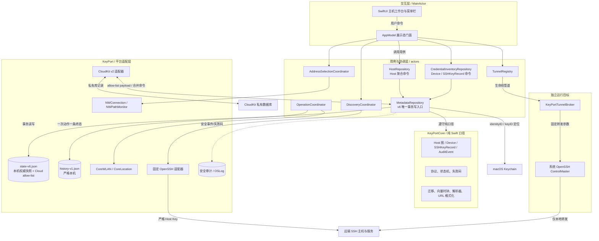
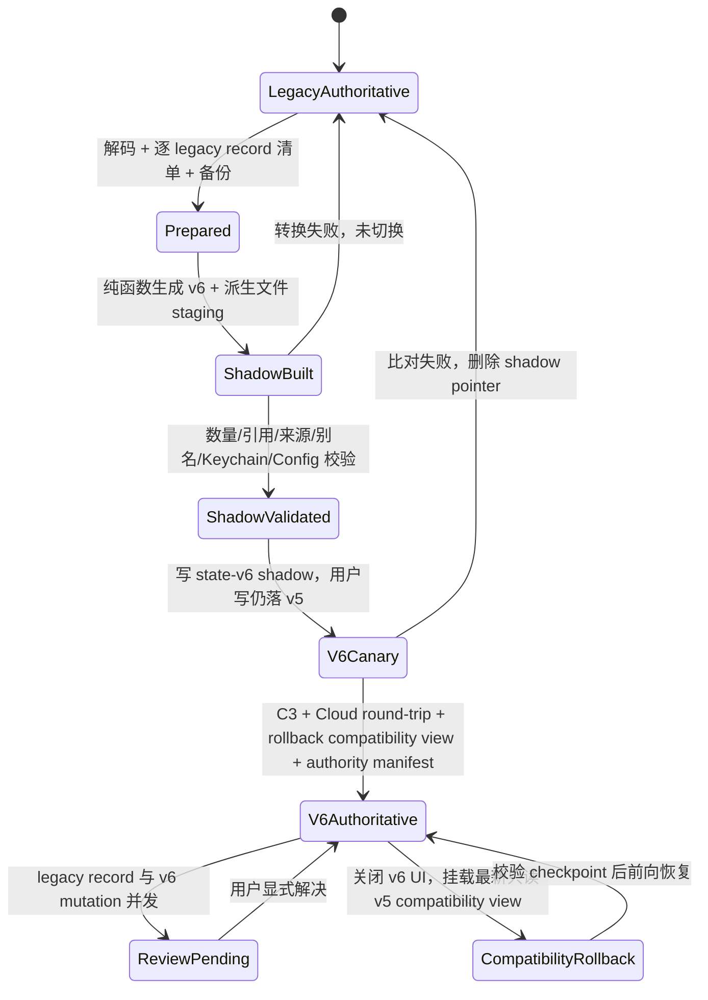
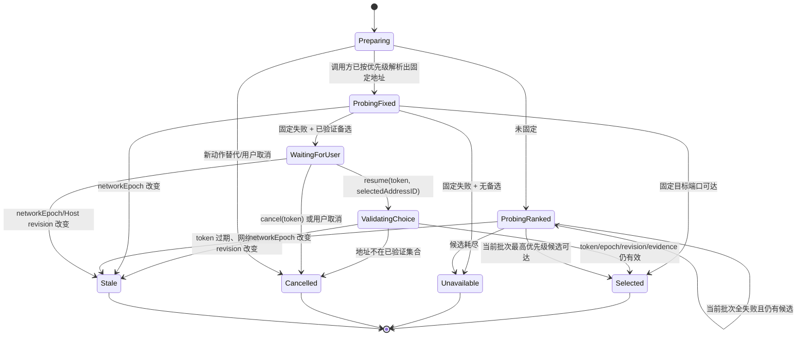
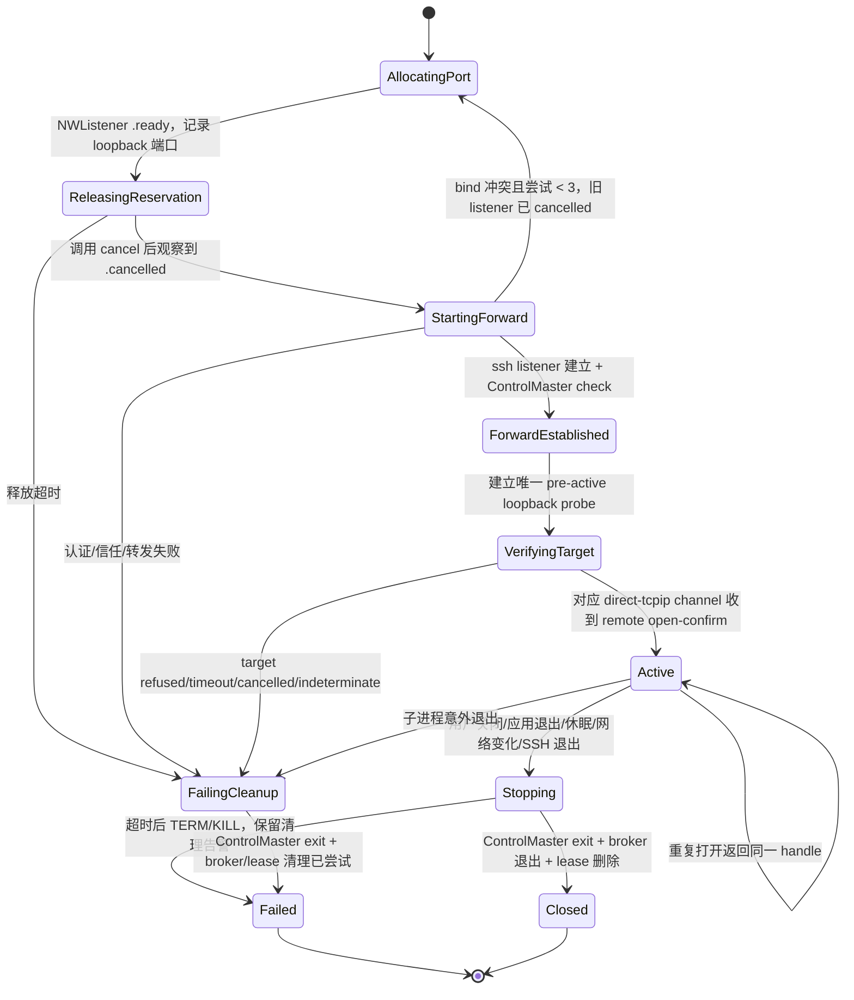

# KeyPort 主机工作台技术架构与迁移契约

- Issue: JODER-10
- 输入基线: JODER-8 已批准产品方案与 12 个验收场景
- 代码基线: `d25456d` (`origin/main`)
- 方案日期: 2026-08-25
- 独立评审修订: 2026-08-25 / revision 2
- 结论: **go with conditions**

本文只定义首版承重技术口径，不改变 JODER-8 的产品范围、页面顺序或服务类型。文中的 `Host` 是稳定的物理机或虚拟机对象；“可达”“SSH 可信”“本次访问方式”始终是三个独立状态轴。

## 1. 结论与进入实施的条件

首版可以在现有 SwiftPM、SwiftUI、系统 OpenSSH、版本化 JSON 和 CloudKit 私有库之上实施，不需要引入 SwiftData、后台守护服务、局域网扫描、系统 hosts/DNS/代理修改或第三方 SSH 协议栈。选择在现有两层模块内增加纯领域契约和平台适配器，并新增一个职责单一的 `KeyPortTunnelBroker` 可执行目标，用父进程生命线托管 OpenSSH 转发。

以下条件必须在对应功能开关打开前完成；它们不是隐含扩容：

| 条件 | 负责人 | 可验证门禁 | 未满足时的结论 |
| --- | --- | --- | --- |
| C1 隧道来源语义 | 所有者 | 接受隧道 URL 为 `http(s)://127.0.0.1:<port>`；依赖原始 Host header、SNI 或证书主机名的 HTTP(S) 服务不承诺透明工作，KeyPort 不绕过 TLS，也不修改 hosts/DNS/代理 | 对“来源敏感的 HTTP(S) 隧道”是 `no-go`；直连 HTTPS、普通 HTTP 隧道和通用 TCP 不受影响 |
| C2 SSID 权限 | macOS 平台实现负责人 | 使用真实团队签名包，在 macOS 14 与当前发布目标上完成允许、拒绝、系统关闭、授权撤销四组实验；拒绝后 SSH/发现/访问验收 100% 通过 | 保持网络提示开关关闭，不阻断其他能力 |
| C3 跨版本 CloudKit 与写权切换 | 数据/同步实现负责人 | 两台 Mac 以 v5/v6、v6/v6 组合验证；Host 图、Device、SSHKeyRecord、Authorization、NodeAssociation、Pin 来源、墓碑和本机 AuditEvent 数量均符合迁移清单；所有非撤销设备写入升级确认后才签发 v6 authority manifest | 不进入 `v6Authoritative`，继续以 v5 写入、v6 影子比对 |
| C4 发现、目标验证与崩溃清理 | SSH/平台实现负责人 | Linux/macOS fixture 覆盖 IPv4/IPv6、权限不足、容器宿主可见端口和大输出；隧道矩阵覆盖 listener 延迟取消、目标接受/拒绝/超时及失败清理；活动隧道 `SIGKILL` 主应用后 2 秒内端口关闭 | 不开放发现/隧道功能开关 |

C1 是唯一需要所有者确认的产品表达边界。若期望任意 HTTPS/虚拟主机服务在隧道后仍保持原始来源语义，需要受管浏览器代理、本地 TLS 终止或 DNS/hosts 介入，均超出已批准首版且扩大安全边界，本方案明确拒绝。

## 2. 已验证事实、实验与假设

### 2.1 仓库事实

- `Package.swift:4-33` 只有 `KeyPortCore`、主应用、AskPass 与检查/测试目标，最低 macOS 14；主应用链接 AppKit、CloudKit、LocalAuthentication 和 Security。
- `Sources/KeyPortCore/Models/DomainModels.swift:127-185` 的 `ServerConnection` 同时拥有端点、账号、别名、Host Key、运行状态和机器配置；`187-234,304-348` 的 `Device`、`SSHKeyRecord`、`AuditEvent` 也都在当前 v5 `AppSnapshot` 中，不能在 Host 模型迁移时遗漏。
- `Sources/KeyPort/Stores/SnapshotStore.swift:17-27` 以单一 JSON 文件原子保存，并设置 `0600`；`Sources/KeyPort/Support/KeyPortPaths.swift:16-25` 的当前路径是 `state-v1.json`。
- `Sources/KeyPort/Stores/AppModel.swift:701-725` 在主 Actor 加载、迁移并持久化整个快照；`845-1011` 保存账号时同时写 Keychain、Host Key、授权、SSH Config 与快照，尚无可恢复事务日志。
- `Sources/KeyPort/Services/Keychain/KeychainService.swift:89-113,157-188` 以旧 `ServerConnection.id.uuidString.lowercased()` 作为 generic-password account；因此 ID 可原样继承，无需搬运秘密。
- `Sources/KeyPortCore/SSHConfig/SSHConfig.swift:92-121` 以账号 ID 聚合并输出稳定别名；`Sources/KeyPort/Services/SSHConfig/SSHConfigService.swift:41-61` 只写 KeyPort 管理文件与一条幂等 Include。
- `Sources/KeyPortCore/Models/ServerConnectionGrouping.swift:55-67` 会把 hostname 大小写与尾点差异归为同一 endpoint；`Sources/KeyPort/Services/HostKey/HostKeyService.swift:25-47` 则逐字保存 `ssh-keyscan` 原始行，写文件时只对完全相同的行去重。逻辑 Pin 与原始行 multiplicity 因此必须分层建模。
- `Sources/KeyPort/Services/CloudSync/CloudSyncService.swift:132-203,241-247` 以一个 `KPMetadata/keyport-metadata-v1` 记录保存脱敏快照，并用 `.ifServerRecordUnchanged` 做 CAS；`Sources/KeyPortCore/Support/CloudMetadataSnapshotPolicy.swift:16-36,137-155` 当前只按 ID、整数版本和时间合并。
- `Sources/KeyPortCore/Support/CloudMetadataSnapshotPolicy.swift:7-12,39-78` 当前同步 Device、公钥和 Authorization，剥离 `isCurrent`、私钥路径/本机可用性，并把 AuditEvent 恢复为严格本机状态；`MetadataArchive.swift:27-44` 同样同步公钥元数据但剥离私钥定位、当前设备和审计。v6 必须保持该 allow-list，而不是只列 Host 新实体。
- `Sources/KeyPort/Support/ProcessRunner.swift:19-55` 会同步等待子进程，未提供超时、Task 取消、输出上限或长期进程托管，不能直接复用为发现/隧道运行时。
- `Sources/KeyPort/App/ContentView.swift:13-27,203-249` 已有三栏结构；`Sources/KeyPort/App/KeyPortMenuBarView.swift:31-114` 目前只显示已授权 SSH 别名；`Sources/KeyPort/Features/Servers/ServerListView.swift:9-58` 仅在 UI 按端点聚合账号。
- `Resources/KeyPort.entitlements:5-20` 与 `script/build_and_run.sh:63-91` 尚无网络提示所需的平台声明和使用说明。

### 2.2 本轮验证证据

- `./script/test.sh` 通过：32 个 XCTest、`KeyPortCoreChecks` 和 AskPass 受保护 FIFO 集成检查全部成功。
- Xcode 当前 macOS 26.5 SDK 的 CoreWLAN 头文件明确说明：SSID 仅在 Location Services 开启且用户授权应用后可用；Apple 的 `CWInterface.ssid()` 与 Core Location 授权文档见文末。
- 当前 SDK 的 `NWPathMonitor` 是网络变化观察器，`NWConnection` 可取消；本地 `NWListener` 只有设置 `newConnectionHandler` 后才能以系统分配端口进入 `.ready`，实验取得动态端口 `54783`。SDK 头文件同时明确 `NWListener.cancel()` 异步完成，端口交接必须等到 `.cancelled`，不能以 `cancel()` 返回作为释放证据。
- Foundation 实验中，`URLComponents.host = "2001:db8::1"` 生成 `nil`，显式使用 `[2001:db8::1]` 后生成 `https://[2001:db8::1]:8443/status`；URL 构造器必须自行处理 IPv6 方括号。
- `/usr/bin/ssh -G -N -o ExitOnForwardFailure=yes -L '127.0.0.1:55000:[::1]:8080' example.invalid` 返回 0，确认当前 OpenSSH 接受带方括号的 IPv6 转发目标。
- OpenSSH `ExitOnForwardFailure` 只保证转发监听建立，不保证后续 `direct-tcpip` channel 能连接最终目标；ControlMaster check 也只证明 master 存活。二者只能形成 `forwardEstablished` 证据，不能形成 `targetAccepted` 证据。
- 本机 `/usr/sbin/lsof -nP -a -iTCP -sTCP:LISTEN -F0pcnT` 字段模式返回可解析的 PID、命令、端点和 TCP 字段；实验只统计字段数，未保存或输出具体监听内容。

### 2.3 尚未被代码或本机证明的事实

- 真实 CloudKit 双设备冲突、iCloud Keychain 跨设备命中、真实 Linux `ss` 输出、远端权限不足、OpenSSH 崩溃清理和 SSID 授权必须由 C2-C4 的环境验收完成。
- JODER-8 没有承诺通过隧道保持 HTTP Host/TLS SNI；本方案把该事实作为 C1 明示条件，不自行扩展为本地代理或证书管理。

## 3. 方案比较与架构决定

| 方案 | 优点 | 代价/风险 | 决定 |
| --- | --- | --- | --- |
| A. 规范化 v6 快照 + 现有 CloudKit CAS + 平台适配器 | 保留当前 JSON/Actor/CloudKit 经验；实体可独立合并；Keychain/别名 ID 可原样继承；回滚路径短 | 仍是单 CloudKit payload，需要大小保护；需要一次显式迁移 | **采用** |
| B. 保留 `ServerConnection`，只增加 Host UI 聚合视图 | 改动最少，短期 UI 快 | 多地址、服务、Host Key 和删除没有唯一所有者；共享字段继续复制；迁移与 Cloud 冲突无法收口 | 拒绝，不能满足 JODER-8 的一等 Host 语义 |
| C. SwiftData + 每实体 CloudKit 记录 | 查询和大规模同步更自然 | 同时替换持久化、迁移和同步栈；当前 SwiftPM/JSON 测试接缝全部重做；首版回滚与签名风险显著上升 | 首版拒绝；单 payload 达到大小门禁后再立项 |

ADR-1：`Host` 是逻辑聚合根，实体在物理快照中规范化为独立数组，以便地址、身份和服务分别合并。Host 子实体命令经过 `HostRepository`，但所有数组的最终读改写和跨聚合后置条件只由 `MetadataRepository` 的单次事务完成；UI 不再直接修改 `AppSnapshot`。

ADR-2：不新增业务 library target。纯模型、迁移、合并、解析和格式化继续进入 `KeyPortCore`；Network/CoreWLAN/CloudKit/Process/AppKit 适配器留在 `KeyPort`。只新增 `KeyPortTunnelBroker` executable target，因为崩溃清理需要独立进程生命线，而不是代码分层需要新模块。

ADR-3：CloudKit 新旧代际使用不同记录名。v6 读取 `keyport-metadata-v2`，兼容期只把 v1 变更单向导入 v2，不把无法完整表达的 Host/Service 反写 v1，从结构上防止旧客户端删除新字段。

ADR-4：v6 本机文件的唯一事务入口改为 `MetadataRepository`。`HostRepository` 只拥有 Host 聚合命令，`CredentialInventoryRepository` 只拥有 Device/SSHKeyRecord 命令，二者通过 `MetadataRepository.transact` 完成跨聚合原子写；UI 和 Cloud adapter 都不得直接替换数组。

ADR-5：Host Key 采用一个逻辑 `HostKeyPin` 加零到多个 `KnownHostsLine` 来源行。拒绝把 raw line 塞进 Pin 唯一键，也拒绝按 legacy identity 各造一份独立信任状态；前者会碰撞/折叠，后者会让同一地址出现互相漂移的信任结论。

ADR-6：在 C3 完成前 v6 只能影子构建，v5 保持唯一写权；切到 v6 写权后，旧 v1 只作为逐记录外部输入。拒绝“恢复升级前备份后继续写”作为 post-authority 回滚，因为它会把已提交的 v6 变更变成不可见丢失；post-authority 只允许由最新 v6 checkpoint 生成的只读兼容视图，并以前向恢复返回可写状态。

ADR-7：隧道成功采用“端口 reservation 确认释放 -> OpenSSH forward 建立 -> 经该本地端点触发的唯一 `direct-tcpip` channel 获得远端 open-confirm”三段门禁。拒绝 master-only 判据，也拒绝只看本地 `NWConnection.ready`，因为前者没有发起目标连接，后者可能在远端 channel 被拒绝前已完成本地 TCP 握手。系统 OpenSSH 没有稳定结构化 channel API，首版用 bounded DEBUG1 recognizer 并以支持版本 fixture fail closed；若 C4 不能稳定识别，则隧道子功能保持 no-go，而不是退回假成功。

## 4. 技术架构与依赖方向

本图是详细设计的逻辑 + 运行时视图，回答稳定技术单元、状态所有权与外部边界；步骤和分支另见后续状态图。



图例：圆柱表示持久状态；实线表示同步命令/依赖；双向线表示同步；虚线表示旁路审计。CloudKit、Keychain、系统 OpenSSH 与远端主机均按不可靠外部依赖处理，失败不得破坏本地同步口径。

依赖方向固定为：`Views -> AppModel -> UseCases -> KeyPortCore protocols/domain`。`HostRepository` 与 `CredentialInventoryRepository` 依赖同一个 actor 隔离的 `MetadataRepository` 事务端口，不能互相调用或各自落盘。平台实现依赖 `KeyPortCore`，`KeyPortCore` 不反向导入 SwiftUI、CloudKit、Network、CoreWLAN 或 AppKit。`KeyPortTunnelBroker` 不依赖主应用，也不暴露任意命令入口。

## 5. 数据所有权、稳定 ID 与不变量

### 5.1 同步实体

所有同步实体携带 `SyncStamp`：

```swift
public struct SyncStamp: Codable, Hashable, Sendable {
    public var vector: [String: UInt64]       // device/<id> or legacy-v1/<kind>/<id> -> counter
    public var mutationID: UUID
    public var updatedAt: Date
}

public protocol SyncedEntity: Identifiable, Codable, Sendable {
    var stamp: SyncStamp { get }
    var deletedAt: Date? { get }
}
```

| 实体 | 稳定 ID | 命令所有者与主要字段 | 引用 |
| --- | --- | --- | --- |
| `Host` | 新建随机 UUID；迁移为固定 namespace + `legacyEndpointKey` 的 UUIDv5 | `HostRepository`；名称、分组、机器配置、Host 级固定地址、时间、墓碑 | `fixedAddressID?` |
| `AccessAddress` | 新建随机 UUID；迁移为 HostID + endpoint key 的 UUIDv5 | `HostRepository`；规范化 DNS/IP、SSH 端口、原字面 endpoint label、来源、用户排序、墓碑 | `hostID` |
| `SSHIdentity` | **直接继承旧 `ServerConnection.id`** | `HostRepository`；用户名、稳定别名、身份级首选地址、时间、墓碑 | `hostID`, `preferredAddressID?` |
| `Device` | **直接继承 v5 `Device.id`**；新设备继续使用 `KeyPort.deviceID` 持久字符串 | `CredentialInventoryRepository`；名称、注册/最近活动、`deletedAt`（领域语义为 revoked）、Tailscale identity、stamp；`isCurrent` 是本机派生值，不进实体 | 无 |
| `SSHKeyRecord` | **直接继承 v5 `SSHKeyRecord.id`**；新密钥继续用 `key_*` ID。v6 合并键是 ID，不再用 fingerprint 折叠不同 ID | `CredentialInventoryRepository`；kind、公钥、fingerprint、origin、墓碑；私钥路径/agent/本机可用性为本机 overlay | `deviceID`（允许指向已撤销但仍保留的 Device） |
| `HostKeyPin` | UUIDv5(`addressID + algorithm + fingerprint`) | `HostRepository`；只保存逻辑信任状态、确认/替换时间，不保存单一代表 raw line | `hostID`, `addressID` |
| `KnownHostsLine` | 迁移为 UUIDv5(`pinID + legacyIdentityID + SHA256(rawLine) + duplicateOrdinal`)；ordinal 是同 identity 内字节相同 raw line 的从 0 重复序号，与数组重排无关。新确认以 operationID 代替 legacyIdentityID | `HostRepository`；逐字 raw line、来源类型、来源 identity/operation、墓碑 | `pinID` |
| `SavedService` | 用户确认保存时生成随机 UUID | `HostRepository`；名称、协议、远端监听、路径、收藏、服务级固定地址、墓碑 | `hostID`, `fixedAddressID?` |
| `Authorization` | 保持 `identityID:fingerprint`；旧 `serverID` 解码键兼容 | `HostRepository`；远端状态与本地 relation lifecycle 分开；metadata detach 不宣称远端 key 已撤销 | `sshIdentityID`, `keyID`（必须解析到活动或墓碑 SSHKeyRecord） |
| `NodeAssociation` | 保持现有逻辑节点 ID | `HostRepository`；原 `serverID` 语义改名为 `sshIdentityID`，解码兼容旧键，新增 stamp/墓碑 | `sshIdentityID` |
| `MergeReview` | UUIDv5(`entityType + entityID + sorted(conflicting mutationIDs)`) | Cloud 合并器创建，`HostRepository`/`CredentialInventoryRepository` 按目标类型解决；保存结构化脱敏候选、阻断等级、`resolvedAt` 与 resolution mutation | `entityType`, `entityID` |
| `LegacySourceRevision` | `legacyKind + legacyID`；如 server UUID、Authorization ID、Device/Key/Node ID | 迁移器；版本/修订、规范内容 SHA-256、删除位、所贡献的 entity IDs；是同步内部元数据，不向 UI 暴露 | 所有派生 entity IDs |

`Host.notes` 不进入同步实体。现有备注迁入 `LocalHostAnnotation(hostID, legacyIdentityID, notes)`；保留来源 identity 是为了同 endpoint 多账号备注不相等时可逆，不把确定性代表误当成唯一原文。认证检查与旧状态迁入 `LocalSSHIdentityState`，AuditEvent 由独立的 `LocalAuditRepository` 拥有，但三者都随 `MetadataRepository` 的同一 `state-v6.json` atomic replace 落盘。

Pin 与原始行必须满足以下分层：一个逻辑 Pin 可以拥有任意多个 `KnownHostsLine`，包括字节完全相同的两行；信任判断只看 Pin，known_hosts 派生文件取所有活动来源行的 `sorted(unique(rawLine))`。因此 `DB.EXAMPLE.COM.` 与 `db.example.com` 可以映射到同一 Address/Pin 而仍保留两条不同原文，同 endpoint 多账号的相同原文也保留两个来源记录。删除或替换 Pin 不删除来源证据，只给 Pin/line 写墓碑；恢复可按来源重建。

服务监听结构固定为：

```swift
public enum ServiceProtocol: String, Codable, Sendable { case http, https, tcp }
public enum ListenerBind: Codable, Hashable, Sendable {
    case loopbackV4, loopbackV6, wildcardV4, wildcardV6
    case specific(IPAddress)
}
public struct RemoteServiceEndpoint: Codable, Hashable, Sendable {
    public var bind: ListenerBind
    public var port: UInt16
    public var path: String?      // http(s) only, normalized to leading slash
}
```

### 5.2 本机、Cloud 与归档 allow-list

`state-v6.json` 是本机完整权威 envelope，顶层明确分为 `synced`、`local` 和 `migrationProvenance`；Cloud 和 archive 各自由专用 payload DTO 编码，禁止直接编码整个 envelope。v6 加密归档使用 container version 2；v6 importer 仍接受现有 version 1，先解出 v1-v5 `AppSnapshot` 再走本节迁移。旧应用对 version 2 必须报 unsupported，不得部分解码。

| 数据 | `state-v6.json` | Cloud `KPMetadataV2` allow-list | 加密 archive v2 allow-list |
| --- | --- | --- | --- |
| Host、Address、Identity、Pin、KnownHostsLine、Service、Authorization、NodeAssociation、MergeReview、墓碑、stamp | 完整 | 是；只含表 5.1 字段 | 是 |
| Device | 完整 + 本机派生 `isCurrent` | `id/name/registeredAt/lastActiveAt/deletedAt/tailscaleIdentity/stamp`；**无 isCurrent** | 同 Cloud；无 isCurrent |
| SSHKeyRecord | 完整 + 本机 overlay | `id/deviceID/kind/publicKey/fingerprint/origin/deletedAt/stamp` | 同 Cloud |
| `privateKeyPath/isInAgent/isLocallyAvailable` | 是，本机 overlay | **否** | **否** |
| `LegacySourceRevision` 与 authority/rollback manifest | 是 | 是；不含路径、设备本地 flag 或原始 v1 payload | 是，用于重复导入和前向恢复 |
| Host/Identity 本机备注、旧 `AuthorizationStatus/statusDetail/lastCheckedAt/passwordCheck/keyCheck/machineConfigurationRefreshAttemptedAt` | 是 | **否** | 是；detail 先过敏感文本过滤 |
| `AuditEvent` | 是；沿用 UUID，按原顺序迁移，最多 1000 条 | **否** | **否** |
| 最近可达 evidence | 是，过期即替换 | 否 | 否 |
| `ConnectionRecord`、SSID、进行中 operation | `history-v1.json`，`0600` | **否** | **否** |
| `DiscoverySession`、`DiscoveryCandidate`、原始命令输出 | 内存；页面关闭即丢弃 | 否 | 否 |
| `TunnelHandle` | `TunnelRegistry` 内存 | 否 | 否 |
| crash lease（仅 tunnelID/controlPath/brokerPID/时间） | runtime 目录；关闭/下次启动清理 | 否 | 否 |
| 密码 | Keychain，account = `SSHIdentity.id` | 否 | 否 |
| 私钥文件 | `~/.ssh/keyport/identities` | 否 | 否 |

Cloud decode/merge 后必须按 ID 从 pre-merge 本机 envelope 恢复所有 local overlay 与 AuditEvent；远端 payload 中若出现 allow-list 外字段，解码器忽略并记稳定 `unexpectedCloudField`，绝不把它写入本机 overlay。Archive export 的 forbidden fixture 必须同时扫描私钥路径、agent flag、isCurrent、AuditEvent、SSID、BSSID、历史和 raw discovery。

### 5.3 强制不变量

1. 每个活动 Address/Identity/Pin/Service 必须引用活动 Host；每个活动 KnownHostsLine 必须引用活动 Pin；墓碑可以保留历史引用。
2. 活动 `SSHIdentity.alias` 在 KeyPort 范围和用户已有字面 SSH Host 别名中唯一。
3. `Host.fixedAddressID`、`SSHIdentity.preferredAddressID` 和 `SavedService.fixedAddressID` 若存在，必须指向同一 Host 的活动地址。涉及 SSH 身份的服务动作按“服务级固定 > 身份级首选 > Host 级固定”解析；不涉及身份时按“服务级 > Host 级”解析。
4. 活动 SSH 身份至少存在一个带合法 SSH 端口的活动地址，否则身份进入不可用展示态，不得生成 SSH Config。
5. 同一地址 + 算法最多一个 `confirmed` Pin；旧指纹只能是 `replaced`，冲突只能是 `pendingReview`。Pin 至少有一条活动 KnownHostsLine 才能写入 known_hosts；任何 `pendingReview` 或当前扫描 mismatch 都阻止该 Host 的所有 SSH 动作。
6. 端口可达不能提升 SSH 信任；SSH 信任不能提升 HTTPS/TLS 信任；访问方式只描述本次 direct/tunnel/unavailable。
7. 发现候选没有仓储写权限；只有 `confirmService` 命令可以创建或显式更新服务。
8. 连接历史可引用已删除对象，但不得反向阻止墓碑；UI 以“已删除对象”显示。
9. 每个 Authorization.keyID 必须解析到活动或墓碑 SSHKeyRecord；每个 SSHKeyRecord.deviceID 必须解析到活动或已撤销 Device。缺失引用是 `invariantFailed`，不得切换 authority。
10. 同一 active SSHKeyRecord ID 只能对应一个 fingerprint；同 fingerprint 的不同 legacy key ID 不折叠，避免 Authorization.keyID 悬空。retire key 时，任何 `remoteState != revoked` 的 active 或 detached Authorization 都算引用，不能因 relation tombstone 绕过远端风险。
11. 删除 Host/Identity 不自动删除远端公钥、不删除不属于该聚合的 Device/SSHKeyRecord，也不触碰 hosts、DNS、resolver、路由或防火墙。
12. Authorization 的 `deletedAt/relationState=detached` 只表示 KeyPort 关系已隐藏；只有远端撤销命令成功后才能写 `remoteState=revoked`，历史状态不得伪造。
13. 未解决且为 blocking 的 MergeReview 必须阻止目标实体及引用它的动作；目标被删除时 review 以 `resolvedByTargetDeletion` 收口，不留活动 review 引用墓碑目标。
14. 每个同步写命令携带 `commandID` 与 `expectedMutationID`；不匹配返回 `staleRevision`，不做隐式覆盖。

### 5.4 并发与 Cloud 冲突

整数版本 + 时间无法证明两个离线写入的因果关系。v6 对每个实体使用小型版本向量：一方向量支配另一方时取支配者；互不支配即为并发冲突。并发冲突不做 LWW：合并器选择 mutation ID 字典序较小者作为临时展示值，同时创建 `MergeReview` 保存两份结构化、已脱敏候选。

- 名称/分组冲突允许浏览，但标记待确认。
- 地址归属、固定地址、用户名/别名、Host Key、删除与更新并发冲突会阻止对应连接/发现/隧道动作。
- 用户解决冲突时，新写入先 join 两个版本向量，再递增当前设备计数，因此结果因果上支配两份候选。
- 墓碑因果上晚于更新时获胜；墓碑与更新并发时 UI 隐藏对象但保留更新候选，允许显式恢复。v1 不物理清除同步墓碑，避免离线设备复活数据。
- `MergeReview` 的候选 mutation 集合、ID 和默认展示候选均按字节排序；重复合并不新增 review。解决后记录 resolution mutation，后续相同候选不会再次打开；只有出现不被 resolution vector 支配的新候选才创建新 review。

### 5.5 删除事务、幂等与恢复

下表中的“墓碑”都在一次 `MetadataRepository.transact(commandID, expectedMutationID)` 内完成；先计算完整 next snapshot 并验证 5.3 的后置条件，再以一次 atomic replace 提交。相同 commandID 返回已记录结果，不重复递增向量；新的 delete 命令遇到已满足的墓碑也返回 no-op。除具名的 `revokeAuthorization` 两阶段远端动作外，模型提交后才执行派生文件、Keychain、隧道和其他外部动作。

| 命令 | 同一模型事务的后置条件 | 必须拒绝的情况 | 事务外动作/恢复 |
| --- | --- | --- | --- |
| `deleteHost` | Host、全部 Address/Identity/Pin/KnownHostsLine/Service、对应 Authorization/NodeAssociation 写墓碑；相关 MergeReview 记 `resolvedByTargetDeletion` | 任一目标有并发 mutation 或 expectedMutationID 过期 | 关闭相关 tunnel；重建 config/known_hosts；Identity credential 清理可 pending。Authorization 记 `detached/remoteStateUnchanged`；任一远端授权未确认 revoked 时，已提交结果必须带 `remoteAuthorizationMayRemain`，不伪称远端撤销 |
| `deleteIdentity` | Identity、其 Authorization/NodeAssociation 写墓碑；Host/Address/Service/Device/SSHKeyRecord 保留；相关 review 收口 | identity 正被另一事务更新 | 删除该 identity 的 Keychain password、重建 config、关闭相关 tunnel；失败进入 journal 重试。任一 detached Authorization 的远端状态未确认 revoked 时，已提交结果带 `remoteAuthorizationMayRemain` |
| `deleteAddress(referencePolicy:)` | 该 Address 及其 Pin/KnownHostsLine 写墓碑；调用方必须对所有 fixed/preferred 引用显式选择 `.clear` 或 `.replace(addressID)`，并在同一事务执行 | 仍有引用但未提供完整 policy；replacement 非同 Host 活动地址；或它是活动 Identity 的最后地址且本命令不同时删除这些 Identity | 关闭使用该地址的 tunnel并重建 known_hosts；不自动选择 replacement |
| `deleteService` | Service 写墓碑，其他同步实体不变 | revision 过期 | 关闭 service tunnel；历史保留 |
| `retireSSHKey` | SSHKeyRecord 写墓碑；Device 保留 | 任一 active/detached Authorization 引用该 keyID 且 `remoteState != revoked`，返回 `keyStillAuthorized` | 私钥删除是单独确认的 journal step；失败为 `keyMaterialCleanupPending`，公钥元数据墓碑仍保留 |
| `revokeDevice` | Device 写 `deletedAt`（展示为 revoked）；其 key/auth 不级联，仍作为远端授权事实展示并带 revoked-device warning | 当前设备尝试撤销自己且没有另一活动设备接管 authority | 撤销只阻止该 deviceID 产生新向量；不删私钥、不远程撤权 |
| `revokeAuthorization` | **仅在远端命令成功后**写 `remoteState=revoked` 与墓碑 | Host Key 未确认、远端失败或 keyID 缺失 | 失败不改模型；Host/Identity 删除产生的是 `detached`，不是此命令 |
| `resolveMergeReview` | join 全部候选向量，写 resolution mutation 并设置 `resolvedAt`；目标已墓碑时只允许 `resolvedByTargetDeletion` | 候选集合在提交前变化 | 无外部副作用；重复 resolve 幂等 |
| `clearAuditEvents` | local audit array 在同一次 atomic replace 中变为空；不产生同步 stamp/墓碑 | 无；单条删除 API 不存在 | 相同 commandID 幂等；只写不含目标内容的 OSLog 稳定码，ConnectionRecord/history 不受影响 |

配置/Keychain 与模型不在同一原子域。每个事务先写 mutation journal，再提交模型，再执行具名 step；启动时按 commandID 恢复未完成 step。`revokeAuthorization` 是唯一反向顺序：先 journal prepared，再执行远端撤销，再把 remote result 写 journal，最后提交模型；模型写失败时从已记录 remote result 收口，绝不盲目重发。config/known_hosts 失败保留旧文件备份并显示 `derivedConfigOutOfDate`；credential/私钥失败显示对应 cleanup pending。任何恢复都从已提交 snapshot 重算派生内容，绝不回滚模型墓碑，也不通过模糊 PID/路径删除未知资源。

AuditEvent 不是同步实体：append 时生成 UUID，按 timestamp + insertion order 保留最新 1000 条；超过上限只在新 append 的同一 local transaction 中删除最旧项。v5 -> v6 迁移本身不得触发 retention，输入超过 1000 条时以 `invariantFailed` 停在旧模型而不是截断。其唯一删除入口是上表的全量 clear。

## 6. v5 -> v6 迁移、CloudKit 兼容与回滚

### 6.1 迁移状态机

本图回答一次升级如何准备、验证、取得写权、失败恢复和回滚；“文件已生成”不等于“v6 已取得写权”。待确认冲突由用户负责解决，迁移器不猜测。



### 6.2 文件与 Cloud 代际

- 保留原 `state-v1.json`，升级前复制到 `backups/<timestamp>/state-v1.json` 并记录 SHA-256、权限和代码版本。它只对 pre-authority 回退有写权，v6 首次用户 mutation 后永远不得再标为当前权威源。
- v6 权威本地文件为 `state-v6.json`；迁移/next-state staging、`migration-journal.json`、`authority-manifest.json`、每次成功提交对应的 committed checkpoint 和 `state-v1-compat.json` 也位于应用支持目录，均为 `0600`。manifest 至少记录 v1/v6/compat/checkpoint hash、已确认 device IDs、Cloud change tag、首个 v6 mutationID 与代码版本。
- 同一备份清单保存 `~/.ssh/keyport/config` 与 `known_hosts` 的副本和哈希；私钥不复制，Keychain 不导出。
- CloudKit 使用新 record type/name `KPMetadataV2/keyport-metadata-v2`。现有 `KPMetadata/keyport-metadata-v1` 不覆盖、不删除，旧客户端无法触碰 v2。
- v6 同步期间按 legacy entity 读取 v1 payload，不再用整个 payload hash 或单一 `legacy-v1` 维度裁决。每个源记录的规范 digest、revision 与派生实体集合进入 `LegacySourceRevision`；重复 payload 是 no-op。
- v6 **不反写 Cloud v1**。混合版本期是 v1 -> v2 单向兼容；旧设备看不到新服务/地址。所有未撤销已知 Device 完成升级确认、两台 Mac C3 通过且 `state-v1-compat.json` 校验通过之前，v5 保持唯一用户写权。
- v2 Cloud payload 编码前硬限制 800 KiB；超过时本地继续工作、Cloud 返回 `payloadTooLarge`，不得截断。容量 fixture 至少覆盖 50 Host、每 Host 4 地址/4 身份/20 服务；若超过门禁，发布前改为每实体 CloudKit 记录，不能放宽限制硬推。

### 6.3 确定性转换

1. 解码 v1-v5 后先执行现有 v2-v5 纯迁移，再处理 Host 模型。规范 JSON 使用固定 key 顺序、ISO-8601 UTC 毫秒和小写 UUID；本机 overlay 不进入 synced digest。
2. 对每个旧 `ServerConnection s` 定义 `sourceID = s.id.lowercase`、`dimension = legacy-v1/server/<sourceID>`、`counter = max(1, s.version)`、`digest = SHA256(canonicalSyncedFields(s))`。同一 `(sourceID,counter,digest)` 重放是 no-op；同一 `(sourceID,counter)` 出现不同 digest 返回 blocking `legacyVersionReuse`，绝不选更新时间较大者。
3. `legacyEndpointKey` 严格沿用当前 UI 聚合规则：host 去首尾空白、转小写、去末尾点，再拼 SSH port；不做 DNS、反向 DNS、相似名、共享出口或 Host Key 推断。同 endpoint key 创建一个确定性 Host/Address，不同 endpoint 永不自动合并。
4. 派生实体的 legacy vector 是**所有贡献 source 维度的逐项 max union**；legacy mutationID 为 UUIDv5(`entityType + entityID + sorted(sourceID:counter:digest)`)。例如 A(version 10) 与 B(version 1) 合成 Host 时向量为 `{A:10,B:1}`；B 更新到 2 后得到 `{A:10,B:2}`，严格支配旧 Host，不会被 A 的 10 吞掉。
5. 每个旧 ServerConnection 创建一个同 ID `SSHIdentity`，只带自己的 `{sourceID:version}`；username、alias、createdAt、updatedAt、墓碑原样迁移。Host/Address/共享机器配置按 contributor 集合生成；字段不一致时所有候选进确定性 MergeReview，临时展示候选按 sourceID 排序，来源不丢。
6. 每个旧 `confirmedHostKeys` 先按 `(algorithm,fingerprint,rawLine bytes)` 规范分组，再给同 raw line 的重复项分配从 0 开始的 duplicateOrdinal；据此生成逻辑 Pin 和 KnownHostsLine。Pin 可合并，来源行不可合并；数组重排不改变 line ID。算法/指纹冲突创建 blocking review；完全相同 raw line 的多重来源仍保留多条 provenance。
7. contributor 删除规则固定：Identity 直接跟随自己的 source 墓碑；Host/Address 在至少一个 contributor active 时保持 active；KnownHostsLine 跟随来源 source，Pin 在至少一条来源 line active 时保持 active；共享字段只从 active contributor 组装，已删除候选仍留在 provenance/review 中。不得因 B 删除而级联删除仍由 A 支撑的 Host/Pin。
8. Device 按原 ID 复制；`isCurrent` 丢弃后由当前 `KeyPort.deviceID` 重算。v5 Device 没有 version，固定用 `legacy-v1/device/<id>` 维度，counter 为 `max(1, floor(lastActiveAt.timeIntervalSince1970 * 1000))`，digest 覆盖除 isCurrent 外的同步字段；相同 counter/digest 重放是 no-op，相同 counter 不同 digest 创建 blocking review。`isRevoked=true` 另加入 `legacy-v1/device-revocation/<id>:1`，确定性映射为 `deletedAt=lastActiveAt`；后续不带 revocation 维度的 active v1 候选与墓碑并发，按 5.4 保持隐藏，只有显式 v6 restore resolution 才能恢复。SSHKeyRecord 按原 key ID 复制并视为 immutable，固定维度为 `legacy-v1/key/<id>:1`；同 ID 相同 digest 重放是 no-op，不同 device/fingerprint/publicKey/origin 是 blocking `legacyImmutableKeyConflict`，同 fingerprint 不同 ID 不折叠。
9. Authorization 用自己的 `version` 形成 `legacy-v1/authorization/<id>` 维度，`serverID` 原值映射为 sshIdentityID，keyID 原值必须解析；NodeAssociation 使用自己的 revision 形成 `legacy-v1/node/<id>` 维度并保持 target。两者的派生 vector 还要 join 被引用 Identity 的 lifecycle vector：Identity 墓碑时，Authorization 强制为 `detached/remoteStateUnchanged`、NodeAssociation 强制墓碑，即使各自 legacy source 仍 active；source provenance 不改，Identity 经显式 resolution 恢复且 relation source 仍 active 时才能重新投影。缺 key/device/identity 引用直接 `invariantFailed`。
10. AuditEvent 按 v5 数组顺序与 UUID 逐条复制到 local partition，不进向量；最多 1000 条时数量必须仍为 1000。每个 identity 的 status/statusDetail/lastCheckedAt/passwordCheck/keyCheck/machineConfigurationRefreshAttemptedAt 逐字段复制到 LocalSSHIdentityState；Host notes 以 legacyIdentityID 保留全部来源。
11. v6 设备上的新 mutation 先保留完整 legacy vector，再递增 `device/<currentDeviceID>`。因此当前 `{A:10,B:1,device:X=1}` 与后来 v1 B=2 互不支配，必须产生 review，而不是让任一方覆盖另一方。
12. 整体转换是 `sorted LegacySourceRevision set + local overlay -> outputHash` 的幂等纯函数；相同输入必须产生字节等价快照、相同 mutationID 和相同 review ID。

### 6.4 无损证明门禁

| 资产 | 证明方式 |
| --- | --- |
| Keychain 定位 | 对迁移前每个 ID 记录 local/synchronizable/missing 三态；迁移后以相同 ID 查询，矩阵必须完全相等。迁移器从不读出或重写密码值 |
| SSH 别名 | 活动别名 multiset 与 identityID -> alias 映射完全相等；用新模型渲染 managed config 后，对每个别名运行 `ssh -G` 比较 hostname/port/user/identityfile/knownhosts |
| Host Key | 对每个 `(legacyIdentityID,rawLineDigest,duplicateOrdinal)` 恰有一条 KnownHostsLine，rawLine/algorithm/fingerprint 完全相等；provenance raw-line multiset 与 v5 完全相等且数组重排不改 ID。Pin 数量允许因逻辑合并变少，known_hosts 派生文件必须等于 v5 当前 `sorted(unique(rawLine))` |
| Device | ID/name/registeredAt/lastActiveAt/revoked/tailscaleIdentity 映射完全相等；当前 Device 只按本机 UserDefaults 重算，不从 Cloud/archive 恢复 |
| 设备密钥 | key ID、device ID、fingerprint、公钥、origin 和本机私钥 path/agent/available overlay 映射完全相等；Authorization.keyID 全部可解析；私钥文件哈希/权限不改 |
| 远端授权 | `identityID + fingerprint` 授权 ID、keyID、状态、时间、墓碑完全相等；迁移不连接远端、不写 authorized_keys |
| NodeAssociation | 旧 serverID 值按 identityID 解码，记录数、revision 和 target 完全相等 |
| 认证与展示状态 | 每个旧 identity 的 AuthorizationStatus、statusDetail、lastCheckedAt、passwordCheck、keyCheck、machineConfigurationRefreshAttemptedAt 逐字段等价；共享 machineConfiguration 候选都有来源或明确 review |
| AuditEvent | UUID、timestamp、category、action、targetID、result、level、数组顺序和数量完全相等；1000 条 fixture 迁移后仍为 1000，Cloud/archive 均为 0 |
| 墓碑 | SSHIdentity 数量与每个旧 ServerConnection ID 的删除状态完全相等；Authorization/NodeAssociation 原墓碑逐项相等；派生 Host/Address/Pin 按 contributor 规则决定 active/tombstone，任何墓碑都不物理清理 |
| 因果与重复执行 | 每个 legacy source 的 revision/digest/派生 ID 集合可反查；A10+B1 -> A10+B2 只更新 B 贡献，重复导入输出 hash/review count 不变 |

任一门禁失败，状态回到 `LegacyAuthoritative`，不签 authority manifest，不改 Keychain/SSH/远端。可复现输入与预期结果见 `Docs/Design/JODER-10/review-fixtures.md`。

### 6.5 写权门禁与可执行回滚矩阵

进入 `V6Authoritative` 必须在同一 commit 中写 authority manifest，并同时满足：6.4 全部门禁、v2 Cloud CAS 写后读 hash 相等、所有非撤销 Device 的 upgrade acknowledgement、无 blocking MergeReview、最新 v6 checkpoint 可生成并验证 `state-v1-compat.json`、派生 SSH config/known_hosts 语义相等。任何一项缺失都只允许 `V6Canary`，用户命令仍写 v5。

v5 compatibility view 以最新 v6 checkpoint 为唯一输入：每个 SSHIdentity 生成一个同 ID ServerConnection，地址按 identity preferred > Host fixed > 活动 Address 稳定 ID 选择；username/alias/Keychain account 不变；只带所选地址的活动 Pin 来源行；Device/SSHKeyRecord/Authorization/NodeAssociation/AuditEvent 与本机认证 overlay 逐项回填。Host-only/额外 Address/Service 等 v5 无法表达的对象只留在 v6，并列入 manifest 的 `notRepresentable`，绝不删除或伪造。该兼容视图不上传 Cloud v1。

| 触发时点 | 权威输入 | 可用能力 | 写入规则 | 恢复/禁止项 |
| --- | --- | --- | --- | --- |
| `LegacyAuthoritative` / `V6Canary` | 当前 state-v1 + 已验证备份 | 完整旧 SSH 能力 | v5 可写，v6 shadow 可重建 | 可恢复备份；不产生 v6 用户 mutation |
| authority 切换后、尚无用户 mutation | state-v6 checkpoint | v6 完整能力 | v6 可写 | 可撤销 manifest 回到 V6Canary，前提是 v1 hash 未变化 |
| authority 切换后已有 v6 mutation | 最新 state-v6 checkpoint | v6 完整能力 | **state-v1 备份永久失去写权** | 只能前向继续，或进入下行只读 compatibility rollback |
| `CompatibilityRollback` | checkpoint 生成且验证过的 state-v1-compat | 连接/查看旧 SSH 身份；v6-only 服务隐藏但不丢 | 禁止 Host/Identity/Key/Auth 编辑，暂停 Cloud v1/v2 写；连接历史仍写本机 | 修复后验证 v6 hash 并回 `V6Authoritative`；不得把 compat 文件改名覆盖 state-v1 |
| v6 当前文件损坏 | 最新 committed checkpoint，或尚未收口但 hash 匹配的 journaled next-state | 最后一次已返回成功的 commit 可表达的能力 | 恢复期间只读 | journal/hash 验证后前向恢复；若两者均不可验证则 `rollbackProjectionInvalid` 并升级所有者 |
| 降级到不认识 v6 的旧 binary | 仅 pre-authority 允许 | 旧能力 | 仅 pre-authority v5 可写 | 首个 v6 mutation 后为 `binaryDowngradeUnsafe`，明确禁止；不得用旧备份掩盖新数据 |

每次 v6 commit 先写 next-state/compat staging、journal 与 hash 并 fsync，再 atomic replace state-v6；随后把同一 next-state bytes 固化为 committed checkpoint、更新 manifest、fsync 目录并清 journal，全部完成后才向调用方返回成功。崩溃恢复按 manifest -> state-v6 -> committed checkpoint -> journaled next-state 的 hash 链选择最后一次已提交 bytes，因此对已成功返回的本机 metadata mutation 目标 RPO 为 0。恢复不读出/搬运 Keychain secret，identity ID、key ID、私钥路径和 alias 均保持；派生文件存在用户手工修改时停止并返回 `artifactMismatch`。v1/v2 Cloud record 均不物理删除，清理由未来独立、可审计且需所有者批准的迁移决定。

## 7. 地址验证与选择协调器

### 7.1 公共契约

```swift
public struct AddressSelectionRequest: Sendable {
    public let operationID: UUID
    public let hostID: UUID
    public let target: ProbeTarget          // ssh or service(UInt16)
    public let fixedAddressID: UUID?        // resolved before call: service > identity > host
    public let candidates: [AddressCandidate]
    public let networkEpoch: UInt64
}

public struct AddressChoiceToken: Hashable, Sendable {
    public let id: UUID                    // opaque; coordinator owns full continuation
    public let operationID: UUID
    public let expiresAt: Date
}

public enum AddressSelectionOutcome: Sendable {
    case selected(AddressDecision)
    case requiresUserChoice(token: AddressChoiceToken,
                            failedFixed: ProbeEvidence,
                            verifiedAlternatives: [ProbeEvidence])
    case unavailable([ProbeEvidence])
    case cancelled(OperationFailureCode)
}

public protocol AddressSelecting: Sendable {
    func select(_ request: AddressSelectionRequest) async -> AddressSelectionOutcome
    func resume(_ token: AddressChoiceToken,
                selectedAddressID: UUID,
                expectedNetworkEpoch: UInt64) async -> AddressSelectionOutcome
    func cancel(_ token: AddressChoiceToken) async -> AddressSelectionOutcome
    func invalidate(before networkEpoch: UInt64) async
}

public protocol ReachabilityProbing: Sendable {
    func probe(_ target: NetworkTarget,
               timeout: Duration,
               operationID: UUID) async -> ProbeEvidence
}
```

### 7.2 状态机与算法

本图回答一次地址选择如何成功、固定地址失败如何交给用户、网络变化如何取消并失效。



固定契约：

- 调用方必须在发起请求前按“服务 > SSH 身份 > Host”解析出至多一个 `fixedAddressID`；任一引用跨 Host、已删除或冲突待确认时直接返回 `invalidAddress`，不降级到低优先级值。
- 使用 `NWConnection` 做目标 TCP 握手，不用 ping，也不把 DNS 解析成功当作端口可达。
- 每个 probe 超时 5 秒；单次最多 3 个并发。按优先级三条一批，等待本批终态后选本批最高优先级成功者；最多验证前 12 条，整体最长约 20 秒，剩余地址只能由用户点选验证。
- 未固定排序依次为：当前 SSID 下最近成功（仅有权限时）、本机最近成功、用户同步的 `sortOrder`、稳定 ID。完成探测后才选择；历史只影响顺序，不生成信任。
- 固定地址失败后可以验证备选，但 outcome 必须是 `requiresUserChoice`；协调器在内存保存 continuation：operationID、hostID、fixedAddressID、已验证 alternative IDs/evidence、networkEpoch、Host mutationID 和 30 秒 expiresAt。调用方只能把返回的 opaque token 交给 `resume`/`cancel`，没有自行构造或替换候选的入口。
- `resume` 只接受同 token、同 operationID、同 networkEpoch、同 Host mutationID 且仍在 30 秒窗口内的已验证 addressID；否则分别返回 `addressChoiceStale` 或 `invalidAddressChoice`，不自动重探也不降级。第一次 selected、stale、invalid 或显式 cancel 都消费 token，并按 operationID 缓存对应终态；任何重复调用幂等返回第一次结果，不允许用第二次 resume 改写选择。
- WaitingForUser 期间 `ConnectionHistoryWriting` 的 inflight 保留；resume/cancel/失效仍沿用原 operationID 并只 finish 一条终态。应用终止时按既有规则收口为 `interruptedByPreviousTermination`。
- `NWPathMonitor` 路径签名变化、Tailscale 状态变化、系统 willSleep/didWake 都递增 `networkEpoch`。旧 evidence 立即展示为 stale；正在运行的 `NWConnection` 和 OpenSSH probe 取消。
- 正在使用的隧道在 epoch 变化时关闭，不迁移；普通浏览器直连由外部应用拥有，KeyPort 只把自己的 evidence 标记过期。
- 地址 probe 只产出 `ReachabilityState`。选中 SSH 路径后还必须独立扫描/比较 `HostKeyPin`；Host Key changed 会阻止整个 Host 的 SSH、发现和隧道，但不阻止独立 HTTPS 直连。

## 8. 固定只读服务发现

### 8.1 适配器边界

```swift
public protocol ListenerDiscoveryAdapter: Sendable {
    var platform: DiscoveryPlatform { get }
    func capabilities(using session: TrustedSSHSession) async -> DiscoveryCapabilities
    func discover(using session: TrustedSSHSession,
                  limits: DiscoveryLimits) async -> DiscoveryResult
}

public struct DiscoveryLimits: Sendable {
    public let timeout: Duration             // 10 seconds
    public let maximumOutputBytes: Int       // 512 KiB
    public let maximumCandidates: Int        // 500
}
```

只有 Host Key confirmed 且至少一个身份通过当前 Mac 公钥认证后才创建 `TrustedSSHSession`。调用方只能选择 `DiscoveryCommand.listenerSnapshot`; API 不接受脚本文本、参数数组或用户插值。

### 8.2 固定命令

Linux 适配器通过现有 `ssh ... sh -s` 发送编译进应用的固定脚本，固定 `PATH=/usr/sbin:/usr/bin:/sbin:/bin` 与 `LC_ALL=C`：

```sh
if command -v ss >/dev/null 2>&1; then
  exec ss -H -lntp
elif command -v lsof >/dev/null 2>&1; then
  exec lsof -nP -a -iTCP -sTCP:LISTEN -F0pcnT
else
  exit 127
fi
```

macOS 适配器只执行：

```sh
exec /usr/sbin/lsof -nP -a -iTCP -sTCP:LISTEN -F0pcnT
```

不执行 `sudo`、`docker`、`podman`、`netstat`、用户 shell、进程读取或容器 namespace 命令。首版“容器端口”严格指在宿主 `ss/lsof` 中可见的 published listener；仅通过 NAT 表实现、没有宿主 listener 的映射返回 `containerMappingNotObservable` 警告，不进入容器。这与“不做容器管理/任意远程命令”一致。

### 8.3 解析与失败语义

- Linux parser 覆盖 `127.0.0.1:port`、`0.0.0.0:port`、`[::1]:port`、`[::]:port`、`:::port` 和具体 IPv4/IPv6；macOS parser 使用 `lsof -F0` 的 NUL 字段，不解析人类表格列宽。
- 仅保留 transport、`ListenerBind`、port 和可选 process basename。丢弃 PID、用户、文件路径、命令行参数和未知字段；process hint 最长 80 个字符，只允许字母数字、Unicode 字母、点、下划线和连字符。
- stdout/stderr 由有界收集器读取。超过 512 KiB 立即终止子进程并返回稳定码 `outputLimit`；候选超过 500 条返回前 500 条并带 `truncated` warning，原始 Data 在解析后清零引用。
- 无 `-p` 权限或 lsof 只返回部分进程信息时，端口候选仍成功，结果带 `permissionLimited`；不能因为缺进程名丢端口。
- 有合法行也有坏行时返回候选和 `partialParse` warning；没有合法行且存在非空未知格式时返回 `parseFailed`；exit 127 为 `toolUnavailable`；不支持的 `uname -s` 为 `unsupportedOS`。`permissionLimited` 也是带候选的 warning，不与 terminal failure 混用。
- 任何 stderr 原文、完整命令和原始 stdout 不进入记录、审计、OSLog、CloudKit 或归档。日志只写 adapter、计数、时长和稳定失败码。
- 同一 Host 同时只允许一个发现 session，全局最多两个；新 session 显式取消旧 session。页面关闭立即释放候选。

再次发现只产生新候选：匹配 `serviceID` 只能用于“可能已保存”提示。自动新增、改名、改协议、改端口或删除服务全部禁止；歧义必须由用户选择“新建”或“更新某服务”。

## 9. 服务访问、URL 与临时隧道

### 9.1 地址和 URL 组装

`ServiceEndpointFormatter` 是 `KeyPortCore` 纯函数，并有完整矩阵测试：

- HTTP(S) direct：使用实际选中的 address；IPv6 字面量先包为 `[addr]` 再赋给 `URLComponents.host`；path 只接受规范化绝对路径；禁止 user-info。
- HTTP(S) tunnel：`http(s)://127.0.0.1:<localPort><path>`。只绑定 IPv4 loopback，避免 `localhost` 解析到未监听的 IPv6。
- TCP direct：DNS/IPv4 输出 `host:port`，IPv6 输出 `[addr]:port`；tunnel 输出 `127.0.0.1:localPort`。
- 端口 probe 成功只显示“端口可达”。KeyPort 首版不发应用层认证请求、不保存 cookie/token、不关闭系统 TLS 校验。HTTPS 的证书和登录由打开 URL 的外部应用负责。
- loopback listener 直接进入 tunnel；wildcard/specific listener 必须对实际目标端口探测成功才 direct。wildcard IPv6 不假设同时接受 IPv4，两族分别验证。

### 9.2 隧道公共契约

```swift
public enum TunnelSubject: Hashable, Sendable {
    case savedService(serviceID: UUID)
    case discoveryCandidate(sessionID: UUID, candidateID: UUID)
}

public struct TunnelRequest: Sendable {
    public let operationID: UUID
    public let subject: TunnelSubject
    public let sshIdentityID: UUID
    public let sshAddressID: UUID
    public let remote: RemoteServiceEndpoint
    public let networkEpoch: UInt64
}

public enum TunnelState: Sendable {
    case allocatingPort(attempt: Int)
    case releasingReservation(attempt: Int)
    case startingForward
    case forwardEstablished(local: LocalEndpoint)
    case verifyingTarget(local: LocalEndpoint)
    case active(local: LocalEndpoint,
                evidence: TargetVerificationEvidence,
                startedAt: Date,
                reused: Bool)
    case stopping(TunnelCloseReason)
    case closed(TunnelCloseReason)
    case failed(primary: OperationFailureCode, cleanup: TunnelCleanupResult)
}

public struct TargetVerificationEvidence: Hashable, Sendable {
    public let tunnelID: UUID
    public let operationID: UUID
    public let subject: TunnelSubject
    public let sshIdentityID: UUID
    public let sshAddressID: UUID
    public let remoteEndpointDigest: String   // lowercase SHA-256 hex
    public let networkEpoch: UInt64
    public let verifiedAt: Date
    public let expiresAt: Date
}

public enum TunnelCleanupResult: Hashable, Sendable {
    case completed
    case pending(leaseID: UUID, code: OperationFailureCode)
}

public protocol TunnelManaging: Sendable {
    func open(_ request: TunnelRequest) async -> TunnelHandle
    func close(id: UUID, reason: TunnelCloseReason) async
    func closeAll(reason: TunnelCloseReason) async
}
```

### 9.3 生命周期状态机

本图回答一个 KeyPort 自有转发如何释放端口、建立监听、验证最终目标、复用、关闭并在故障后收口。`ForwardEstablished` 不是成功终态。



实现口径：

- registry key 为 `TunnelSubject + sshIdentityID + sshAddressID + remote endpoint`。发现候选尚未拥有 serviceID，必须使用内存 sessionID/candidateID；已保存服务使用 serviceID。`allocating` 到 `verifyingTarget` 的重复打开等待同一 Task；只有 active 才可返回可使用的本地端点并复用同一 master。每次用户动作仍各写一条终态记录，结果可为 `reusedTunnel`。
- 用设置了 `newConnectionHandler` 的 `NWListener(using: .tcp)` 请求动态端口并等待 `.ready`。调用 `cancel()` 后必须继续持有 listener/state handler，直到观察到 `.cancelled` 才能把该端口交给 broker；2 秒内未 cancelled 返回 `localPortReleaseTimeout`，**不得启动 ssh**。已确认释放后若 ssh 仍报 bind conflict，最多重新分配三次。
- broker 以子进程方式持有前台 `ssh -N -M -S <control> -T`，不使用 `-f` 作为生命周期信号；固定参数仍含 `BatchMode=yes`、`ExitOnForwardFailure=yes`、5 秒 connect timeout、严格专用 known_hosts、`IdentitiesOnly=yes`、明确 identity file 和 `-L 127.0.0.1:<local>:<remote>:<port>`。IPv6 remote 加方括号。进程存活、监听建立和 ControlMaster check 只产生 `forwardEstablished`。
- 进入 active 前，registry 不向 UI/外部应用发布 local endpoint，并只允许一个带 probe token 的 `NWConnection` 连接该 loopback 端口。broker 从同一受管 ssh 进程的 bounded DEBUG1 stderr 流中，只识别该 probe 之后第一条 `direct-tcpip` channel 的 open-confirm/open-failed 信号：open-confirm 映射 `targetAccepted`；明确 connection refused 映射 `targetConnectionRefused`；5 秒内无确认映射 `targetConnectionTimeout`；未知格式映射 `targetProbeIndeterminate`。由于 pre-active 阶段没有第二个客户端，该 channel 与 probe 一一对应。原始 debug 流持续 drain 后丢弃，不进入日志、历史、Cloud 或归档；支持的 macOS/OpenSSH 版本输出必须由 C4 fixture 固定，未知版本 fail closed。
- 仅 `targetAccepted` 生成 30 秒有效的 `TargetVerificationEvidence`；registry 先关闭并等待 pre-active probe 收口，再发布 local endpoint 并进入 active。对 loopback discovery candidate，`confirmService` 必须收到同 operationID、session/candidate、identity/address/remote digest、networkEpoch 且未过期的 active evidence；否则返回 `targetVerificationRequired`，不得保存候选。事务成功创建 SavedService 后，registry 以 `adopt(tunnelID, serviceID, evidence)` 原子把内存 key 从 discoveryCandidate 改为 savedService；失败则保留 candidate key 到 session 关闭/epoch 失效后清理。该证据只证明目标 TCP 在 verifiedAt 接受过连接，不提升应用层认证、HTTP Host 或 TLS 信任，也不承诺服务在验证后永不退出。
- target refused/timeout/indeterminate、probe cancellation 或 epoch 变化都先进入 `FailingCleanup`：关闭 probe，执行 `ssh -S <control> -O exit`，等待 broker，删除 control socket/lease；2 秒后仍未收口才 TERM/KILL 并记录 `cleanupPending`。handle 只在清理尝试完成后发布 failed 终态，ConnectionRecord 保留 primary target code，cleanup 问题另写稳定审计码。
- 主应用持有 broker stdin 写端；broker 监视 EOF。正常退出或主应用 crash 会关闭 pipe，broker 随即执行 `ssh -S <control> -O exit` 并删除 control socket/lease。broker 自身异常时，下次启动按当前 UID、受管短 control path 和 lease ID 校验后清理；不凭宽泛 PID 或命令文本 kill 进程。
- `AppDelegate.applicationShouldTerminate` 返回 terminateLater，先给 registry 最多 2 秒关闭，再完成退出；强杀由 EOF 生命线处理。
- willSleep、networkEpoch 改变和用户关闭都会关闭隧道；didWake 不自动重建。应用不保存本地端口，不把隧道当系统服务。
- 全局最多 8 个 allocating/starting/verifying/active 隧道、每 Host 最多 4 个；达到上限返回稳定码 `capacityReached`，不驱逐已有隧道。

## 10. 一次动作一条终态记录与 SSID 降级

### 10.1 记录契约

```swift
public struct OperationContext: Codable, Sendable {
    public let operationID: UUID       // also ConnectionRecord.id
    public let hostID: UUID
    public let addressID: UUID?
    public let sshIdentityID: UUID?
    public let serviceID: UUID?
    public let action: ConnectionAction
    public let startedAt: Date
}

public struct ConnectionRecord: Identifiable, Codable, Sendable {
    public let id: UUID
    public let hostID: UUID
    public let addressID: UUID?
    public let sshIdentityID: UUID?
    public let serviceID: UUID?
    public let action: ConnectionAction
    public let accessMode: AccessMode?
    public let result: OperationResult
    public let failureCode: OperationFailureCode?
    public let startedAt: Date
    public let endedAt: Date
    public let ssid: String?
}

public protocol ConnectionHistoryWriting: Sendable {
    func begin(_ context: OperationContext) async throws
    func finish(operationID: UUID, outcome: SanitizedOutcome) async throws
    func clear(hostID: UUID?) async throws
}
```

`history-v1.json` 同时保存不展示的 `inflight` 和终态 `records`。`begin` 原子写入最小上下文；`finish` 在一次 atomic replace 中删除 inflight、以 operationID 幂等 upsert 一条终态、删除早于 30 天的记录，并对每 Host 只保留 endedAt 最新的 200 条。启动时把遗留 inflight 原子转为 `interruptedByPreviousTermination`，从而 crash 也不会产生零条或多条历史。

内部地址重试、Host Key 扫描、端口重分配和隧道复用都共享 operationID。已存在终态时，同结果 finish 为幂等成功，不同结果返回 `historyTerminalConflict`。记录写失败不回滚已经完成的远端/网络动作；UI显示“动作完成但历史未保存”，安全审计只记录稳定失败码。

连接记录只保存上面的字段。禁止密码、私钥、公钥正文、Host Key 原始行、地址字符串副本、完整命令、原始探测输出、BSSID、位置、HTTP header/cookie/token 和任意未筛选错误文本。

### 10.2 SSID 提供者

```swift
public enum NetworkHintResult: Sendable {
    case available(ssid: String)
    case disabled, notDetermined, denied, restricted, servicesDisabled, unavailable
}

public protocol NetworkHintProviding: Sendable {
    func currentSSID() async -> NetworkHintResult
}
```

- 设置开关默认关闭且只存在当前 Mac。首次私网成功后的非阻断询问只决定未来记录；用户明确同意后才调用 Core Location 授权。
- 只有开关开启、本次使用私网 address 且进入 finish 时才读取 `CWWiFiClient.shared().interface()?.ssid()`；代码禁止读取 `bssid`，并以静态 grep 测试守护。
- denied/restricted/servicesDisabled/revoked/unavailable 全部折叠为 `ssid=nil`，不影响 begin/finish、SSH、发现、direct 或 tunnel。
- 构建产物需加入 `NSLocationWhenInUseUsageDescription`，链接 CoreLocation/CoreWLAN；发布签名包必须通过 C2。权限状态只在 UI 展示，不写连接记录。
- SSID 只进入本机 history 文件，清除记录同时清除 SSID；Cloud sanitizer、archive codec 和日志扫描测试必须证明它不会离开该文件。

## 11. 失败码、安全与恢复口径

用户可见错误由 `stage + objectID + code + recoveryAction` 组成；记录、审计和 OSLog 只保存 code 与不含地址/用户名的稳定 ID。首版稳定码至少包括：

| 域 | 失败码 | 恢复动作 |
| --- | --- | --- |
| address | `invalidAddress`, `dnsUnresolved`, `tcpTimeout`, `tcpRefused`, `networkChanged`, `probeCancelled`, `fixedAddressUnavailable`, `addressChoiceStale`, `invalidAddressChoice` | 编辑、重试或通过 continuation 显式选择已验证备选 |
| ssh/trust | `hostKeyPending`, `hostKeyChanged`, `identityUnavailable`, `keyAuthenticationFailed`, `strictHostKeyRejected` | 核对指纹、准备本机密钥或重新授权 |
| discovery | `unsupportedOS`, `toolUnavailable`, `outputLimit`, `parseFailed`, `remoteExecutionFailed` | 安装系统工具、接受有限候选或重试；不提供自定义命令 |
| service | `protocolUnconfirmed`, `directUnavailable`, `targetVerificationRequired`, `originSensitiveTunnelUnsupported`, `tlsHandledExternally` | 改协议/地址；loopback 候选重新完成目标验证；C1 情况不绕过 TLS |
| tunnel | `localPortUnavailable`, `localPortReleaseTimeout`, `forwardRejected`, `targetConnectionRefused`, `targetConnectionTimeout`, `targetProbeIndeterminate`, `brokerExited`, `capacityReached`, `closedForSleep`, `closedForNetworkChange`, `cleanupPending` | 重试、关闭其他隧道或完成清理；任何 target code 都不是可保存成功 |
| model/delete | `staleRevision`, `addressStillReferenced`, `lastAddressForActiveIdentity`, `keyStillAuthorized`, `derivedConfigOutOfDate`, `credentialCleanupPending`, `keyMaterialCleanupPending`, `remoteAuthorizationMayRemain` | 重读、显式提供 replacement、先撤权或完成幂等清理 |
| migration/cloud | `decodeFailed`, `invariantFailed`, `artifactMismatch`, `legacyVersionReuse`, `legacyImmutableKeyConflict`, `concurrentConflict`, `payloadTooLarge`, `mixedVersionPending`, `authorityGateFailed`, `rollbackProjectionInvalid`, `binaryDowngradeUnsafe`, `unexpectedCloudField` | 保持旧写权、解决 review、完成 C3 或以前向恢复返回 v6 |
| history/hint | `historyWriteFailed`, `historyTerminalConflict`, `hintDenied`, `hintUnavailable` | 重试写入/打开系统设置；hint 失败永不阻断主流程 |

`permissionLimited`、`partialParse`、`truncated` 和 `containerMappingNotObservable` 是 `DiscoveryWarningCode`，可以和成功候选一起返回；它们不写 `ConnectionRecord.failureCode`。`derivedConfigOutOfDate`、`credentialCleanupPending`、`keyMaterialCleanupPending`、`remoteAuthorizationMayRemain` 和 `cleanupPending` 是模型已提交或主动作已有终态后的恢复条件：返回 `committedWithWarnings`/cleanup detail，不能伪装成事务回滚，也不能覆盖主失败码。`targetAccepted` 是 TargetVerificationEvidence 的结果值，不是失败码。文中出现的 code 以本表拼写为唯一公共/历史/审计口径。

安全规则：

- 所有远端执行由闭集 enum 映射到固定命令；协议层没有 `run(command: String)`。
- 进程收集器同时限制 wall-clock、stdout/stderr bytes，并响应 Task cancellation；超限先 TERM，2 秒后仍存活再 KILL。
- 隧道只绑定 loopback，ControlMaster/runtime 目录为当前 UID `0700`，socket 名不含 host/user/service 文本。
- Host Key changed fail closed；端口可达、SSID 相同、Tailscale 命中和 HTTPS 成功均不能解除。
- Cloud/归档 encoder 使用明确 allow-list，不依赖“新增字段默认会被剥离”的脆弱假设；测试对序列化 bytes 扫描 forbidden fixtures。
- `AuditLogService` 当前把 result/target 以 public 记录（`Sources/KeyPort/Services/AuditLog/AuditLogService.swift:8-17`）；新路径只能传 enum code 和 UUID，不传动态 stderr/SSID/地址/命令。

硬件与部署：无需新服务器、系统扩展、launch daemon 或网络配置。所有运行单元仍在当前 Mac，只有短生命周期的已签名 broker/helper 子进程和用户明确触发的 SSH 连接。

## 12. 主要接口与代码落点

| 路径 | 变化 | 最小测试接缝 |
| --- | --- | --- |
| `Sources/KeyPortCore/Hosts/`（新增目录） | Host 图、Device/SSHKeyRecord、Pin provenance、不变量、版本向量、merge review | 纯 XCTest，固定 clock/deviceID |
| `Sources/KeyPortCore/Migration/` | v1-v5 -> v6 纯转换、逐 source ledger、authority manifest 与 v5 兼容视图 | JSON golden fixtures、幂等/因果/无损/回滚矩阵 |
| `Sources/KeyPortCore/Networking/` | address ranking/state、IP/URL/host:port formatter | fake probe + IPv4/IPv6 矩阵 |
| `Sources/KeyPortCore/Discovery/` | `ss`/`lsof -F0` parser、过滤与 limits | 脱敏 fixture，不需要 SSH |
| `Sources/KeyPortCore/Operations/` | operation context、terminal result、failure codes、retention | fake clock + duplicate finish tests |
| `Sources/KeyPort/Stores/` | `MetadataRepository`、`HostRepository`、`CredentialInventoryRepository`、`ConnectionHistoryStore`、mutation journal | 临时 home、引用故障注入、atomic replace、重复 commandID |
| `Sources/KeyPort/Services/CloudSync/` | v2 record、向量 merge、v1 单向 importer、allow-list sanitizer | in-memory remote + concurrent vectors |
| `Sources/KeyPort/Services/Network/`（新增） | NWConnection probe、NWPathMonitor epoch、CoreWLAN/CoreLocation hint | protocol fake；签名机做平台验收 |
| `Sources/KeyPort/Services/SSH/` | `TrustedSSHSession`、固定 discovery command、可取消 process executor | fake executable/runner + 本地 SSH fixture |
| `Sources/KeyPort/Services/Tunnel/`（新增） | registry、异步 port handoff、target verifier、broker client、lease reaper | fake listener/broker + target accept/refuse/timeout + crash integration |
| `Sources/KeyPortTunnelBroker/`（新增 target） | stdin lifetime、前台 OpenSSH、bounded channel signal recognizer、start/check/exit | 本地 sshd + supported OpenSSH output fixtures；无 UI 依赖 |
| `Sources/KeyPort/Stores/AppModel.swift` | 退化为展示态/命令门面，不直接拥有同步写规则 | coordinator spy + 现有主动作回归 |
| `Sources/KeyPort/Features/Servers` 与菜单栏 | 按 Host/Service 展示，三轴状态和显式备选 | view-model/state tests；最终截图/可访问性验收 |

关键平台协议应通过 initializer 注入；禁止在纯逻辑中直接调用 `Date.now`、`UUID()`、`UserDefaults.standard`、`FileManager.default.homeDirectoryForCurrentUser` 或全局 `Process`。

## 13. 性能、容量、可观测与测试门禁

- 地址 probe：每项 5 秒，3 并发，最多前 12 项/约 20 秒；取消传播到 NWConnection/Process。
- 发现：10 秒、512 KiB、500 candidates；每 Host 1 个、全局 2 个。
- 隧道：全局 8、每 Host 4；listener release 2 秒、SSH connect 5 秒、target channel confirmation 5 秒、关闭预算 2 秒；四个阶段分别计时，不把总超时误报为 target success。
- 历史：30 天且每 Host 200；50 Host x 200 记录 fixture 的 finish + prune + atomic save 在发布基线 Mac 上 p95 < 150 ms，并且不在 MainActor 执行。
- Cloud：脱敏 payload < 800 KiB；CAS 冲突最多 4 次，沿用当前行为；重试耗尽返回 conflict，不覆盖远端。
- UI：可达性、SSH 信任、访问方式均有文字 + 图标；错误包含阶段、对象、恢复动作；颜色不是唯一信息。
- 观测：本地计数只记录 duration bucket、candidate count、reason code 和 UUID；无网络 telemetry。安全审计与连接历史使用不同类型和 store。

必须新增的自动证据：

1. v1-v5 golden snapshots：同端点多账户、Device/SSHKeyRecord/Authorization、1000 AuditEvent、旧认证检查/状态、不同端点相似名、共享字段冲突、墓碑、NodeAssociation 与旧 archive；以 `review-fixtures.md` 和 generator 为最小复现入口。
2. Keychain API spy：迁移调用次数为 0，迁移前后 account 查询集合相等。
3. SSH config semantic diff：每个别名的 `ssh -G` 关键字段相等，重复迁移不新增 Include/alias。
4. 向量时钟：A10+B1 聚合、只更新 B2、重复 B2、v6 并发写 + B2、legacy version reuse、delete-vs-update、用户 resolve 和墓碑不复活。
5. Host Key：大小写/尾点不同 raw line 合并为一 Pin 但来源双射；完全相同 raw line multiplicity 保留；known_hosts 输出与现有 `sorted(unique)` 语义相等。
6. 删除事务：Host/Identity/Address/Key/Device/Auth/Review 每行后置条件、expected revision 竞争、重复 commandID、atomic replace 故障、派生/credential 恢复。
7. Address coordinator：固定失败返回 token、合法 resume、伪造 address、token 过期、Host revision/epoch 变化、重复 resume/cancel、排序、3 并发和超时。
8. Discovery parser：Linux/macOS、IPv4/IPv6、loopback/wildcard/specific、无进程名、权限有限、NUL、坏行、512 KiB、500 条、宿主可见 container proxy；warning 与 terminal code 分离。
9. URL/TCP matrix：默认/非默认端口、路径编码、DNS/IPv4/IPv6、direct/tunnel；HTTPS 不存在 trust bypass。
10. Tunnel：listener `.cancelled` 前绝不 spawn、bind collision 三次、forward established 但 target refused/timeout、open-confirm success、未知 debug output fail closed、失败后 cleanup、重复复用、terminateLater、SIGKILL EOF、broker crash reaper、sleep/network epoch。
11. Authority/回滚：C3 未满不签 manifest、首个 v6 mutation 后旧备份不可写、compat view hash/alias/Keychain/Pin 等价、v6-only 数据留存、前向恢复与旧 binary 禁止矩阵。
12. History：begin/finish 幂等、WaitingForUser/crash inflight 收口、30 天/200 条先到先删、按 Host/全部原子清理、write failure。
13. Privacy scan：Cloud/archive allow-list 精确计数；payload、history 之外日志/配置均不含 fixture password、private key path、isCurrent、AuditEvent、SSID、BSSID、raw discovery、OpenSSH debug stream或完整命令。
14. 保持 `./script/test.sh` 全绿，并把迁移/解析纯逻辑纳入 `KeyPortCoreChecks` 的无 Xcode 快速门禁。

外部验收矩阵：

- Linux：有 `ss`/无 `ss` 有 `lsof`/两者无、root 与普通用户、IPv4/IPv6、docker-proxy 宿主 listener、NAT-only notObservable。
- macOS：`lsof -F0`、权限有限、IPv4/IPv6、休眠唤醒。
- 两台签名 Mac：CloudKit v1/v2、逐 source 因果、Device/Key/Auth allow-list、iCloud Keychain local/synchronizable、authority manifest、compat rollback、SSID allow/deny/revoke。
- 本地隔离 sshd：Host Key 变化、key auth、listener 延迟取消、forward bind success 后 target accept/refuse/timeout、支持版本 channel output、进程 crash 与清理。

## 14. 增量实施顺序、并行流与回滚点

每个切片应建立单一负责人 Issue，以可观察行为而非目录命名。共享契约使用独立 worktree；后续按数据、平台、UI lane 隔离，主工作树不直接承载并行实现。

| 切片 | 单一责任与可观察结果 | 依赖/可并行 | 验证证据 | 回滚点 |
| --- | --- | --- | --- | --- |
| A 共享口径 | Host 图 + Device/SSHKeyRecord/AuditEvent、Pin/line、删除后置条件、稳定码、版本向量和协议可编译；旧 UI/SSH 无行为变化 | 起点；**JODER-11 复审通过后才派发** | 纯模型/merge/delete/allow-list tests | 删除未消费的新类型 |
| B 影子迁移 | 生成 `state-v6.json` staging、逐 legacy source ledger 和无损报告，默认仍由 v5 写 | A；可与 C/D/E 并行；**JODER-11 复审通过后才派发** | review fixture + Keychain/alias/Pin provenance/Device/Key/Auth/Audit/causal 矩阵 | 不签 authority manifest，继续 v5 |
| C SSH 兼容承重层 | v6 identity/address 可组装为现有 SSH route；可取消 process executor 与固定命令 enum 落地；现有一期全回归 | A；与 B/D/E 并行 | `script/test.sh` + semantic `ssh -G` | pre-authority 切回 legacy adapter；post-authority 只读兼容视图 |
| D 地址/网络代际 | fixed/auto 选择、continuation resume/cancel、3 并发和 stale 状态可由 fake probe 完整驱动 | A；与 B/C/E 并行 | coordinator token/state tests + IPv6 experiment | 关闭 addressSelectionV2 |
| E 本机记录/SSID | 一次动作一条终态、30 天/200 条、SSID 全降级；默认 hint off | A；与 B/C/D 并行 | retention/privacy + C2 | 删除 history 文件不影响同步口径；hint 保持 off |
| F 同步与写权切换 | v2 Cloud record、逐 v1 record 单向导入、并发 review、authority manifest、checkpoint 和只读 compat rollback 可用 | B+C；**JODER-11 复审通过后才派发** | in-memory conflict + rollback matrix + C3 | pre-authority 回 v5；post-authority 只读 compat 后前向恢复 |
| G 固定发现 | Linux/macOS 候选只在内存，取消不新增服务，raw output 不落盘 | C+D | parser/limit/SSH fixture | 关闭 discoveryEnabled |
| H 隧道与访问 | direct/tunnel 决策、异步端口交接、forward/target 双门禁、broker、复用/失败清理/退出/崩溃清理、URL/TCP 格式化可独立验收 | C+D；可与 G 并行 | target accept/refuse/timeout + tunnel matrix + C1/C4 | 关闭 serviceAccessEnabled，broker/lease reaper 保留清理能力 |
| I Host 工作台 | 三栏切换为 Host 聚合，旧 SSH 添加/确认/授权/撤销/别名全可用，服务区暂可空 | C+F+D+E | JODER-8 场景 1/4/7/8/9/11/12 | UI feature flag 回旧列表，v6 数据保留 |
| J 服务闭环 | 发现确认、服务编辑、主窗与菜单栏两步内打开/复制、活动隧道关闭 | G+H+I | JODER-8 场景 2-12 全矩阵与截图/可访问性证据 | 分别关闭 discovery/service 菜单入口 |

首个集成门禁只纳入 A-C：先证明 v6 模型可无损承载现有 SSH 一期，再允许任何页面切换。A/B/F 在本 revision 获 JODER-11 独立复审通过前不得创建实现 Stage；D/E 可在通过后于隔离 worktree 与 B/C 并行，但不得先于 A-C 合入或改变运行行为。F 不得在 C3 前签发写权，H/J 不得绕过 C1/C4。独立复审入口是本文第 5.1-5.5 节完整生命周期、第 6.3-6.5 节因果/回滚、第 7.1 continuation、第 9.3 target 门禁和 `review-fixtures.md`。

## 15. 风险清单

| 风险 | 触发 | 影响 | 预防/恢复 |
| --- | --- | --- | --- |
| 跨版本 Cloud 丢字段 | v5 客户端覆盖同一 record | Host/Service 丢失 | v2 独立 record；v1 只单向导入；C3 后切换 |
| Keychain 失联 | 迁移换 identity ID | 密码不可定位 | identity ID 原样继承；迁移器禁止写 Keychain；矩阵证明 |
| Device/Key/Audit 遗漏 | v6 codec 只编码 Host 图 | 授权悬空、设备/审计入口丢失 | 完整 envelope + Cloud/archive allow-list + 1000 Audit fixture |
| Host Key 误合并/折叠 | 同 endpoint 大小写/尾点或多账号相同 raw line | known_hosts 语义或 multiplicity 丢失 | Pin 与 KnownHostsLine 分层、来源双射、pendingReview、Host 级 fail closed |
| legacy 多对一丢因果 | A 高 version 与 B 后续小 version 合成一 Host | 旧设备更新被吞或重复 review | 每 source 独立向量维度、确定性 mutation/review、version reuse 阻断 |
| 陈旧备份回滚 | v6 写入后恢复升级前 state-v1 并继续写 | 新 identity/alias/Pin/Service 变陈旧 | authority manifest；post-authority 只读 compat view；旧 binary 禁止；前向恢复 |
| 别名重复 | config 组装或回滚重复写 | CLI/脚本错误 | alias multiset + `ssh -G` semantic diff + 幂等 Include |
| 原始发现泄漏 | stderr/stdout 进入日志/历史 | 进程/端口隐私泄漏 | bounded memory、allow-list candidate、forbidden fixture scan |
| 隧道假 Active | ssh listener/master 存活但最终 target 拒绝/超时 | 不可访问候选被保存、历史假成功 | listener cancelled 门禁、ForwardEstablished/VerifyingTarget 分态、channel open-confirm、失败清理、C4 |
| OpenSSH probe 输出变化 | 系统 OpenSSH 更改 DEBUG1 channel 文本 | 无法判定 target | supported-version fixtures；未知输出 `targetProbeIndeterminate` fail closed，不保存服务 |
| 子进程孤儿 | app crash/force quit | 本地端口持续开放 | broker stdin EOF、ControlMaster exit、下次启动 lease reaper、C4 |
| TLS/虚拟主机不透明 | tunnel URL 改为 loopback | HTTPS/Host 路由失败 | C1 明示；不绕过 TLS；需要代理/DNS时另立产品决策 |
| SSID 权限撤销 | 系统或用户改变授权 | hint 缺失 | nil 完整降级；主流程不依赖；C2 |
| 单 JSON/Cloud payload 增长 | 大量服务/墓碑 | 保存/同步变慢或超限 | 本机 benchmark、800 KiB guard；超限时转每实体 Cloud 记录，不截断 |
| 多文件派生不一致 | snapshot 成功、config/keychain 失败 | UI 与 CLI 不一致 | mutation journal、派生文件重建、明确 cleanupPending、备份恢复 |

## 16. 官方与仓库参考

- Apple `CWInterface.ssid()`: <https://developer.apple.com/documentation/corewlan/cwinterface/ssid()>
- Apple Core Location authorization: <https://developer.apple.com/documentation/corelocation/cllocationmanager/requestwheninuseauthorization()>
- Apple `NWPathMonitor`: <https://developer.apple.com/documentation/network/nwpathmonitor>
- Apple `NWConnection`: <https://developer.apple.com/documentation/network/nwconnection>
- Apple `NWListener.cancel()`: <https://developer.apple.com/documentation/network/nwlistener/cancel()>
- Apple `NSWorkspace.didWakeNotification`: <https://developer.apple.com/documentation/appkit/nsworkspace/didwakenotification>
- Apple CloudKit record save policy: <https://developer.apple.com/documentation/cloudkit/ckmodifyrecordsoperation/recordsavepolicy>
- OpenBSD `ssh(1)`，包括 `-f`、`-L` 与 multiplex control: <https://man.openbsd.org/ssh>
- OpenBSD `ssh_config(5)` `ExitOnForwardFailure` 边界: <https://man.openbsd.org/ssh_config#ExitOnForwardFailure>
- Linux `ss(8)`: <https://man7.org/linux/man-pages/man8/ss.8.html>
- lsof field output: <https://github.com/lsof-org/lsof/blob/master/Lsof.8>
- RFC 3986 IPv6 literal bracket grammar: <https://www.rfc-editor.org/rfc/rfc3986#section-3.2.2>

无需部署或发布。本文是架构与实施门禁，不具有关闭 JODER-8 或自动批准不可逆迁移的意图。
