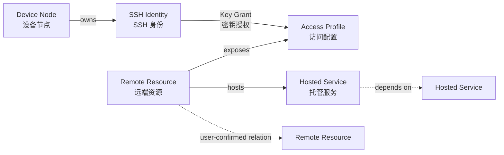
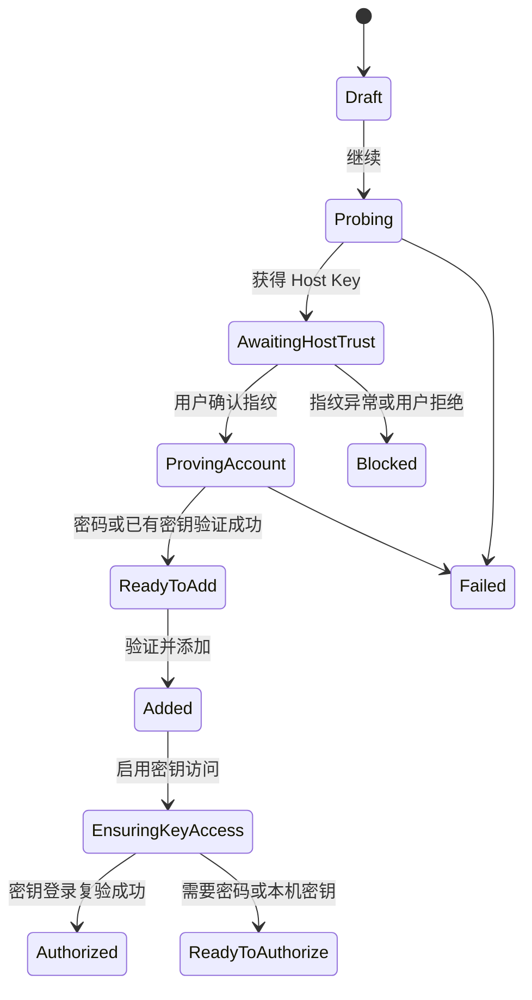
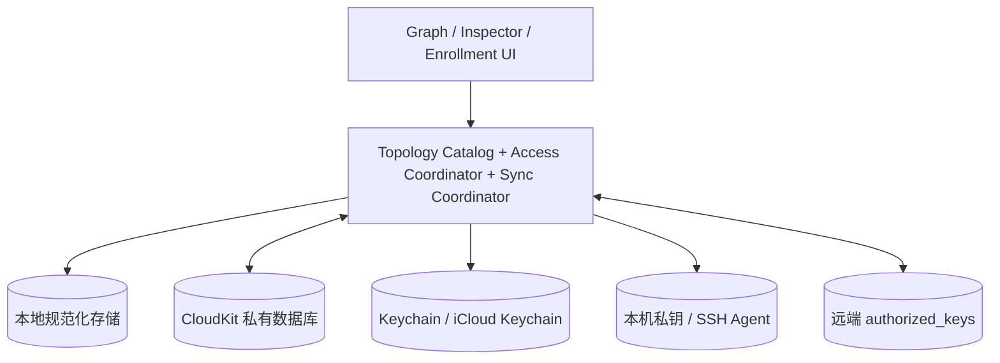

# KeyPort Graph 拓扑与跨设备授权架构

- 状态：提案
- 文档版本：V2.0
- 日期：2026-08-28
- 关联 Issue：[GitHub #26](https://github.com/jihtsan/key-port/issues/26)
- 领域词汇：[CONTEXT.md](../CONTEXT.md)

## 1. 结论

Graph 方向适合作为 KeyPort 的新主界面，但它必须表达真实的管理关系，而不是把现有服务器列表换成散点图。

推荐的新产品核心是：**一个通过 iCloud 私有工作区同步的个人 SSH 访问拓扑**。工作区中的远端资源和服务在所有设备间共享；每台 Mac 保持独立 SSH 身份；每一条设备到远端资源的可访问关系，都由具体访问配置、SSH 身份和密钥授权推导出来。

因此：

1. A、B 服务器在工作区中各只有一个稳定的远端资源 ID，不会为每台 Mac 复制一份。
2. Mac 1 和 Mac 2 分别拥有自己的 SSH 身份，并各自形成到 A、B 的密钥授权。
3. Mac 2 新增 C 或 C 上的服务后，其他设备同步的是同一个 C 和服务节点。
4. “能看到节点”不等于“当前 Mac 已经能访问节点”；当前设备仍需用自己的公钥完成授权。
5. Graph 是领域数据的投影，不是独立事实源，也不需要引入图数据库。

## 2. 产品目标与非目标

### 2.1 目标

- 以图的方式回答“有哪些设备、远端资源和服务，它们之间是什么关系”。
- 明确回答“当前 Mac 能否通过哪个账号访问哪个远端资源”。
- 将新增连接、账号验证和启用 SSH 密钥访问组织成可解释的流程。
- 让新 Mac 通过 iCloud 恢复拓扑和公开元数据，再用独立密钥获得自己的访问权。
- 在节点和关系持续增长时，仍能搜索、过滤、分组和诊断。
- 保留现有 Host Key、Keychain、私钥隔离和远端原子写入等安全边界。

### 2.2 非目标

- Graph 不表示真实物理网络、路由路径、流量或隧道，除非未来有可验证的数据来源。
- 不自动扫描整个局域网并创建未知设备。
- 不把 KeyPort 扩展为通用服务器监控、内嵌终端或远程命令执行工具。
- 不同步私钥，不让多台 Mac 共用同一把默认私钥。
- 不因为某条云端授权记录存在，就宣称远端 `authorized_keys` 当前一定包含该公钥。
- 当前工作区仍是单个 Apple ID 的私有空间，不在本阶段引入团队共享和审批。

## 3. 核心领域模型

现有 `ServerConnection` 同时承担远端对象、网络入口、登录账号、Host Key、认证检查和 UI 状态。Graph 要成立，必须先拆开这些概念。



### 3.1 同步实体

| 实体 | 关键字段 | 说明 |
| --- | --- | --- |
| `Workspace` | ID、名称、创建时间 | 一个 Apple ID 下的个人 KeyPort 工作区 |
| `DeviceNode` | ID、名称、平台、注册时间、最近活跃时间、撤销时间 | 每台 Mac 的稳定公开身份；“是否为当前设备”是本地属性 |
| `RemoteResource` | ID、名称、类型、环境、标签、备注、删除时间、版本 | 逻辑服务器、虚拟机、NAS 或网络设备，不包含登录账号 |
| `HostedService` | ID、所属资源 ID、名称、类型、标签、备注、删除时间 | PostgreSQL、Redis、Web 应用等可选服务节点 |
| `AccessProfile` | ID、资源 ID、协议、主机、端口、账号、SSH 别名、备注、删除时间、版本 | 一个账号级 SSH 入口；同一资源可有多个账号或入口 |
| `HostTrust` | 访问配置 ID、算法、指纹、确认设备、确认时间、替换时间 | 用户确认过的 SSH 主机身份及历史 |
| `SSHIdentity` | ID、设备 ID、算法、公钥、指纹、名称、撤销时间 | 只同步公开部分；私钥位置和 Agent 状态不属于该实体 |
| `KeyGrant` | ID、访问配置 ID、身份 ID、首次建立时间、最后确认时间、观察设备、撤销时间 | 一条已建立或曾观察到的密钥授权元数据 |
| `TopologyRelation` | ID、起点 ID、终点 ID、类型、备注、删除时间 | 用户确认的 `hosts`、`dependsOn` 等逻辑关系 |
| `GraphPlacement` | 视图 ID、节点 ID、位置、固定状态、分组、更新时间 | 只保存展示偏好，不保存授权事实 |

### 3.2 本地实体

| 实体 | 关键字段 | 原因 |
| --- | --- | --- |
| `LocalIdentityPresence` | SSH 身份 ID、私钥路径、Agent 状态、最后扫描时间 | 私钥和本地路径不能跨设备同步 |
| `CredentialLocator` | 访问配置 ID、Keychain service/account、同步偏好 | 只定位 Keychain 项，不包含密码值 |
| `AccessObservation` | 观察设备、访问配置、可达性、Host Key、密码认证、密钥认证、时间、错误分类 | 结果依赖当前网络和当前设备，不能当作全局状态 |
| `EnrollmentSession` | 草稿、当前步骤、临时 Host Key、临时凭据证明、错误 | 未完成接入前不污染同步工作区 |
| `OperationRun` | 操作类型、目标、阶段、进度、可取消状态 | 表达当前授权、撤销和批量任务 |

### 3.3 事实源

| 数据 | 权威来源 | CloudKit 中的含义 |
| --- | --- | --- |
| 远端资源、服务、访问配置和用户拓扑关系 | KeyPort 工作区 | 同步事实 |
| Host Key 信任决定 | 用户确认记录 | 其他设备用于比较的期望指纹，不是新的网络验证 |
| 公钥和设备归属 | `SSHIdentity` | 可同步公开元数据 |
| 私钥 | 当前设备文件系统或 SSH Agent | 禁止上传 |
| 服务器密码 | Keychain；用户可选 iCloud Keychain 同步 | 禁止进入 CloudKit |
| 密钥是否真实存在于远端 | 远端账号的 `authorized_keys` | `KeyGrant` 只是最近已知或成功建立的记录 |
| 当前设备能否连接 | 当前设备的实时检查 | 不由其他设备的成功状态代替 |

## 4. Graph 投影

### 4.1 默认可见节点

- 设备节点：当前 Mac 和工作区中的其他已注册设备。
- 远端资源：服务器、虚拟机、NAS、网络设备。
- 托管服务：用户明确添加到某个远端资源上的服务。

`AccessProfile`、`SSHIdentity` 和 `HostTrust` 默认放在节点或边的 Inspector 中，不占用主画布。用户开启“显示安全细节”后，才将 SSH 身份和密钥授权展开为可见节点与边。

### 4.2 默认可见关系

| 关系 | 来源 | 含义 |
| --- | --- | --- |
| 设备 → 远端资源 | `DeviceNode → SSHIdentity → KeyGrant → AccessProfile → RemoteResource` | 某设备曾建立该账号级密钥授权 |
| 当前设备 ⇢ 远端资源 | 当前设备 + 工作区中的活动 `AccessProfile`，但没有已确认的 `KeyGrant` | 仅用于提示待检查或待授权的候选边；使用虚线且不作为持久化事实 |
| 远端资源 → 服务 | `HostedService.resourceID` | 服务由该资源托管 |
| 资源/服务 → 资源/服务 | `TopologyRelation` | 用户确认的依赖或逻辑关联 |

候选访问边只为当前设备生成，避免“全部设备”视图出现设备数 × 访问配置数的虚假关系。Graph 不从相同网段、相似主机名或同步顺序自动推断资源或服务关系；自动发现只能形成候选，必须由用户确认后才成为工作区事实。

### 4.3 视图模式

第一版提供三种投影，底层使用同一份实体：

1. **当前设备**：当前 Mac 居中，突出它能访问、待授权或被阻断的远端资源。
2. **全部设备**：显示每台设备与共享远端资源之间的授权差异。
3. **服务拓扑**：隐藏设备，突出远端资源、托管服务和依赖关系。

节点较多时必须提供搜索、环境/标签过滤、仅显示异常、折叠服务和自动布局。Graph 之外保留一个可排序的“节点列表”作为高密度浏览和无障碍入口，但它不再是产品的默认心智模型。

### 4.4 状态不是单一枚举

现有 `AuthorizationStatus` 混合了网络、Host Key、凭据、密钥和同步状态。新模型应保存相互独立的状态维度：

| 维度 | 建议状态 |
| --- | --- |
| 可达性 | `unknown`、`reachable`、`unreachable` |
| 主机信任 | `pending`、`trusted`、`mismatch` |
| 密码凭据 | `unknown`、`missing`、`available`、`verified`、`rejected` |
| 当前设备密钥访问 | `unknown`、`notAuthorized`、`verified`、`drifted`、`revoked` |
| 同步 | `clean`、`pending`、`conflict` |
| 操作 | `idle`、`checking`、`authorizing`、`revoking`、`failed` |

Graph 再根据这些维度投影摘要，优先级为：Host Key 异常阻断 > 正在执行 > 明确失败/漂移 > 待授权 > 已验证 > 未知或过期。颜色只能辅助表达，节点图标、线型、标签和 Inspector 文本必须同时给出含义。

## 5. 新增远端资源与账号验证流程

主流程采用“先验证、后加入工作区”，按钮名称使用“密钥访问”而不是“免密”。SSH 密钥登录仍然是认证，只是无需每次输入账号密码。



### 5.1 表单阶段

用户输入：

- 远端资源名称和类型。
- 主机或域名、SSH 端口、登录账号。
- 稳定 SSH 别名。
- 可选环境、标签、备注和托管服务。

如果主机、端口和账号与已有访问配置相似，界面提示“关联到已有远端资源”或“仍然创建新的访问配置”，但不能仅凭 IP 自动合并。

### 5.2 主机身份阶段

1. 检查 DNS/TCP 并扫描 Host Key。
2. 首次连接展示算法和 SHA256 指纹。
3. 用户确认后形成 `HostTrust`。
4. 指纹变化或已有记录不一致时立即阻断；在确认之前不得发送密码。

### 5.3 账号证明阶段

默认提供两条证明路径：

- **账号密码验证**：输入密码，执行仅认证后立即退出的 SSH 检查；成功后可选择只用一次、保存在本机 Keychain，或允许 iCloud Keychain 同步。
- **使用已有密钥验证**：当前设备已有可登录身份时直接形成凭据证明，不强迫用户再次输入密码。

只有验证成功后，“验证并添加”才把 `RemoteResource`、`AccessProfile` 和 `HostTrust` 作为一个事务写入本地工作区并排队同步。用户也可以明确选择“保存为待处理”，但此类记录必须显示为未验证，不能产生绿色访问边。

## 6. “启用密钥访问”操作

用户描述的“一键判断，有就验证，没有就授权”应实现成一个深模块，而不是让 UI 依次拼接多个服务调用。

### 6.1 用户界面语义

| 当前状态 | 主按钮 | 行为 |
| --- | --- | --- |
| 从未检查 | 启用密钥访问 | 先测试当前设备身份；必要时授权 |
| 已有密钥可登录 | 已启用 · 重新验证 | 只检查，不修改远端 |
| 本机有密钥但未授权 | 授权当前设备 | 使用已验证密码安装公钥并复验 |
| 本机无身份 | 创建身份并授权 | 生成独立 Ed25519 身份后继续 |
| 缺少可用密码 | 添加账号密码 | 验证后继续原操作 |
| Host Key 异常 | 核对主机身份 | 阻断任何认证和远端写入 |

界面可以在辅助文案中使用“免输密码登录”，但领域和代码统一使用“密钥访问”或 `EnableKeyAccess`。

### 6.2 编排步骤

`EnableKeyAccess` 必须保证以下顺序和不变量：

1. 获取最新 Host Key，并与 `HostTrust` 比较。
2. 为当前设备选择本地可用 SSH 身份；没有时生成一把独立 Ed25519 密钥。
3. 先执行公钥认证检查。
4. 若已成功，只更新 `AccessObservation` 和 `KeyGrant.lastConfirmedAt`，不修改远端。
5. 若未授权，要求一个已验证且仍可读取的密码凭据。
6. 通过固定、幂等操作按公钥 blob 向 `authorized_keys` 安装公钥。
7. 再次执行公钥认证；只有复验成功才创建或更新 `KeyGrant`。
8. 写入当前设备的 SSH Config，并验证稳定别名解析结果。
9. 持久化不含秘密的审计事件并排队同步元数据。

若远端写入成功但复验失败，结果必须是“授权结果待核对”，不能展示“已启用”。重试应先检查公钥是否已经存在，避免重复写入。

## 7. 多设备场景

### 7.1 Mac 1 已连接 A 和 B

工作区包含：

- `DeviceNode(Mac 1)` 及其 `SSHIdentity(K1)`。
- `RemoteResource(A)`、`RemoteResource(B)` 和各自访问配置。
- `K1 → A`、`K1 → B` 两条 `KeyGrant`。

Graph 将它们投影成 Mac 1 到 A、B 的两条访问边。

### 7.2 Mac 2 首次登录同一 iCloud 账户

1. CloudKit 恢复 A、B、访问配置、Host Key 期望值、Mac 1 公钥元数据和既有授权记录。
2. Mac 2 注册新的 `DeviceNode`，生成自己的 `SSHIdentity(K2)`；不复制 K1 私钥。
3. Graph 仍显示 Mac 1 到 A、B 的历史授权；Mac 2 到 A、B 显示“待检查/待授权”。
4. 如果 iCloud Keychain 中存在用户允许同步的账号密码，用户通过一次本机身份验证后可批量为 Mac 2 授权。
5. A、B 的 `authorized_keys` 分别新增 K2，复验成功后形成 Mac 2 到 A、B 的访问边。

### 7.3 Mac 2 新增 C 和数据库服务

Mac 2 新建 `RemoteResource(C)`、`AccessProfile(C/root)` 和 `HostedService(C/PostgreSQL)`。CloudKit 同步后，Mac 1 看到的是同一个 C 和 PostgreSQL 节点，以及 C 托管 PostgreSQL 的关系；Mac 1 不会自动获得 C 的访问权。

## 8. iCloud 同步方案

### 8.1 推荐分层



- **CloudKit 私有数据库**：同步工作区元数据和 Graph 展示偏好。
- **iCloud Keychain**：按用户选择同步服务器密码；与 CloudKit 完全分离。
- **本地存储**：离线可用的完整元数据副本、待同步操作和设备本地观测。
- **本机文件/Agent**：保存或提供私钥。
- **远端服务器**：保存真实的密钥授权。

### 8.2 CloudKit 记录形态

目标实现使用私有自定义 Zone，并按实体保存独立记录；不再把整个 `AppSnapshot` 编码成单个 `payload`。

建议记录类型：

```text
KPWorkspace
KPDevice
KPRemoteResource
KPHostedService
KPAccessProfile
KPHostTrust
KPSSHIdentity
KPKeyGrant
KPTopologyRelation
KPGraphPlacement
KPTombstone
```

实体级记录带稳定 ID、schema version、revision、modifiedAt 和 modifiedByDeviceID。Graph 布局单独记录并对拖动更新做防抖，避免频繁位置变化与安全元数据产生冲突。

### 8.3 同步与冲突原则

1. 启动、应用重新激活、本地事务提交后和用户手动操作时触发增量同步；不承诺应用未运行时的实时同步。
2. 使用 Zone change token 拉取增量，使用本地 outbox 重试上传。
3. 删除使用带 `deletedAt` 的 tombstone，防止长期离线设备复活旧实体。
4. 公钥按指纹去重；设备、资源、访问配置和关系按稳定 ID 合并。
5. Host Key 历史和 KeyGrant 以追加/撤销为主，不静默覆盖安全证据。
6. 主机、端口、账号、资源归属或 Host Key 出现并发修改时创建显式冲突，阻断自动认证；不能简单以最后写入者覆盖。
7. 名称、标签、备注和 Graph 位置可采用字段规则合并；无法判断时保留双方值并提示。
8. `AccessObservation` 默认不上传。其他设备的成功检查可作为审计线索，但不能覆盖当前设备的实时结果。

### 8.4 密码同步

密码项使用固定 Keychain service 和 `AccessProfile.id` 作为 account。用户为每个访问配置选择：

- 仅本次使用，不保存。
- 保存到当前 Mac Keychain。
- 保存并允许 iCloud Keychain 同步。

CloudKit 只保存用户的同步偏好，不能保存“云端一定存在密码”的断言。每台设备都要独立查询 Keychain 可用性；读取已保存密码并执行远端写入前，需要 LocalAuthentication。

## 9. 应用模块与接口

目标代码应把复杂行为放进少量深模块，SwiftUI 只持有选择、筛选、表单和操作进度。

| 模块 | 小接口提供的能力 | 隐藏的实现 |
| --- | --- | --- |
| `TopologyCatalog` | 提交领域事务、查询工作区和 Graph 快照 | 实体一致性、去重、tombstone、迁移和本地持久化 |
| `EnrollmentCoordinator` | 开始/推进/取消一个接入会话 | 连通性、Host Key、凭据证明、草稿事务和恢复 |
| `AccessCoordinator` | 确保、验证或撤销一个设备的密钥访问 | 身份选择、密码读取、SSH 写入、复验、Config 和审计 |
| `GraphProjector` | 根据查询生成 `GraphSnapshot` | 多实体连接、状态优先级、过滤和可见性规则 |
| `SyncCoordinator` | 同步并返回结构化报告 | change token、outbox、冲突、CloudKit 映射和重试 |
| `SecretVault` | 保存、读取和删除账号密码 | Security.framework、同步属性和内存清理 |
| `SSHTransport` | 执行有限的检查与授权能力 | 系统 OpenSSH/AskPass 或未来替代实现 |

`SSHTransport`、`SecretVault`、云同步和本地存储各自具有生产适配器和测试适配器，因此它们是实际 seam。Host Key 判定、Graph 投影和状态机属于进程内逻辑，不应为了测试再暴露额外协议。

## 10. 安全不变量

1. 任何密码认证前必须先确认或匹配 Host Key。
2. 密码不得进入 CloudKit、本地元数据、命令参数、普通 stdin、日志或 Graph。
3. 私钥不得跨设备同步；每台设备默认拥有独立 SSH 身份。
4. 公钥安装必须按 blob 幂等、保留未知行、备份、原子替换并复验。
5. 云端 `KeyGrant` 不能替代远端验证；过期或失败时显示“待确认”或“漂移”。
6. 撤销设备只同步撤销意图；真正删除远端公钥仍需一台拥有有效访问权的设备执行。
7. Graph 中任何绿色访问边都必须能追溯到具体访问配置、SSH 身份和最近一次成功观测。
8. 用户定义的服务依赖关系不得被解释成应用可以执行任意跨节点命令。

## 11. 首版范围

### 11.1 P0

- 设备、远端资源、访问配置、SSH 身份、密钥授权的规范化模型。
- 当前设备和全部设备两种 Graph 投影。
- 新增连接的分步验证流程。
- “启用密钥访问”编排和单节点操作。
- CloudKit 实体级同步、iCloud Keychain 可选密码同步。
- 节点 Inspector、搜索、过滤和等价列表视图。
- V3 快照向新模型的一次性迁移。

### 11.2 P1

- 托管服务节点和 `hosts` 关系。
- 用户维护的 `dependsOn` 关系。
- 多节点批量授权与逐项恢复。
- Graph 自定义分组和跨设备布局同步。
- 授权漂移检查和设备撤销任务。

### 11.3 暂缓

- 自动网络发现、跳板机路径、端口转发拓扑。
- 团队共享、角色和审批。
- 通用服务监控和任意远程命令。
- 用图数据库替换本地或 CloudKit 存储。

## 12. 验收场景

1. Mac 1 添加并验证 A、B，Graph 出现两个资源；启用密钥访问后显示两条可追溯的访问边。
2. Mac 2 同步后看到同一个 A、B，但不会继承 Mac 1 的私钥或虚假显示为当前设备已授权。
3. Mac 2 使用自己的公钥授权 A、B 后，全部设备视图显示两台 Mac 的独立授权关系。
4. Mac 2 添加 C 和 PostgreSQL 服务后，Mac 1 同步得到同一节点与托管关系。
5. 已有公钥可登录时，“启用密钥访问”只验证，不重复修改远端。
6. 公钥不可登录但密码已验证时，操作安装公钥并在复验成功后才显示已启用。
7. Host Key 变化时，即使密码可用也不得继续认证或写入。
8. CloudKit 不可用时已有本地拓扑和 SSH 连接继续工作；恢复后增量同步。
9. 同一资源的多个账号形成多个访问配置，但默认 Graph 仍只显示一个远端资源节点。
10. 任何 CloudKit 记录、日志和导出元数据中都找不到密码或私钥内容。
