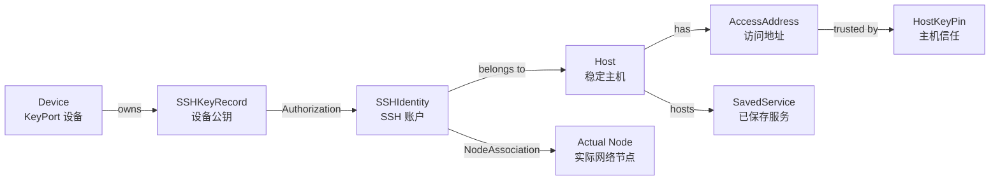
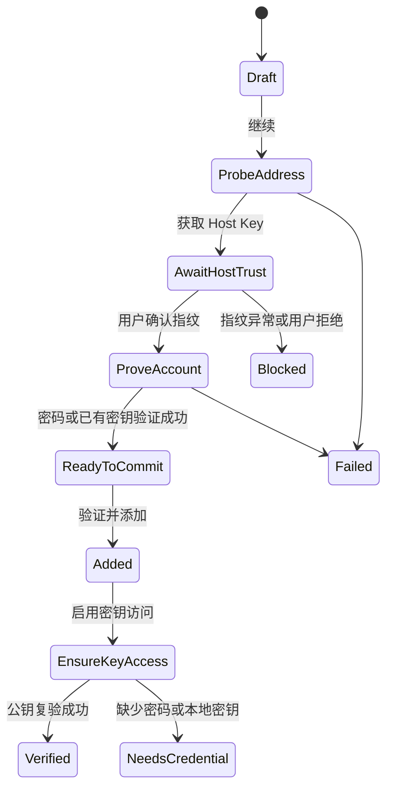

# KeyPort Graph 拓扑与跨设备授权架构

- 状态：提案
- 文档版本：V2.1
- 日期：2026-08-28
- 关联 Issue：[GitHub #26](https://github.com/jihtsan/key-port/issues/26)
- 领域词汇：[CONTEXT.md](../CONTEXT.md)
- 承重基线：[主机工作台技术架构与迁移契约](./Design/JODER-10/host-workbench-architecture.md)

## 1. 结论

Graph 方向适合作为 KeyPort 的新主界面，而且当前仓库已经具备承载它的数据模型。正确方案不是再造一套 `RemoteResource` 或图数据库，而是把已有 `HostV6.SyncedGraph` 投影成用户可理解的设备、主机、SSH 账户、服务和授权拓扑。

推荐的新产品核心是：**一个通过 iCloud 同步元数据、由每台 Mac 独立持有私钥的个人 SSH 访问拓扑**。

1. 主机 A、B 在工作区中各只有一个稳定 `Host`，不会为每台 Mac 复制一份。
2. 每台 KeyPort 设备拥有自己的 `SSHKeyRecord` 和本地私钥。
3. “设备能访问主机”由 `Device → SSHKeyRecord → Authorization → SSHIdentity → Host` 推导。
4. 主机上的 HTTP、HTTPS 和 TCP 服务使用已有 `SavedService` 表达。
5. Tailscale 等真实网络节点与 SSH 账户的映射使用已有 `NodeAssociation`，不能被普通画布连线替代。
6. Graph 只显示和操作事实，不成为新的授权真源，也不表示物理路由或任意命令执行能力。

## 2. 当前基线

在本文之前，仓库已经完成了比早期 MVP 更深的 Host v6 承重层：

- V5 `AppSnapshot` 和列表式 SwiftUI 仍是默认用户界面与兼容写路径。
- `HostV6.SyncedGraph` 已规范化保存 Host、Address、SSH Account、Device、Key、Host Key Pin、Service、Authorization、Node Association 和 Merge Review。
- `MetadataEnvelope` 已把同步事实、本机状态和迁移来源分开。
- v5 → v6 确定性影子迁移、CloudKit v2、向量时钟、墓碑、冲突保留、authority manifest 和恢复 journal 已实现。
- 服务发现、直连/隧道决策、`KeyPortTunnelBroker` 和精确隧道清理已实现，但相关功能仍受开关和验收门禁控制。
- 当前 UI 已有状态感知的 `PasswordlessPrimaryAction`，能够在“验证、启用、生成密钥、输入密码、核对 Host Key”之间选择。
- C3 双 Mac 签名环境验收尚未完成，Host v6 写权不能被 Graph UI 绕过。

因此，Graph 的主要工作是投影、交互和应用编排，而不是重新设计持久化模型。本文若与 Host v6 的 authority、CloudKit 或删除契约冲突，以 JODER-10 承重文档和已合并实现为准。

## 3. Graph 使用的现有领域图

### 3.1 代码实体与界面语言

| Host v6 实体 | 界面名称 | Graph 角色 |
| --- | --- | --- |
| `HostV6.Host` | 主机 | 稳定的主节点 |
| `HostV6.AccessAddress` | 访问地址 | 主机 Inspector 中的路由候选，默认不单独占节点 |
| `HostV6.SSHIdentity` | SSH 账户 | 主机内部账号或访问边详情；它不是设备密钥 |
| `HostV6.Device` | KeyPort 设备 | 当前 Mac 和其他已注册 Mac 的节点 |
| `HostV6.SSHKeyRecord` | SSH 密钥 | 设备安全详情，默认折叠 |
| `HostV6.HostKeyPin` | 主机信任 | 地址安全状态和阻断证据 |
| `HostV6.SavedService` | 已保存服务 | 主机的子节点，可直接访问或通过受控隧道访问 |
| `HostV6.Authorization` | 账户授权 | 设备到主机访问边的事实链 |
| `HostV6.NodeAssociation` | 节点关联 | SSH 账户到 Tailscale 等实际节点的稳定映射 |
| `HostV6.MergeReview` | 待解决冲突 | 阻断对应节点动作的同步冲突 |

### 3.2 本机证据

以下内容来自 `HostV6.LocalState`，只影响当前 Mac 的 Graph 状态：

- `LocalDeviceState`：哪一个 Device 是当前设备。
- `LocalSSHKeyState`：私钥路径、Agent 和本机可用性。
- `LocalSSHIdentityState`：账号检查结果和最近检查时间。
- `ReachabilityEvidence`：某地址在当前网络 epoch 下是否可达。
- 本机审计事件和备注。

这些状态不能被另一台 Mac 的成功结果覆盖，也不能因为 CloudKit 中存在 Authorization 就直接显示“当前 Mac 可用”。

## 4. Graph 投影语义

### 4.1 默认节点

- KeyPort 设备：当前设备突出显示，其他设备用于比较授权覆盖。
- Host：远端物理机或虚拟机，是 Graph 的主要管理节点。
- Saved Service：默认折叠在 Host 中，在服务视图中展开。
- Actual Node：只在存在稳定 Node Association 或用户打开网络节点层时显示。

Access Address、SSH Account、SSH Key 和 Host Key Pin 默认进入 Inspector。开启“显示安全细节”后，才展开这些中间实体，避免主画布被账号和密钥节点淹没。

### 4.2 默认边

| 边 | 推导链 | 含义 |
| --- | --- | --- |
| Device → Host | `Device → SSHKeyRecord → Authorization → SSHIdentity → Host` | 某设备的密钥曾被具体 SSH 账户授权 |
| Current Device ⇢ Host | 当前设备 + Host 的活动 SSH Account，但没有已确认 Authorization | 待检查或待授权候选；使用虚线，不是持久化事实 |
| Host → Saved Service | `SavedService.hostID` | 服务由该 Host 承载 |
| SSH Account → Actual Node | 活动 `NodeAssociation` | 由强证据或用户确认的真实节点映射 |

候选访问边只为当前设备生成，避免全部设备视图出现设备数 × 账户数的虚假关系。同一 Host 有多个 SSH Account 时，主画布仍只显示一个 Host；点击访问边后在 Inspector 中选择具体账号和别名。

### 4.3 不自动生成的边

- 相同网段、相似名称、共享公网 IP 或相同操作系统不产生 Host 合并边。
- Node Association 不等于 SSH Authorization。
- Host 到 Host 的连线不自动表示路由、跳板、依赖或数据流。
- 自动发现的服务候选在用户确认前不成为 Saved Service。
- 画布上的拖放和位置变化不能创建授权。

如果未来需要“服务 A 依赖数据库 B”这类用户维护关系，应单独增加有类型、有来源的领域实体和 schema 迁移，不能复用 Node Association 或 Authorization。

### 4.4 视图模式

第一版提供三种投影：

1. **当前设备**：当前 Mac 居中，显示它对所有 Host 的可用、待授权或阻断状态。
2. **全部设备**：显示每台 KeyPort 设备到共享 Host 的独立账户授权。
3. **服务**：隐藏设备细节，展开 Host 和 Saved Service，并给出直连或隧道访问方式。

节点较多时提供搜索、分组、仅显示异常、仅显示当前设备可访问、折叠服务和自动布局。Nodes 列表必须作为键盘、VoiceOver 和高密度管理的文本等价入口。

## 5. 状态投影

Graph 不再把所有问题压成一个 `AuthorizationStatus`。摘要由下列独立证据计算：

| 状态轴 | 现有来源 | 示例 |
| --- | --- | --- |
| 可达性 | `ReachabilityEvidence`、地址选择结果 | 未知、可达、不可达、证据过期 |
| 主机信任 | `HostKeyPin`、`KnownHostsLine`、当前扫描 | 待确认、可信、变化、冲突 |
| SSH 路由 | Address/Identity/Service 固定地址和路由投影 | 可解析、无地址、冲突阻断 |
| 当前设备密钥 | `LocalSSHKeyState` | 可用、缺少私钥、仅 Agent、已撤销 |
| 远端授权 | `Authorization.remoteState/relationState` | 未知、已授权、已撤销、已脱离 |
| 本机复验 | `LocalSSHIdentityState` | 未检查、成功、失败、检查中 |
| 同步与写权 | `MergeReview`、authority mode、Cloud 状态 | 干净、冲突、canary、只读兼容 |
| 操作 | 接入、授权、撤销、隧道任务 | 空闲、进行中、失败、待清理 |

摘要优先级为：

1. Host Key 变化、阻断性 Merge Review 或无安全路由。
2. 正在进行或需要恢复的操作。
3. 明确授权漂移、远端失败或缺少私钥。
4. 待验证或待授权。
5. 当前设备最近一次公钥复验成功。
6. 其他设备的历史授权或未知状态。

绿色访问边必须能追溯到具体 SSH Account、设备密钥、Authorization 和当前设备最近一次成功复验。其他设备的边可以显示“最近已知授权”，但不能替当前设备宣称实时可达。

## 6. 新增主机和 SSH 账户

用户提出的“新增 → 密码验证 → 添加 → 启用免密”是合理主流程，但必须把 Host Key 放在发送密码之前，并允许已有密钥用户跳过密码证明。

### 6.1 `EnrollmentCoordinator`

新增流程应由一个可暂停的应用层编排器负责，而不是由 Sheet 直接依次调用 Host Key、Keychain、SSH Config 和仓储：

1. 收集 Host 名称、地址、端口、SSH 用户、别名和可选分组。
2. 解析地址并扫描 Host Key。
3. 用临时 known_hosts 完成确认；提交前不污染正式文件。
4. 默认通过账号密码进行仅认证检查；已有本地密钥可登录时允许以密钥证明账号可控。
5. 验证成功后，在一个 Host v6 事务中创建或复用 Host、Address、SSHIdentity、HostKeyPin 和 KnownHostsLine。
6. 用户明确选择“保存为待处理”时可以跳过账号证明，但 Graph 必须标为未验证且禁止绿色访问边。

Host v6 当前 `ModelCommand` 主要覆盖删除、撤销和冲突解决。新 UI 获得 v6 写权之前，必须先补齐创建/更新 Host、Address、SSHIdentity、Pin、Service 和 Authorization 的命令，不允许 UI 直接改 `SyncedGraph` 数组。

## 7. “启用密钥访问”

当前 `PasswordlessPrimaryAction` 已经实现了用户期望的状态感知入口。重构时保留其行为，用户可见名称建议使用“启用密钥访问”，并用“免输密码登录”解释结果。

| 当前证据 | 主按钮 | 行为 |
| --- | --- | --- |
| 已有公钥复验成功 | 重新验证 | 只检查，不修改远端 |
| 有本地私钥和可用密码 | 授权当前设备 | 安装公钥并复验 |
| 有私钥但无密码 | 输入密码并授权 | 验证密码后继续 |
| 无本地私钥 | 创建密钥并授权 | 生成当前设备独立 Ed25519 密钥后继续 |
| Host Key 待确认或变化 | 核对主机身份 | 阻断密码和远端写入 |
| Merge Review 或路由冲突 | 解决冲突 | 不猜测地址或账号 |

### 7.1 `AccessCoordinator` 不变量

1. 重新获取 Host Key，并在认证前匹配 Host Trust。
2. 为当前设备选择本地可用 SSH Key；没有时显式生成。
3. 先执行公钥认证。已经成功时只更新本机证据和 Authorization 确认时间。
4. 公钥失败时才读取已经验证的账号密码。
5. LocalAuthentication 成功后，按公钥 blob 幂等写入 `authorized_keys`。
6. 再次执行公钥认证；只有复验成功才显示“密钥访问可用”。
7. 通过 Host v6 事务记录 Authorization，并重建当前设备 SSH Config。
8. 写入不含秘密的 Activity；部分失败必须可重试和恢复。

如果远端写入成功但复验失败，显示“授权结果待核对”，不得生成绿色边。重试必须先检查公钥是否已经存在。

## 8. 多设备场景

### 8.1 Mac 1 管理 A 和 B

工作区中存在 Host A、B，各自的 Address 和 SSH Account。Mac 1 的 Device 拥有 Key K1，K1 通过两个 Authorization 关联到 A、B 的具体 SSH Account。Graph 投影为 Mac 1 到 A、B 的两条访问边。

### 8.2 Mac 2 登录同一 iCloud 工作区

1. CloudKit v2 恢复 Host、Address、SSH Account、Host Key Pin、Device、公开密钥、Authorization、Service 和 Node Association。
2. Mac 2 注册自己的 Device 并生成 K2；不会下载 K1 私钥。
3. Graph 仍可显示 Mac 1 到 A、B 的最近已知授权；Mac 2 到 A、B 是待检查候选边。
4. 如果用户曾允许账号密码通过 iCloud Keychain 同步，Mac 2 可在一次本机身份验证后批量为 K2 建立授权。
5. 每个账号复验成功后，新增 K2 对应 Authorization，形成 Mac 2 的独立访问边。

### 8.3 Mac 2 新增 C 和服务

Mac 2 创建 Host C、SSH Account 和 Saved Service。CloudKit 同步后，Mac 1 看到的是同一个 C 和服务节点；Mac 1 不会因此自动拥有 C 的私钥授权。服务能否直连或需要隧道由现有地址选择和 Service Access 规则决定。

## 9. iCloud 与本地数据边界

### 9.1 采用现有 Host v6 同步契约

Graph 首版不另建 CloudKit Zone 或每实体记录。继续使用：

- 本机 `state-v6.json` 的 `MetadataEnvelope`。
- CloudKit 私有数据库中的 `KPMetadataV2/keyport-metadata-v2` 单记录 payload。
- 每实体 SyncStamp、向量时钟、墓碑和 Merge Review 完成逻辑级合并。
- 800 KiB payload 硬门禁；达到门禁后再立项迁移为每实体 CloudKit 记录。
- V1 payload 只作为兼容期单向输入，不接收 V6 无法反写的 Host/Service 数据。
- authority manifest 和 C3 证据控制 v5 → v6 写权切换。

Graph 展示不能绕过 canary、`v6Authoritative` 或 `compatibilityRollback` 模式。Canary 阶段可读取影子图并深链到旧操作界面，但不得直接修改 V6。

### 9.2 密码、私钥和远端事实

| 数据 | 位置 | 是否随 CloudKit v2 同步 |
| --- | --- | --- |
| Host、Address、SSH Account、Service、公开 Key、Authorization、Node Association | Host v6 synced graph | 是 |
| Graph 当前筛选、选择和自动布局 | 当前 Mac | 否 |
| 私钥路径、Agent、本机可用性、Reachability、审计 | Host v6 local state | 否 |
| 账号密码 | Keychain；用户可选 iCloud Keychain | 不进入 CloudKit |
| 真实远端公钥授权 | 远端 `authorized_keys` | Cloud 只保存最近已知 Authorization |

首版使用确定性自动布局，避免为 Graph 坐标引入 V7 schema。未来若用户要求跨设备同步固定位置，应把布局建模成独立、低风险、可丢弃的展示记录；位置冲突绝不能阻断 SSH 动作。

## 10. 应用模块

目标结构沿用当前 SwiftPM target 和 Host v6 seam，不新增一套平行领域层：

| 模块 | 对外能力 | 隐藏的复杂度 |
| --- | --- | --- |
| `TopologyGraphProjector` | 输入 MetadataEnvelope 和查询，输出 `TopologyGraphSnapshot` | 实体连接、候选边、状态优先级、过滤和证据摘要 |
| `EnrollmentCoordinator` | 开始、推进、恢复、取消接入会话 | Host Key、账号证明、临时文件和原子提交 |
| `AccessCoordinator` | 确保、验证、撤销当前设备的账号授权 | 密钥、Keychain、OpenSSH、远端写入、复验和 Config |
| `GraphWorkspaceModel` | 选择、搜索、视图模式和任务展示 | SwiftUI 状态，不拥有领域事实 |
| `HostV6Runtime/MetadataRepository` | 版本化快照和领域命令 | 写权、journal、向量时钟、迁移和外部效果恢复 |
| 现有平台适配器 | SSH、Keychain、CloudKit、Tailscale、Tunnel | 不可靠外部系统和结构化错误 |

`TopologyGraphProjector` 属于纯 KeyPortCore 逻辑。`EnrollmentCoordinator` 和 `AccessCoordinator` 属于主应用用例层，依赖现有协议和适配器。SwiftUI 不直接读取 Keychain、不运行 Process，也不修改 `SyncedGraph` 数组。

## 11. 安全不变量

1. 任何密码认证前必须确认或匹配当前地址的 Host Key。
2. 密码不得进入 Graph、CloudKit、本地元数据、命令参数或日志。
3. 私钥不跨设备同步，每台 Mac 默认使用独立 SSH Key。
4. 公钥安装必须按 blob 幂等、保留未知行、备份、原子替换并复验。
5. Cloud Authorization 不能替代远端验证；失败时显示未知、漂移或待核对。
6. Node Association 不能替代账号级 Authorization。
7. 阻断性 Merge Review、Host Key 变化或无安全路由时，Graph 必须禁用认证、服务访问和隧道动作。
8. 删除 Host 或 SSH Account 不能宣称远端公钥已经撤销；继续遵守现有 detached/remoteState 契约。
9. Graph 不提供任意命令、交互式 Shell、自动网络路由或 TLS 绕过。

## 12. 实施范围

### 12.1 P0

- 基于 Host v6 的纯 Graph 投影和 fixtures。
- 当前设备、全部设备、服务三种视图。
- Graph/Nodes/Inspector/Activity 新界面骨架。
- 统一接入向导和现有状态感知密钥访问动作。
- Canary 只读 Graph 与旧账号操作深链。
- v6 create/update/authorize 命令和 authority 后的原生写路径。
- 搜索、过滤、异常聚焦和文本等价视图。

### 12.2 P1

- 多账号选择、批量授权逐项进度和恢复。
- Saved Service 的直接/隧道访问入口。
- Node Association 展开层和冲突解决入口。
- Host Key 历史、Merge Review 和连接历史的可视化。
- 100+ 节点的布局性能和可访问性优化。

### 12.3 暂缓

- 用户自定义 Host/Service 依赖边。
- 自动局域网拓扑、物理路由和跳板路径图。
- 团队共享、审批和角色。
- 图数据库和每实体 CloudKit 迁移。
- 通用服务监控和任意远程命令。

## 13. 验收场景

1. V6 fixture 中的 Device、Key、Authorization、SSH Account 和 Host 被投影为可追溯访问边。
2. 同一 Host 的多个地址和账号默认只占一个主节点，Inspector 可准确展开。
3. Mac 1 管理 A/B 后，Mac 2 同步看到相同 Host，但不会继承 Mac 1 私钥或虚假显示为当前设备已授权。
4. Mac 2 用独立 K2 授权 A/B 后，全部设备视图显示两台 Mac 的独立关系。
5. Mac 2 新增 C 和 Saved Service 后，Mac 1 同步看到同一节点和服务。
6. 已有密钥可登录时，“启用密钥访问”只验证，不重复修改远端。
7. 无密钥授权但密码有效时，安装公钥并在复验成功后才生成绿色边。
8. Host Key 变化、Merge Review 或地址冲突时，所有相关 Graph 动作被阻断并展示原因。
9. Canary/兼容回滚模式下 Graph 不取得 V6 写权。
10. CloudKit 不可用时本地 Graph、已有 SSH Config 和服务状态继续可读；恢复后按现有契约合并。
11. Graph、Nodes 列表和 VoiceOver 对同一节点、状态和动作提供等价信息。
12. Cloud payload、日志、Graph snapshot 和导出中都不存在密码或私钥内容。
