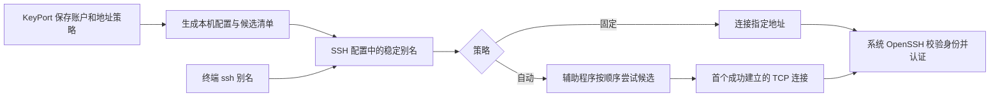

# 统一 SSH 别名与多地址连接策略实施方案

- 日期：2026-09-15
- 规划 Issue：[#129](https://github.com/jihtsan/key-port/issues/129)
- 核查基线：`0e8f49e`（#128 合并后）。本文是待实施方案；本次仅提交文档。
- 产品依据：[一期产品边界](一期产品边界与功能整合规划.md)、[领域词汇](../CONTEXT.md)。

## 1. 目标与推荐路径

恢复「一个 SSH 别名 → 一个服务器账户 → 一项地址策略」。多地址属于同一服务器；公钥授权属于账户；每个地址保留自己的身份检查与访问验证证据。

推荐复用现有 Swift `KeyPortSSHRelay`，通过 OpenSSH `ProxyCommand` 在每次连接时按用户顺序建立 TCP 连接。接通后保持同一连接并转发字节，由系统 OpenSSH 完成主机身份校验、认证和会话处理。KeyPort 退出后，普通终端仍可运行同一个 `ssh <alias>`。



### 用户可见契约

| 场景 | 预期行为 |
| --- | --- |
| 自动策略 | 用户勾选并排序候选；连接前首选不可达才尝试下一个；常用命令始终是同一个别名 |
| 固定策略 | 只连接明确选定的地址，失败直接报告 |
| 点击地址行 | 查看或验证该地址，不改变常用命令及默认策略 |
| 本次指定地址 | 放入地址行的次级操作；明确只覆盖本次连接，不写回策略 |
| 新增 Tailscale 地址 | 一次加入 Node 的端点集合，可加入当前 profile 的候选集合；不再每个地址创建一个同名 profile |
| 地址待验证 | 能保存、查看和批量验证；尚未满足本机执行条件时不进入实际自动候选 |
| 日常连接 | 同一账户共用已有本机密钥授权；增加地址不重复安装公钥 |

新建多地址连接时，表单建议自动策略并展示顺序，由用户保存；已有固定策略保持原语义，通过明确的「改为自动策略」操作升级。当前规划不直接修改用户的现有连接设置。

第一版采用确定的用户排序，不引入按延迟、SSID 或历史成功时间暗中重排。用户可以把局域网放在 Tailnet 前，也可以反过来；Tailscale 在线只提供说明，不代替实际连接检查。

## 2. 当前代码：可复用能力和断点

| 环节 | 当前证据 | 所需改变 |
| --- | --- | --- |
| 策略模型 | [SSHConnectionPlanning.swift](../Sources/KeyPortCore/SSH/SSHConnectionPlanning.swift) 已有 fixed / automatic、candidateEndpointIDs、accountID、sshAlias | 保留领域对象；新自动策略必须有明确候选，区分“旧空候选表示全部”与“用户没有允许任何候选” |
| 候选解析 | SSHRoutePolicyResolver 检查节点归属、协议、networkScope 并保留显式顺序 | 在其上补本机信任、密钥与有效验证的执行资格判定 |
| 保存与投影 | [WorkspaceStore.swift](../Sources/KeyPort/Features/Workspace/WorkspaceStore.swift) 批量保存时逐地址创建 fixed profile；project 将 automatic 压成首个候选；checked 只支持 fixed | 连接配置与地址行拆开；所有候选均能显示，验证必须明确 endpointID |
| 默认命令 | command 对 defaultPaths 返回短别名，其余返回独立 `ssh -F path-*.conf` | 常用命令由 profile 决定，单地址诊断命令使用单独入口 |
| 配置导出 | [SSHConfig.swift](../Sources/KeyPortCore/SSHConfig/SSHConfig.swift) 的 directConfig 明确拒绝 proxyCommand；[ManagedAliasInstallation](../Sources/KeyPort/Services/SSHConfig/SSHManagedAliasInstallation.swift) 保护配置所有权和事务 | 扩展严格的策略配置生成模块，接入相同的文件保护与恢复流程 |
| Relay 协议 | [SSHPreconnectRelay.swift](../Sources/KeyPortCore/SSH/SSHPreconnectRelay.swift) 已有 profile、目标匹配、最多 16 候选、超时/预算、版本清单 | 复用数据结构，增加运行代次与本地诊断协议；审查空候选兼容 |
| Relay 运行时 | [main.swift](../Sources/KeyPortSSHRelay/main.swift) 已有顺序 TCP 尝试、非阻塞 socket、字节转发和接通后不回退 | 补 DNS 的真正截止时间、文件读取竞态、会话隔离和诊断 |
| 打包 | Package.swift 有 executable；[build_and_run.sh](../script/build_and_run.sh) 当前只打包主程序和 AskPass | 打包、签名、安装、版本探测及修复 Relay；CLI 配置引用持久路径 |
| 云端与备份 | [TopologyCloudMetadataSnapshotPolicy](../Sources/KeyPortCore/Support/TopologyCloudMetadataSnapshotPolicy.swift) 同步 profile，清除本机验证与观测 | 扩展迁移标记和冲突处理；新 Mac 不能继承其他 Mac 的可执行状态 |
| 授权与删除 | WorkspaceAuthorization / WorkspaceServerRemoval 从 connections 取首项作为执行路径 | 改为明确解析当前账户可执行的 ConnectionPlan，不能依赖数组第一项 |

### 已确认的隐藏缺口

1. **DNS 不受现有单候选预算完整约束**：Relay 同步调用 `getaddrinfo`，在解析完成后才创建 candidateDeadline；总预算也可能被阻塞解析突破。现有 socket 超时测试不足以证明 DNS 有界。
2. **策略与地址行共用 ID**：当前 `ConfiguredAccessPath.id` 实际是 profile ID，无法承载一个 profile 下多条地址的独立选择与检查结果。
3. **默认项按服务器记录**：`defaultPaths[serverID]` 无法清楚表达同一服务器的不同账户和别名；必须避免统一策略时误合并用户主动创建的多个账户或别名。
4. **持久化与导出可能分步失败**：commit 先发布工作区，再生成 known_hosts / SSH 文件。恢复自动策略时需要明确“已保存 / 已安装”的差别，尤其不能在撤销或身份变化后继续留下旧的可用入口。
5. **旧 Tailnet transport 语义**：现有 resolver 的 automatic 在 tailnet 范围可能返回 tailscaleCLI。不能不加审查地把这一整条旧执行逻辑恢复进新工作区。

## 3. 领域与模块设计

### 3.1 唯一事实源

继续以 `WorkspaceStore.Document.topology` 为唯一可写工作区。配置文件和 helper 清单都是本机派生产物；UI 不拥有第二套策略。

- Node：服务器身份，拥有 Endpoint。
- SSHAccount：Node 上的用户名，授权归属这里。
- SSHConnectionProfile：稳定 ID、唯一 alias、accountID、routePolicy、有序 candidateEndpointIDs。
- Endpoint：地址和端口；同一 profile 可以引用不同端口，导入表单可提供批量端口默认值。
- AccessVerification：保留 `deviceID + profileID + endpointID`，并绑定用于校验的地址版本、主机信任版本与密钥指纹，防止地址修改后继续使用旧成功结果。

不强制“每账户只能一个 profile”：用户主动配置的不同别名仍可保留。要消除的是批量地址导入产生的同名 fixed profile。

将本机默认选择从 `defaultPaths[serverID]` 迁为含义清楚的 `preferredProfileByAccountID`；服务器首屏当前账户属于 UI 选择状态。KeyPort 管理的每个有效 alias 都可以导出，不再只导出某个服务器的一条地址。

### 3.2 建议的模块接口

以下名称为建议，不是现有接口：

| 模块 | 小接口 | 内部承担的工作 |
| --- | --- | --- |
| ConnectionPolicyPlanner（纯函数） | `compile(profileID, topology, localEvidence) -> PolicyPlan` | 候选校验、顺序、信任一致性、资格筛选、未就绪原因、固定/自动执行计划 |
| WorkspaceConnectionPolicies | `savePolicy` / `previewUpgrade` / `applyUpgrade` | 唯一写权、版本检查、旧数据迁移及批量端点更新 |
| ManagedSSHPolicyInstallation | `prepare(plan)` / `activate(generation)` / `health()` | known_hosts、SSH stanza、候选清单、helper 版本、所有权、原子切换与恢复 |
| SSHAccessCoordinator | `verifyEndpoint` / `verifyCandidates` / `terminalCommand(profileID)` | 复用 OpenSSHFirstAccessAdapter 的身份、授权和验证步骤；批量只检测缺失项，产生逐地址结果 |
| KeyPortSSHRelay | 从固定 profile 的本机清单建立连接 | 有界 DNS/TCP、严格候选顺序、socket 字节转发、本地传输事件；不处理密码、公钥安装或认证重试 |

列表、Graph、首次配置和终端导出共用同一份 PolicyPlan。当前 AddressSelectionCoordinator 的并发探测/历史排序可用于诊断；第一版不作为第二个自动选址权威。

## 4. 普通终端的执行路径

### 4.1 推荐：OpenSSH ProxyCommand + 现有 Swift Relay

配置示意（占位值，不直接执行）：

```sshconfig
Host home-server
    HostName keyport-node-<stable-id>
    HostKeyAlias keyport-node-<stable-id>
    User <account>
    IdentityFile <local-private-key>
    UserKnownHostsFile <generation-known-hosts>
    StrictHostKeyChecking yes
    IdentitiesOnly yes
    ProxyCommand <installed-helper> --config <generation-manifest> --profile-id <profile-id> --forward-host %h --forward-port %p
```

其余现有严格 SSH 参数由统一生成器继续提供。配置字符串必须经过 SSH token 和 shell 参数校验，不能把用户输入拼成任意 shell 片段。

OpenSSH 官方规定 ProxyCommand 通过标准输入/输出传输数据；HostKeyAlias 可指定主机密钥检索名称。ProxyCommand 连接不能依靠 CheckHostIP 完成额外 IP 校验，因此必须设计明确的主机身份映射。[OpenSSH ssh_config 手册](https://man.openbsd.org/ssh_config.5)

同一个 helper 处理所有服务器，通过 profile ID 读取自己的候选配置。第一版沿用字节转发模式：它会随当前 SSH 会话运行，结束后退出，不是常驻守护进程。`ProxyUseFdpass` 可减少持续转发进程，但需要新的 FD 传递实现与验证，暂不列入首版。

### 4.2 信任映射与候选资格

自动策略使用稳定 Node 信任键作为 HostKeyAlias，避免把某个 IP 或可重命名的用户别名当作主机身份。

首版沿用当前 ED25519 校验能力：候选端点须已被用户关联到该 Node，并通过当前主机信任和账户访问验证；所有实际可用候选必须与该 Node 已批准的 ED25519 指纹一致。不能把不同端点上的冲突指纹简单合并成“任选其一”的 known_hosts 白名单。多个独立 sshd 或需要不同信任集合的端点须先解决身份分组，不能直接自动混用。

- 存储的候选表达用户意图；本机可执行候选是其中满足资格的子集，顺序不变。
- 尚未验证、缺本机密钥的地址展示为“待准备”，不进入导出的清单。
- 已检测到主机身份不匹配：停止该策略的后续连接并要求处理，不自动转到别的地址。
- 验证成功是带时间的本机证据，不承诺下一次可达。每次连接仍由 OpenSSH 做真实主机校验和认证。
- 配置升级不能把 Tailscale 在线、扫描返回的指纹或其他 Mac 的验证结果自动提升为本机信任。

### 4.3 有界连接与失败行为

初始沿用已有参数：单候选 5 秒、总预算 20 秒、最多 16 条实际候选。第一阶段不增加调参 UI，验收后再决定是否调整默认值。

整个单候选预算必须覆盖 DNS 和 TCP；总预算使用单调时钟，取消后不得遗留 resolver 子进程或 socket。推荐保留 POSIX relay，在有界子进程中解析域名，父进程限制时间和输出并负责终止回收；避免不可取消的 getaddrinfo 占住主循环。DNS 返回多地址时也共享同一个候选预算，需要验证 IPv6 黑洞下的 IPv4 接续；可在同一域名内部采用短间隔并发拨号，但不同用户候选之间仍严格按顺序。

| 失败 | 是否继续下一候选 |
| --- | --- |
| DNS 失败/超时、TCP 拒绝、无路由、TCP 建连超时 | 是，在总预算内 |
| 全部候选失败或总预算耗尽 | 否，明确失败 |
| TCP 已建立，但 SSH banner 卡住或不是 SSH 服务 | 否，由 OpenSSH 超时/报错 |
| 主机密钥变化、账号认证失败 | 否，不重试认证 |
| 已登录后断网/断连 | 否，不迁移会话；用户下一次连接重新执行策略 |
| 用户固定地址 | 否，无候选回退 |

不采用“先 nc 探测，再让 SSH 重新连”的双连接方式；helper 把实际接通的同一条 TCP 流交给 OpenSSH。也不循环执行完整 ssh 命令，因为那会把认证失败误当作换地址许可。

## 5. 安装、运行与本地诊断

- 应用 bundle 打包并签名 helper；首次设置或升级时校验来源、版本及可执行状态，再安装到当前用户的稳定目录，如 `~/.ssh/keyport-access/bin/`。目录权限 0700、清单/配置 0600，helper 仅所有者可执行写入。
- CLI 引用版本化的持久路径，不引用临时 worktree、`.build` 或可移动的 App 路径。更新使用原子替换；已有 SSH 会话继续使用其已启动进程与 socket。
- 配置、known_hosts 和 manifest 放入不可变 generation 目录，校验完成后切换受管理的 SSH Include。manifest 以安全打开的文件描述符读取，检查 owner/mode/type、禁止跟随符号链接并限制实际读取字节；修补当前 lstat 后重新打开的竞态。
- 区分“策略已保存”和“本机配置已安装”。普通编辑安装失败保留上一代并明确展示；撤销/身份变化先停用相应旧入口，不能用回滚恢复已失效的授权。崩溃恢复日志覆盖上述阶段。
- 已建立的 SSH 会话不会因本地配置撤销自动断开，这一行为单独显示，不宣称本地撤销能终止既有会话。
- 每次 CLI 启动生成新的 attemptID；profile ID、配置 generation、实际 endpoint ID、阶段和时间写到有大小限制的本机诊断记录。stdout 只承载 SSH 字节流，不能混入日志。
- Relay 只能证明“选择了哪个 TCP 地址”，不能报告“SSH 登录成功”。UI 分开显示“最近传输选址”与“最近 KeyPort 登录验证”，并显示时间；退出 App 后发生的 CLI 事件下次打开时可读取，不能标为实时在线。
- health 检查 helper 缺失/版本不匹配/manifest 损坏/SSH Include 被外部修改；提供修复入口，无权限覆盖时说明具体冲突。

## 6. 旧数据、云同步与回滚

### 6.1 迁移规则

1. 扫描 `Node + accountID + 规范化 alias` 下的 fixed profile，生成升级预览。不同账户、不同别名、冲突密钥或身份不自动合并。
2. 用户把旧 fixed 入口改为 automatic 时，保留原默认 profile ID 与 alias；默认不存在则用稳定 ID 顺序选 canonical ID。以原默认地址为首项，其余由用户排序。
3. 按 endpoint ID 合并候选，保留全部端点、账户授权和公钥。逐地址的本机验证只在设备、账户、密钥、地址/信任版本都一致时重挂到 canonical profile；其他证据保留审计来源并标为待验证。
4. 旧重复 profile 写入 tombstone，并保存稳定 supersededBy 映射与 migration ID；重复运行不得创建新 profile、重复别名或丢失端点。不能通过一次性删除丢掉撤销记录。
5. 旧 `path-*.conf` 作为兼容诊断入口，迁移后仍只指向原端点并执行当前信任规则；明确停用端点后撤掉对应旧入口。后续版本按迁移记录清理，不在本次迁移中静默删除用户命令。
6. 工作区采用明确的新版本门槛，保留迁移前本机备份和配置 generation。旧版本应用不可继续写新格式；功能降级优先用新版切回 fixed，避免让旧程序覆盖新策略数据。

### 6.2 云端合并

仅同步策略意图、端点、账户和非敏感信任/授权元数据。本地私钥路径、helper 路径、配置代次、安装状态、实际选址与验证仍留在本机。

当前 profile 合并是按 version / updatedAt 选择；不足以独自解决跨设备同时升级产生的重复 ID 或旧客户端复活记录。迁移需要稳定 canonical ID、supersededBy/tombstone 规则与单调迁移版本；候选排序冲突保留完整一方顺序并展示冲突，不用集合拼接制造新顺序。新 Mac 首先检查本机密钥和身份验证状态，再产生本机执行清单。

备份导入沿用同样的升级和版本规则。删除节点、删除账户、撤销授权、修改端点和云端合并都重新编译策略；不能从 connections 的第一项随意选择远端执行地址。

## 7. 界面改动

服务器详情围绕当前账户显示：

```text
SSH 连接        ssh home-server
连接策略        自动 · 按下列顺序尝试
                [管理地址与策略]
候选地址        1. 局域网      已验证
                2. Tailnet IPv4 已验证
                3. Tailnet IPv6 待验证
本机可用        2 / 3
最近传输选址    Tailnet IPv4 · 时间
最近登录验证    局域网 · 时间
```

- 主要动作统一为「在终端打开」「复制 SSH 命令」「测试连接策略」。选中地址行时，这些日常动作仍以 profile 为目标。
- 地址行次级动作提供「验证此地址」「仅本次使用此地址」；固定诊断命令可在详情展开，不占据常用 SSH 命令位置。
- 「连接策略」提供固定/自动、候选勾选、排序、端点端口及待验证原因。新建和批量导入共享同一编辑模型。
- 「验证所选地址」逐项输出结果，复用已有账户公钥；不会因为多选了三个 IP 就安装三次公钥。
- 列表与 Graph 使用 `profileID + endpointID` 形成稳定地址行 ID；切换展示不改变策略、账户或选中事实。

## 8. 分阶段交付与验收

每阶段建立独立 Issue 与 PR；前一阶段的证据通过后进入下一阶段。不要只交付 UI 切换器就宣称策略恢复。

| 阶段 | 主要改动 | 合并门槛 |
| --- | --- | --- |
| P1 模型与迁移 | profile/地址行分离；多地址写入同一策略；迁移预览与 canonical/tombstone；Document 版本门槛 | 三地址只生成一个入口；不同账户/别名不误合并；已有授权、逐端点证据、备份重放和重启保留 |
| P2 策略编译与运行 | Planner、严格 SSH 配置、HostKeyAlias、Relay DNS/总预算、实际 socket 接续、独立诊断 | 两个真实本地 sshd fixture：首选拒绝后备用成功；首选 TCP 成功但密钥错误/认证失败时绝不接触备用；DNS 黑洞与取消都有界 |
| P3 本机交付与一致性 | helper 打包签名、稳定安装、generation 原子激活、health/repair、失效入口撤除 | App 退出及移动后普通终端仍能连接；并发会话互不改路；配置外部修改、崩溃、身份降级均按契约恢复 |
| P4 工作区与界面 | 常用命令统一、固定/自动编辑、地址排序、多选导入与批量验证；授权/删除使用明确 plan | 从 Tailscale 一次导入三地址到策略设置与连接完成；列表/Graph/终端同一策略；路径行不再替换主命令 |
| P5 迁移同步与发布验收 | 两 Mac 混合版本/并发迁移、备份恢复、断网切换、文档与发布打包 | 本机验证不跨设备冒用；旧记录不复活；真实局域网/Tailnet 场景与普通 CLI 接续可复现 |

P1 合并期间保持现有连接工作，自动能力在 P2/P3 未就绪前明确不可用。P4 是本机可用版本里程碑；声称跨设备完整交付需 P5 实机证据。

### 必测矩阵

- 固定模式失败不换址；自动模式遵守顺序，全部不可达有明确结束。
- MagicDNS、IPv4、IPv6、混合端口；DNS 慢/失败、IPv6 黑洞、TCP 已通但无 SSH banner。
- 同一可信主机多路径成功；首选身份变化、认证失败和会话断开均不自动继续。
- 添加未验证地址保留待办；移除候选、修改地址或端口、撤销密钥后旧证据与旧清单不继续生效。
- App 退出、重启电脑、升级或移动 App 后 `ssh alias` 仍走已安装策略；缺 helper 时输出可修复错误。
- 同时运行两个 SSH，会话选址互不影响；helper 日志不污染 stdout，不能把 TCP 成功记作登录成功。
- 本机迁移重放、云端旧 fixed 记录重现、两个 Mac 同时升级、无本机私钥的新 Mac、恢复旧备份。

## 9. 本次技术核查与下一步

本文记录代码核查及现有能力复用验证；新模型、迁移、HostKeyAlias、DNS 修复和 UI 均尚未实现。现有测试通过不等于上述完整方案已经可用。

### 2026-09-15 核查记录

- 本机系统 OpenSSH：`OpenSSH_10.3p1`；`ssh -G -F /dev/null` 明确识别 ProxyCommand 和 HostKeyAlias 配置。此检查只验证配置解析，不证明真实连接。
- `swift test --filter 'SSHPreconnectRelayTests|SSHConnectionPlanningTests'`：24 项通过。
- `./script/test_ssh_relay.sh`：IPv4 顺序回退、双向转发、接通后不回退、有界 socket 失败、IPv6 和系统 OpenSSH 本地 sshd fixture 全部通过，无跳过。
- 本次没有验证新方案的 DNS 黑洞、Node HostKeyAlias 统一信任、真实局域网/Tailnet 自动切换、helper 正式安装或两 Mac 同步；这些属于上方阶段门槛。
- 两份修改文档的本地相对链接检查与 `git diff --check` 通过。

实施前先做 P1 回归样例和 P2 的主机身份/回退最小实证，以此固定接口，再开发界面。推荐开发顺序：模型与迁移 → 执行与信任 → 安装交付 → UI → 跨设备验收。
