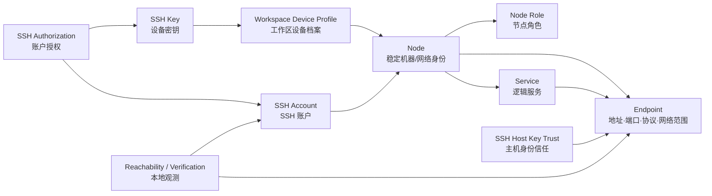

# 网络拓扑领域模型重构设计

- 状态：V1 实现基线
- 文档版本：V1.1
- 日期：2026-08-29
- 设计 Issue：[GitHub #33](https://github.com/jihtsan/key-port/issues/33)
- 实现 Issue：[GitHub #34](https://github.com/jihtsan/key-port/issues/34)
- 相关事项：[VPN 与 RDP 后续支持 #32](https://github.com/jihtsan/key-port/issues/32)
- 领域词汇：[CONTEXT.md](../CONTEXT.md)
- 决策记录：[ADR 0002：统一 Node 身份并分离访问事实](./adr/0002-unify-node-identity-and-separate-access-facts.md)

> 本文是全量重构的领域模型与 V1 实现基线，不是对 `HostV6` 的继续扩展。现有 [Graph 架构文档](./Graph拓扑与跨设备授权架构.md) 和 [整体重构计划](./整体重构与迁移计划.md) 中以 Host v6 为中心的实体关系，保留为历史实现和迁移证据；涉及实体边界时，以本文为准。

## 1. 结论

KeyPort 不再把 `Host` 和 `Device` 当作两种互斥的机器实体，而是采用以下分层：

1. `Node` 是机器或网络参与者的唯一稳定身份。
2. `Node Role` 描述同一个 Node 在不同场景中的用途；客户端设备、SSH 主机、VPN 网关、RDP 主机和服务承载节点都是角色，不是新的根实体。
3. `Workspace Device Profile` 描述 Node 如何注册到 KeyPort 工作区；它承载当前设备、本机密钥和本地操作能力。
4. `Endpoint` 描述如何到达 Node 或 Service；IP、域名、端口、协议和网络范围属于 Endpoint，不属于 Node 身份本身。
5. `SSH Account`、`SSH Key`、`SSH Authorization`、`SSH Host Key Trust` 和本地观测分别表达账户、密钥、允许关系、安全身份和临时证据。
6. `Service` 描述 Node 上的逻辑服务，例如数据库；服务可拥有自己的协议、端口和域名。
7. Graph 只投影这些事实和观测，不反向创建事实。

V1 已将 `TopologySnapshot` 接入默认 App 运行时：Graph 不再等待 HostV6 feature flag 或 `MetadataEnvelope`，而是从 `topology-v1.json` 读取统一快照。旧 `AppSnapshot` 仅保留为 SSH、Keychain、OpenSSH 配置等既有适配器的兼容投影。

当前代码落点：

- 统一实体与一次性迁移：[TopologyModels.swift](../Sources/KeyPortCore/Topology/TopologyModels.swift)
- 统一快照存储：[TopologyStore.swift](../Sources/KeyPort/Stores/TopologyStore.swift)
- Graph 投影：[TopologyGraphProjector.swift](../Sources/KeyPortCore/Hosts/TopologyGraphProjector.swift)
- 默认运行时接入：[KeyPortApp.swift](../Sources/KeyPort/App/KeyPortApp.swift)

目标关系如下：



这里的 `Node → Endpoint` 表示节点可以有多个到达坐标；`Service → Endpoint` 表示服务可能使用自己的端口或域名。两者可以共享同一个实际网络坐标，但不能因为坐标相同就自动合并 Node 或 Service。

## 2. 为什么要重构

当前代码把两个不同维度混在 Graph 的根节点上：

- [HostV6 模型](../Sources/KeyPortCore/Hosts/HostV6Models.swift:152) 中的 `Host` 表示稳定的远端物理机或虚拟机。
- 同一文件中的 `Device` 表示注册到 KeyPort、拥有工作区密钥的设备。
- 当前 Graph 投影器分别生成 `device` 和 `host` 节点，并用 `Device → SSHKeyRecord → Authorization → SSHIdentity → Host` 计算访问边，见 [TopologyGraphProjector](../Sources/KeyPortCore/Hosts/TopologyGraphProjector.swift:60)。

这套模型在“我的 Mac 访问远端服务器”的场景中成立，但在以下场景中会产生概念冲突：

1. 我的 Mac 同时也是一台可以被 SSH 访问的服务器。它不应该因为既是 Device 又是 Host 而拥有两份机器身份。
2. 同一台服务器同时有局域网 IP、公共域名和 Tailnet IP。地址发生变化或增加时，不应该创建新的机器节点。
3. 数据库是服务器上的逻辑服务，不应该与承载它的服务器 Node 混成一个实体。
4. Ping 成功只代表某次观测可达，不能代表 Node 永久在线，也不能代表 SSH 授权存在。
5. VPN 是通往网络的网关或隧道关系，RDP 是一种访问方式；两者都不能被简化成普通的 `Device → Host` SSH 授权边。

当前迁移代码还存在一个必须删除的身份假设：`StableID.host(legacyEndpointKey:)` 以 `host + port` 生成 Host ID，见 [HostV6StableID](../Sources/KeyPortCore/Hosts/HostV6StableID.swift:29)；影子迁移也从旧连接的 endpoint key 推导 Host，见 [HostV6ShadowMigration](../Sources/KeyPortCore/Migration/HostV6ShadowMigration.swift:821)。这会让“同一台机器的多个入口”很容易被拆成多个 Host。

V1 的默认 Graph 已不再使用这条 HostV6 运行时路径；旧路径仅保留给现有迁移、Cloud 和 SSH 兼容测试，后续可在适配器完全迁移后删除。

## 3. 目标实体边界

### 3.1 Node：唯一的机器身份

Node 只回答一个问题：**这是不是同一个机器或网络参与者？**

Node 应承载稳定事实，例如用户给它的名称、设备/操作系统信息、备注和角色集合。它不直接承载某一个 IP、某一个端口、某个 SSH 用户或某次 Ping 结果。

Node 可以同时拥有多个角色：

| 角色 | 含义 | 示例 |
| --- | --- | --- |
| `clientDevice` | 可以作为 KeyPort 访问来源的设备 | 我的 MacBook |
| `sshHost` | 暴露 SSH 登录入口的节点 | Linux 工作站 |
| `rdpHost` | 暴露 RDP 入口的节点 | Windows Server |
| `vpnGateway` | 提供网络接入或隧道入口的节点 | 家庭路由器、Tailscale 网关 |
| `serviceHost` | 承载一个或多个逻辑服务的节点 | 数据库服务器 |

角色是可组合的；不应该为“本机”“服务器”“网关”各建一套相互孤立的实体。

### 3.2 Workspace Device Profile：KeyPort 的工作区角色

当前 `HostV6.Device` 的真正语义不是“另一种机器”，而是“这个 Node 在 KeyPort 中被登记为一个访问来源”。因此它应被重构为 Workspace Device Profile：

- 关联一个 Node；
- 说明是否为当前运行 KeyPort 的设备；
- 关联该设备拥有的 SSH Key；
- 记录本机能力、私钥可用性和本地操作状态；
- 不复制 Node 的通用设备信息。

这样，同一台 Mac 可以既有 `clientDevice` 角色，又有 `sshHost` 角色；它仍然只有一个 Node。

### 3.3 Endpoint：地址不是身份

Endpoint 是可变的访问坐标，至少需要表达：

| 属性 | 说明 |
| --- | --- |
| address | IP 或域名；IPv4、IPv6、DNS 名称都属于地址值 |
| port | 协议端口；例如 SSH 22、PostgreSQL 5432、RDP 3389 |
| protocol | SSH、RDP、VPN 或服务协议；协议决定如何解释端口和凭据 |
| network scope | LAN、public、tailnet、VPN 等网络范围 |
| source | 手工输入、导入、发现或外部系统报告 |
| priority | 多个入口同时可用时的选择顺序 |

一个 Node 可以有多个 Endpoint。增加、删除或替换 Endpoint 不得改变 Node ID。

Endpoint 可以保留 `LAN`、`public`、`tailnet` 或 `VPN` 等相对稳定的网络范围标签；当前 SSID、网卡、信号强度和网络切换记录应放在 Reachability Observation 的环境上下文中。它们可以帮助解释一次检查为什么成功或失败，但不应成为 Node 或 Endpoint 的身份字段。

域名第一阶段只是 Endpoint 的一种地址值或用户别名，不需要单独建 DNS 实体。只有当 KeyPort 未来要管理 DNS 记录、解析历史或所有权时，才另立 DNS 领域。

### 3.4 Service：逻辑能力与机器分离

Service 代表“在 Node 上提供什么能力”，而 Endpoint 代表“从哪里、用什么协议到达它”。例如：

```text
Node: DB-01
  Endpoint: 10.0.0.20:22 / SSH / LAN
  Endpoint: db.example.com:2222 / SSH / public
  Endpoint: 100.64.0.20:22 / SSH / tailnet
  Service: PostgreSQL
    Endpoint: 10.0.0.20:5432 / PostgreSQL / LAN
    Endpoint: db.example.com:5432 / PostgreSQL / public
```

服务不能替代 Node，也不能因为与 SSH 使用同一个 IP 就与 SSH Account 合并。

### 3.5 访问事实与本地观测

访问关系和访问结果必须分开：

| 概念 | 表达 | 不表达 |
| --- | --- | --- |
| `SSH Authorization` | 某个 SSH Key 被某个 SSH Account 接受 | 当前网络可达、登录刚刚成功 |
| `SSH Host Key Trust` | Endpoint 对应的远端主机身份是否被信任 | 账号是否被授权 |
| `Reachability Observation` | 某次检查能否到达 Endpoint | 永久在线状态 |
| `Access Verification` | 某台本地设备某次完成了信任/账号/密钥检查 | 所有设备都实时有效 |

因此，“Host Ping”不应成为 Host 或 Node 的字段。它应是一条带时间、来源、网络环境和结果的 Reachability Observation，Graph 再将它投影成状态颜色。

## 4. 协议扩展边界

当前只实现 SSH，但目标模型要为后续协议留下清晰的位置：

### SSH

SSH 是第一期唯一落地的访问方式：

```text
来源 Node
  └─ Workspace Device Profile
       └─ SSH Key
            └─ SSH Authorization
                 └─ SSH Account ── belongs to ── 目标 Node
                                      └─ uses ── SSH Endpoint
```

SSH Host Key Trust 和本地验证观测绑定 Endpoint/Account，不应塞进 Node 的通用字段。

### RDP（后续）

RDP 复用 Node 和 Endpoint，但使用 RDP 专用账户/凭据与访问验证。它可以让同一个 Node 增加 `rdpHost` 角色，不应复制出一个 `RDPHost` 根实体。

### VPN（后续）

VPN 更接近 `vpnGateway` Node 加一条 Network Access/Tunnel 关系：

```text
当前设备 Node ── Network Access / Tunnel ── VPN Gateway Node
                                              scope: private network
```

VPN 网关不是被 SSH 登录的普通 Host，隧道也不是普通 SSH Authorization。VPN 与 RDP 仍沿用 [Issue #32](https://github.com/jihtsan/key-port/issues/32) 跟踪，当前不实现。

### 数据库等服务

数据库首先是 Service，而不是新的 Node 类型。`PostgreSQL`、`MySQL` 等服务拥有自己的协议和端口，并关联到承载它的 Node；数据库凭据属于服务访问方式，不与 SSH Account 混用。

## 5. 关系不变量

以下规则是后续代码和 Graph 投影必须遵守的边界：

1. 一个物理/虚拟/网络参与者只有一个 Node；一个 Node 可以有多个角色。
2. 一个 Node 可以有多个 Endpoint；Endpoint 的增删改不改变 Node 身份。
3. 不根据名称、IP、域名、操作系统、共享公网地址或相似端口自动合并 Node。缺少强证据时创建待确认的合并候选。
4. Endpoint 地址是值，不是机器身份；域名也不自动成为独立 Node。
5. Service 是逻辑能力，不是 Node；服务端口不是新的机器。
6. Authorization 表达允许关系；Reachability Observation 表达一次可达性检查；两者不能互相推导。
7. SSH Host Key Trust 表达远端身份安全证据；它不能被 SSH Key 或账号授权替代。
8. 本地观测必须携带观察者、时间和来源；不能把一台 Mac 的成功检查当成所有设备的实时状态。
9. Graph 的节点、边和颜色都是投影结果；拖动节点、画布连线或状态计算不能直接创建领域事实。
10. 协议专用字段留在协议专用实体中，Node 不演化成包含所有账户、端口、密码和探测状态的“上帝对象”。

## 6. 典型场景

### 场景 A：本机同时是客户端和 SSH 服务器

```text
Node: MacBook
  roles: clientDevice, sshHost
  Workspace Device Profile: 当前设备
  SSH Endpoint: macbook.local:22 / SSH / LAN
  SSH Account: joo
```

Graph 中只有一个 MacBook 节点。它作为访问来源时，使用 Workspace Device Profile 和 SSH Key；它作为目标时，使用 SSH Account 和 SSH Endpoint。

### 场景 B：一台服务器有多个 IP 和域名

```text
Node: Home-Linux
  Endpoint: 192.168.1.20:22 / SSH / LAN
  Endpoint: home.example.com:2222 / SSH / public
  Endpoint: 100.64.0.20:22 / SSH / tailnet
```

这三个 Endpoint 仍属于一个 Node。每个 Endpoint 可以有自己的 Host Key Trust 和可达性观测；即使它们暂时呈现不同指纹，也只能产生安全告警，不能悄悄创建第二个 Node。

### 场景 C：SSH 与数据库共存

```text
Node: DB-01
  SSH Account: admin
  SSH Endpoint: db-01.example.com:22 / SSH
  Service: PostgreSQL
  Service Endpoint: db-01.example.com:5432 / PostgreSQL
```

SSH 是进入机器的访问方式，PostgreSQL 是机器提供的服务。两者可以在 Graph 中显示为 Node 下的不同子项，但不能共用 SSH Account 或 SSH Authorization。

### 场景 D：VPN 后访问内网服务器

```text
Node: MacBook ── future Network Access ── Node: Home-VPN
                                          scope: 192.168.1.0/24
Node: Home-Linux
  Endpoint: 192.168.1.20:22 / SSH / VPN
```

VPN 关系说明“怎样进入网络”，SSH Authorization 说明“进入服务器后谁能登录”。两条事实都成立，但含义不同。

## 7. 当前模型到目标模型的映射

| 当前概念 | 目标概念 | 处理方向 |
| --- | --- | --- |
| `HostV6.Host` | `Node` | 作为迁移输入；默认运行时不再把 Host 当作 Graph 根身份 |
| `HostV6.Device` | `Workspace Device Profile` + `Node` | 设备注册信息进入 Profile，机器信息进入关联 Node |
| `HostV6.AccessAddress` | `Endpoint` | 从 Host 地址改为可复用的协议访问坐标 |
| `HostV6.SSHIdentity` | `SSH Account` | 保留账户级用户名、别名和首选 Endpoint |
| `HostV6.SSHKeyRecord` | `SSH Key` | 归属 Workspace Device Profile，私钥仍只在本地 |
| `HostV6.Authorization` | `SSH Authorization` | 保留账户授权，但不承担可达性和验证状态 |
| `HostV6.HostKeyPin` | `SSH Host Key Trust` | 绑定 Endpoint 的远端身份安全证据 |
| `HostV6.KnownHostsLine` | Host Key Trust 的来源证据 | 不再作为 Graph 根节点；可保留原始行和导入来源 |
| `HostV6.SavedService` | `Service` + Service Endpoint | 保留服务语义，去掉与 Host 身份的耦合 |
| `HostV6.NodeAssociation` | `External Node Identity` 关联 | 保留外部身份证据，但不与 SSH Authorization 混用 |
| `HostV6.ReachabilityEvidence` | `Reachability Observation` | 从聚合状态改为带时间和来源的本地观测 |
| `LocalSSHIdentityState` | `Access Verification` | 只作为本地验证证据，不成为同步授权事实 |
| `TopologyGraphStatus` | Graph 投影状态 | 保留为显示计算，不持久化为 Node 状态 |
| V5 `ServerConnection` / `AppSnapshot` | `TopologySnapshotMigration` + SSH 兼容投影 | 新 Graph 以统一快照为准；旧对象暂时只服务既有 SSH/配置适配器 |

### 明确可删除或不再作为独立实体的内容

- `Host` 与 `Device` 两套机器根身份在默认 Graph 运行时中的并列地位。
- 以 `host + port` 生成机器 ID 的逻辑；Endpoint 变化不能改变 Node 身份。
- 持久化的 `Host Ping`、`HostStatus` 或把一次状态提升为 Node 永久属性的字段。
- V5 `ServerConnection` 与 V6 Host 并行作为统一 Graph 数据源的运行时路径。
- 把 `Actual Node` 当作与 Host、Device 并列的第三种机器实体；它应降为外部身份证据。
- 把 Graph 节点位置、画布连线或状态颜色写回领域模型的逻辑。

### 不应因为“统一 Node”而删除的内容

- Endpoint：一个 Node 多地址是目标模型的核心能力。
- SSH Account：同一 Node 可以有多个登录账户。
- SSH Key 与 SSH Authorization：密钥归属与账号授权是不同关系。
- SSH Host Key Trust：这是连接安全身份，不是 Ping，也不是授权。
- Reachability/Access Verification：它们是本地、带时效的证据，虽然不是 Node 身份，仍是安全状态计算的输入。
- Service：数据库、HTTP 等逻辑服务需要独立入口和访问语义。

## 8. 身份与迁移策略

### 8.1 新模型的身份规则

- Node 在用户确认或明确创建时获得稳定 ID。
- Endpoint 获得独立 ID；它可以被替换、停用或新增，不影响 Node ID。
- Node 合并必须是显式操作，或者有足够强的外部身份/用户确认依据。
- 同名、同 IP、同端口和同系统型号只能作为合并候选证据，不能单独触发合并。
- Node 的名称变化不改变身份；域名变化也不改变身份。

### 8.2 旧数据导入

1. 读取旧 `AppSnapshot`，为每个工作区设备生成 `Workspace Device Profile` 和对应 Node。
2. 对规范化后完全相同的旧 `host`，生成一个 Node；不同端口生成同一 Node 下的多个 SSH Endpoint，SSH Account 继续保留原 UUID。
3. 不根据名称、相似 IP、操作系统或端口猜测不同地址属于同一台机器；跨地址归并仍需显式事实或用户确认。
4. 完成 Node 归并后，再迁移 SSH Account、SSH Authorization、Host Key Trust、Service 和本地观测的引用。
5. 迁移后的统一快照写入 `topology-v1.json`；旧 `state-v1.json` 由兼容投影继续维护，避免现有 SSH 操作丢失数据。
6. 新模型稳定后删除旧 V5/V6 运行时写路径；当前 HostV6 代码只作为必要的导入、Cloud 和恢复适配器。

当前 `HostV6.StableID.host(legacyEndpointKey:)` 的 endpoint 派生策略不应迁移为目标规则。它最多只能作为旧数据导入的 provenance，不能继续负责新 Node 的身份生成。

## 9. Graph 的新投影边界

Graph 的默认画布只显示统一模型的 Node 和 Service；Endpoint、SSH Account、SSH Key、Host Key Trust 和观测在 Inspector 或边详情中展开。

V1 已完成的投影行为：

- 当前设备 Node 位于左侧，远端 SSH Node 作为分支显示；不再要求 HostV6 envelope 存在。
- 同一 Node 的多个 Endpoint 不创建多个 Graph 节点；SSH Account 只作为可选的 supporting node。
- 已授权访问投影为 `Node → Node` 的 `nodeAccess` 边，尚未授权但存在 SSH Account 的访问投影为候选边。
- Service 投影为 `Node → Service`，为后续数据库、HTTP 等服务保留独立入口。
- Graph 仍然是只读投影；节点位置、连线和状态颜色不会反写领域快照。

目标边语义：

| Graph 边 | 来源事实 | 含义 |
| --- | --- | --- |
| 当前设备 Node → 目标 Node | Workspace Device Profile → SSH Key → SSH Authorization → SSH Account → Node | 当前设备具有 SSH 账户访问授权 |
| Node → Service | Service 承载关系 | 该 Node 提供该逻辑服务 |
| Node → Node（VPN，后续） | Network Access/Tunnel | 通过网关进入另一个网络范围 |
| Node/Account → Endpoint（详情） | Endpoint 关联 | 具体使用哪个地址、端口和协议 |

“两台机器都能 Ping 通”“名字相似”“在同一网段”都不能单独生成访问边。当前 [GraphWorkspaceModel](../Sources/KeyPort/Stores/GraphWorkspaceModel.swift:7) 和 [TopologyGraphProjector](../Sources/KeyPortCore/Hosts/TopologyGraphProjector.swift:6) 已增加统一快照投影入口；旧 `device/host` 投影入口仅用于兼容测试和迁移验证。

状态仍然按多个轴投影，而不是压成 Node 的一个永久状态：

- Endpoint 可达性；
- SSH Host Key Trust；
- 当前设备的 SSH Key 可用性；
- 目标 SSH Account 的远端授权；
- 本地 Access Verification；
- 同步/冲突/操作任务状态。

## 10. 重构顺序

1. **领域基线**：已完成；采用本文和 `CONTEXT.md` 的术语，停止新增 Host/Device 平行概念。
2. **核心模型**：已完成 V1；建立 Node、Role、Workspace Device Profile、Endpoint、Service 和 SSH 访问关系。
3. **SSH 第一阶段**：已接入；迁移 SSH Account、SSH Key、SSH Authorization、SSH Host Key Trust 和本地验证，只支持 SSH。
4. **导入与数据迁移**：已完成首轮；从旧 AppSnapshot 导入，处理同一旧 Host 的多端口 Endpoint，并保留拓扑专属事实。
5. **Graph 投影**：已接入默认运行时；用 Node/Service 作为主要画布节点，地址、账户、信任和观测作为状态输入。
6. **删除旧模型**：进行中；默认 Graph 已断开 HostV6 gate，旧模型暂保留为 SSH/Cloud/恢复适配器。
7. **协议扩展**：单独设计 VPN、RDP 和其他服务访问关系；继续通过 [Issue #32](https://github.com/jihtsan/key-port/issues/32) 跟踪，不提前把它们塞入 SSH 模型。

## 11. 验收场景

V1 已由 `UnifiedTopologyTests` 覆盖：

- 同一旧 Host 的多个 SSH Account 合并到一个 Node。
- 同一 Node 的多个端口保留为多个 Endpoint。
- 授权后投影 `Node → Node` 访问边，未授权时投影候选边。
- 当前设备查询只保留当前 Workspace Device Node，同时保留远端服务器 Node。
- 兼容刷新不会覆盖 Service、手工 Endpoint 或额外 Node Role。

后续版本仍需要覆盖：

- 同一台 Mac 同时拥有 `clientDevice` 和 `sshHost` 角色，Graph 只有一个 Node。
- 一个 Node 同时拥有 LAN IP、公共域名和 Tailnet IP，Graph 只有一个 Node、多个 Endpoint。
- 同一 Node 拥有两个 SSH Account，授权和验证状态互不覆盖。
- 同一 Node 承载 SSH 和 PostgreSQL，Service 与 SSH Account 不混淆。
- Ping 不通但已存在授权：Graph 显示可达性问题，不删除授权。
- Ping 可达但 Host Key 不匹配：Graph 阻断安全操作，不显示为健康访问。
- 一台设备授权成功、另一台设备未验证：本地验证状态不跨设备冒充实时成功。
- VPN 网关、内网 SSH 主机和服务同时存在时，VPN 路径与 SSH 授权分别展示。
